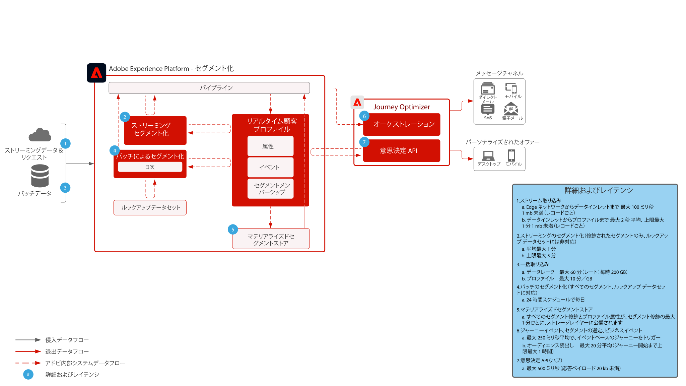

# ガードレール

Guardrail は、データとシステムの使用状況、パフォーマンスの最適化、Adobe Experience Platformおよびアプリケーションでのエラーや予期しない結果の回避に関するガイダンスを提供する、推奨されるしきい値です。 Guardrail は、顧客のアーキテクチャと使用例のパフォーマンス最適化を促進するために、システムの制約とパフォーマンスの期待を反映することを目的としています。 Guardrail は、サービスレベル契約にはなりません。製品固有のサービスレベル契約について詳しくは、以下にリンクされている製品の説明ドキュメントを参照してください。

## Adobe Experience Platformおよびアプリケーションの Guardrail

[データ取り込みガードレール](https://experienceleague.adobe.com/docs/experience-platform/ingestion/guardrails.html?lang=en)

[Edge Network API Guardrails](https://experienceleague.adobe.com/docs/experience-platform/edge-network-server-api/guardrails.html?lang=en)

[リアルタイム顧客プロファイルガードレール](https://experienceleague.adobe.com/docs/experience-platform/profile/guardrails.html?lang=en)

[ID ガードレール](https://experienceleague.adobe.com/docs/experience-platform/identity/guardrails.html?lang=en)

[クエリサービスガードレール](https://experienceleague.adobe.com/docs/experience-platform/query/guardrails.html?lang=en)

[宛先のアクティベーションガードレール](https://experienceleague.adobe.com/docs/experience-platform/destinations/guardrails.html)

[Journey Optimizer Guardrails](https://experienceleague.adobe.com/docs/journey-optimizer/using/get-started/guardrails.html?lang=en)

 

## エンドツーエンドの遅延

### データ取り込み

次の図は、Adobe Experience Platform にデータを取り込む際の平均パフォーマンスのガードレールと待ち時間を示しています。

 

### Journey Optimizer

 

## 製品の説明

[Experience Platform収集 Enterprise](https://helpx.adobe.com/legal/product-descriptions/adobe-experience-platform-collection-enterprise.html)

[Real-time Customer Data Platform](https://helpx.adobe.com/jp/legal/product-descriptions/real-time-customer-data-platform.html)

[B2B 顧客データプラットフォーム](https://helpx.adobe.com/legal/product-descriptions/adobe-experience-platform-b2b.html)

[Experience Platform Activation](https://helpx.adobe.com/jp/legal/product-descriptions/adobe-experience-platform0.html)

[Experience Platform インテリジェンス](https://helpx.adobe.com/legal/product-descriptions/adobe-experience-platform-intelligence---product-description.html)

[インテリジェントサービス](https://helpx.adobe.com/legal/product-descriptions/intelligent-services.html)

[Customer Journey Analytics](https://helpx.adobe.com/jp/legal/product-descriptions/customer-journey-analytics.html)

[Journey Optimizer](https://helpx.adobe.com/legal/product-descriptions/adobe-journey-optimizer.html)

[Journey Orchestration](https://helpx.adobe.com/legal/product-descriptions/journey-orchestration.html)

[Offer Decisioning](https://helpx.adobe.com/legal/product-descriptions/offer-decisioning-app-service.html)