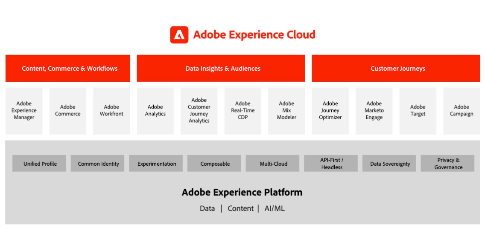

# Adobe Experience Cloud アーキテクチャ図

## Adobe Experience Cloud marketecture

以下の図に、Adobe Experience Platform の基盤上に構築および統合された、データインサイトとオーディエンス、コンテンツとコマース、カスタマージャーニー、およびマーケティングワークフローにわたる Adobe Experience Cloud のさまざまなコンポーネントを示します。

## Data &amp; Insights、Content &amp; Commerce、およびエクスペリエンス配信の統合アーキテクチャ

以下のアーキテクチャ図に、Adobe Experience Cloud の様々なコンポーネントがどのように接続および統合され、データ、コンテンツ、およびエクスペリエンス配信にわたる大規模なパーソナライズ機能を実現するかを示します。

## Adobe Experience Cloudは企業の状況にある

以下のアーキテクチャ図に、Adobe Experience Cloud アプリケーションと Adobe Experience Platform が、データ、インサイト、オーケストレーション、およびエンゲージメントの 4 つのカテゴリにわたる企業顧客のエクスペリエンスアーキテクチャにどのように適合するかを示します。

