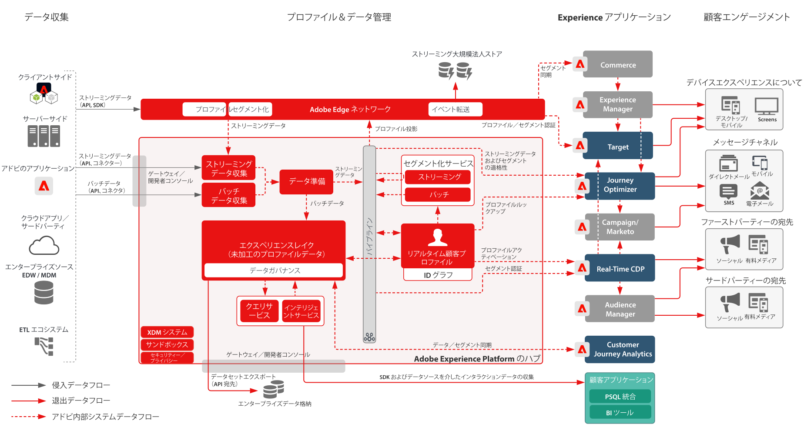

# Adobe Experience Platform およびアプリケーション アーキテクチャ図

## Adobe Experience Platform およびアプリケーションアーキテクチャ図

このアーキテクチャ図に、Adobe Experience Platform が Adobe Experience Cloud アプリケーションおよびアプリケーションサービスとどのように関わっているかを示します。

## Adobe Experience Platform およびアプリケーションの詳細アーキテクチャ図

>[!VIDEO](https://video.tv.adobe.com/v/32456/?quality=12&learn=on)

## Adobe Experience PlatformとExperience Cloudのアプリケーションの統合

<table class="relative-table wrapped" style="width: 100%;">
<colgroup>
<col style="width: 16.0202%;" />
<col style="width: 29.3423%;" />
<col style="width: 33.5582%;" />
<col style="width: 21.0793%;" />
</colgroup>
<tbody>
<tr>
<th>アプリケーション</th>
<th>Experience Platform からアプリケーションへ</th>
<th>アプリケーションから Experience Platform へ</th>
<th>関連するブループリント</th>
</tr>
<tr>
<td colspan="1">Ad Cloud</td>
<td colspan="1">
<ul>
<li>Real-time Customer Data Platformで定義されたオーディエンスは、Audience Managerを介してターゲティングのためにAd Cloudと共有できます。</li>
</ul>
</td>
<td colspan="1">
<ul>
<li>現在の統合はありません</li>
</ul>
</td>
<td colspan="1">
<ul>
<li><a href="https://experienceleague.adobe.com/docs/blueprints-learn/architecture/audience-activation/anonymous.html?lang=ja">匿名オーディエンスアクティベーション</a></li>
<li><a href="https://experienceleague.adobe.com/docs/blueprints-learn/architecture/audience-activation/known-customer-audience-activation/known.html?lang=ja">既知の顧客のアクティベーション</a></li>
<li><a href="https://experienceleague.adobe.com/docs/blueprints-learn/architecture/architecture-overview/platform-applications.html?lang=ja">Experience Platform およびアプリケーションを使用したアクティベーション</a></li>
</ul>
</td>
</tr>
<tr>
<td>Analytics</td>
<td>
<ul>
<li>Web／モバイル SDK で収集されたデータは、Adobe Analytics に転送することができます。</li>
</ul>
</td>
<td>
<ul>
<li>Analytics によって収集されたデータは、Experience Platform データレイクおよびプロファイル格納に送信することができます。 <a href="https://experienceleague.adobe.com/docs/experience-platform/sources/connectors/adobe-applications/analytics.html?lang=ja">Analytics データコネクタ</a></li>
</ul>
</td>
<td>
<ul>
<li><a href="https://experienceleague.adobe.com/docs/blueprints-learn/architecture/architecture-overview/platform-data-flow.html?lang=ja">Experience Platform データフロー</a></li>
</ul>
</td>
</tr>
<tr>
<td>Audience Manager</td>
<td>
<ul>
<li>Real-time Customer Data Platformで定義されたオーディエンスは、サードパーティ Cookie の宛先に対してアクティブ化するために、Audience Managerに共有できます。</li>
</ul>
</td>
<td>
<ul>
<li>Audience Manager からオーディエンスメンバーシップとともに収集および評価されたデータは、Experience Platform データレイクおよびプロファイル格納に共有することができます。 <a href="https://experienceleague.adobe.com/docs/experience-platform/sources/connectors/adobe-applications/audience-manager.html?lang=ja">Audience Manager ソースコネクタ</a></li>
</ul>
</td>
<td>
<ul>
<li><a href="https://experienceleague.adobe.com/docs/blueprints-learn/architecture/audience-activation/anonymous.html?lang=ja">匿名オーディエンスアクティベーション</a></li>
<li><a href="https://experienceleague.adobe.com/docs/blueprints-learn/architecture/audience-activation/known-customer-audience-activation/known.html?lang=ja">既知の顧客のアクティベーション</a></li>
<li><a href="https://experienceleague.adobe.com/docs/blueprints-learn/architecture/audience-activation/platform-and-applications.html?lang=ja">Experience Platform およびアプリケーションを使用したアクティベーション</a></li>
</ul>
</td>
</tr>
<tr>
<td colspan="1">Campaign Classic</td>
<td colspan="1">
<ul>
<li>Real-time Customer Data Platformで定義されたオーディエンスは、キャンペーンを開始するオーディエンスとしてCampaign Classicに共有できます。</li>
</ul>
</td>
<td colspan="1">
<ul>
<li>Campaign で収集されたインタラクションおよびキャンペーンデータは、Experience Platformにデータソースとして取り込み、Real-time Customer Data Platformを介したオーディエンスの構築や、Customer Journey AnalyticsおよびExperience Platformクエリサービスを介した分析でさらに使用できます。</li>
</ul>
</td>
<td colspan="1">
<ul>
<li><a href="https://experienceleague.adobe.com/docs/blueprints-learn/architecture/customer-journeys/overview.html?lang=ja">カスタマージャーニー</a></li>
</ul>
</td>
</tr>
<tr>
<td colspan="1">Campaign Standard</td>
<td colspan="1">
<ul>
<li>Real-time Customer Data Platformで定義されたオーディエンスは、キャンペーンを開始するオーディエンスとしてCampaign Standardに共有できます。</li>
</ul>
</td>
<td colspan="1">
<ul>
<li>Campaign で収集されたインタラクションおよびキャンペーンデータは、Experience Platformにデータソースとして取り込み、Real-time Customer Data Platformを介したオーディエンスの構築や、Customer Journey AnalyticsおよびExperience Platformクエリサービスを介した分析でさらに使用できます。</li>
</ul>
</td>
<td colspan="1">
<ul>
<li><a href="https://experienceleague.adobe.com/docs/blueprints-learn/architecture/customer-journeys/overview.html?lang=ja">カスタマージャーニー</a></li>
</ul>
</td>
</tr>
<tr>
<td colspan="1">Customer Journey Analytics</td>
<td colspan="1">
<ul>
<li>Experience Platform データレイクに収集され、取り込まれたデータは、Customer Journey Analytics で処理できるようになります。 </li>
<li>Real-time Customer Data Platformのプロファイルとオーディエンスのデータを CJA に取り込むことができます。 <a href="https://experienceleague.adobe.com/docs/analytics-platform/using/cja-usecases/ingest-aep-segments.html?lang=ja">RTCDP から CJA への統合</a>.
</li>
</ul>
</ul>
</td>
<td colspan="1">
<ul>
<li>顧客ジャーニー分析でオーディエンスを構築し、オーディエンスの結果をReal-time Customer Data Platformと共有します。 <a href="https://experienceleague.adobe.com/docs/analytics-platform/using/cja-components/audiences/publish.html?lang=ja">CJA オーディエンスの公開</a></li>
</ul>
</td>
<td colspan="1">
<ul>
<li><a href="https://experienceleague.adobe.com/docs/blueprints-learn/architecture/customer-journey-analytics/overview.html?lang=ja">Customer Journey Analytics</a></li>
</ul>
</td>
</tr>
<tr>
<td colspan="1">Experience Manager</td>
<td colspan="1">
<ul>
<li>Experience Platform プロファイルは、サーバーサイドに直接アクセスして、Experience Manager を使用して配信された、パーソナライズされたエクスペリエンスを強化できます。パーソナライゼーションアクティビティは、通常 Target 統合を通じて、Experience Manager で配信されることに注意してください。 </li>
</ul>
</td>
<td colspan="1">
<ul>
<li>Experience Manager Sites で実行される現在の統合、行動およびインタラクションは、Experience Platform Web および Mobile SDK では直接収集されません。</li>
</ul>
</td>
<td colspan="1">
<ul>
<li><a href="https://experienceleague.adobe.com/docs/blueprints-learn/architecture/audience-activation/known-customer-audience-activation/known.html?lang=ja">既知の顧客のアクティベーション</a></li>
</ul>
</td>
</tr>
<tr>
<td colspan="1">Journey Optimizer</td>
<td colspan="1">
<ul>
<li>Experience Platform に取り込まれたデータイベントおよびプロファイルは、Journey Optimizer でジャーニーを開始および強化するために Journey Optimizer で使用できます。</li>
</ul>
</td>
<td colspan="1">
<ul>
<li>Journey Optimizerで生成されたインタラクションとキャンペーンのデータは、Real-time Customer Data Platformを介したオーディエンスの構築や、Customer Journey AnalyticsおよびExperience Platformクエリサービスを介した分析でさらに使用できるように、Experience Platformに収集されます。</li>
</ul>
</td>
<td colspan="1">
<ul>
<li><a href="https://experienceleague.adobe.com/docs/blueprints-learn/architecture/customer-journeys/journey-optimizer.html?lang=ja">Journey Optimizer</a></li>
</ul>
</td>
</tr>
<tr>
<td colspan="1">Adobe Commerce</td>
<td colspan="1">
<ul>
<li>Real-time Customer Data Platformに組み込まれているプロファイルとオーディエンスを、Adobe Commerceでパーソナライズ機能で利用できます。 </li>
</ul>
</td>
<td colspan="1">
<ul>
<li>Adobe Commerce に対してネイティブなデータは、Adobe Commerce ソースコネクタを介して Experience Platform に送信することができます。 </li>
</ul>
</td>
<td colspan="1">現在の統合はありません</td>
</tr>
<tr>
<td colspan="1">Marketo</td>
<td colspan="1">
<ul>
<li>Real-time Customer Data Platformで定義されたオーディエンスをオーディエンスとしてMarketoに共有して、Marketoキャンペーンを開始したり、Marketoオブジェクトを更新したりできます。</li>
</ul>
</td>
<td colspan="1">
<ul>
<li>Marketo アカウント、連絡先および商談データは、Marketo で生成されたインタラクションおよびキャンペーンデータと共に、B2B-CDP を介したオーディエンス構築および Customer Journey Analytics を介した分析、ならびに Experience Platform Query Service でさらに使用するために、Experience Platform に取り込まれます。 <a href="https://experienceleague.adobe.com/docs/experience-platform/sources/connectors/adobe-applications/marketo/marketo.html?lang=ja">Marketo Engage コネクタ</a></li>
</ul>
</td>
<td colspan="1">
<ul>
<li><a href="https://experienceleague.adobe.com/docs/blueprints-learn/architecture/b2b-activation/b2bactivation.html?lang=ja">B2B アクティベーションブループリント</a></li>
</ul>
</td>
</tr>
<tr>
<td colspan="1">Real-Time CDP</td>
<td colspan="1">
<ul>
<li>Experience Platformに取り込まれ、収集されたデータは、Real-time Customer Data Platformを強化するリアルタイム顧客プロファイルを組み立てるためのデータソースです。</li>
</ul>
</td>
<td colspan="1">
<ul>
<li>オーディエンスおよびプロファイル指標は、プロファイルインサイトレポートダッシュボードを強化するために、Experience Platform データレイクに送信されます。</li>
<li>データレイクのオーディエンスおよびプロファイルデータは Query Service および Customer Journey Analytics でさらにインサイトを得るために使用することができます。</li>
</ul>
</td>
<td colspan="1">
<ul>
<li><a href="https://experienceleague.adobe.com/docs/blueprints-learn/architecture/audience-activation/known-customer-audience-activation/known.html?lang=ja">既知の顧客のアクティベーション</a></li>
<li><a href="https://experienceleague.adobe.com/docs/blueprints-learn/architecture/audience-activation/platform-and-applications.html?lang=ja">Experience Platform およびアプリケーションを使用したアクティベーション</a></li>
</ul>
</td>
</tr>
<tr>
<td colspan="1">Target</td>
<td colspan="1">
<ul>
<li>Real-time Customer Data Platformで定義されたオーディエンスとプロファイル属性は、Target と共有したり、Target が提供するパーソナライゼーションおよびターゲティングエクスペリエンスで使用したりできます。</li>
</ul>
</td>
<td colspan="1">
<ul>
<li>Target エクスペリエンスおよびインタラクション用に収集されたデータは、Experience Platform Web／Mobile SDK を使用して Experience Platform に収集することができます。このデータは、Real-time Customer Data Platformを介したオーディエンス構築で、また、Customer Journey AnalyticsおよびExperience Platformクエリサービスを介した分析に使用できます。</li>
</ul>
</td>
<td colspan="1">
<ul>
<li><a href="https://experienceleague.adobe.com/docs/blueprints-learn/architecture/audience-activation/known-customer-audience-activation/known.html?lang=ja">既知の顧客のアクティベーション</a></li>
<li><a href="https://experienceleague.adobe.com/docs/blueprints-learn/architecture/audience-activation/platform-and-applications.html?lang=ja">Experience Platform およびアプリケーションを使用したアクティベーション</a></li>
</ul>
</td>
</tr>
</tbody>
</table>