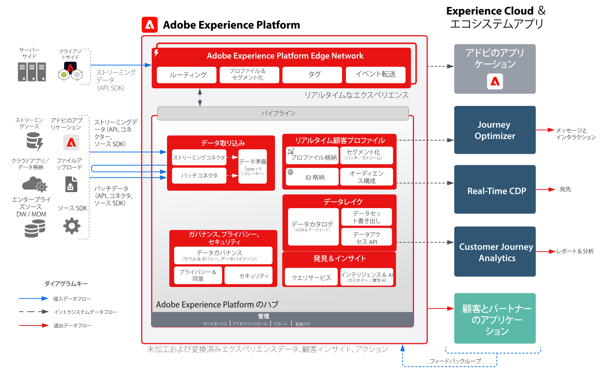
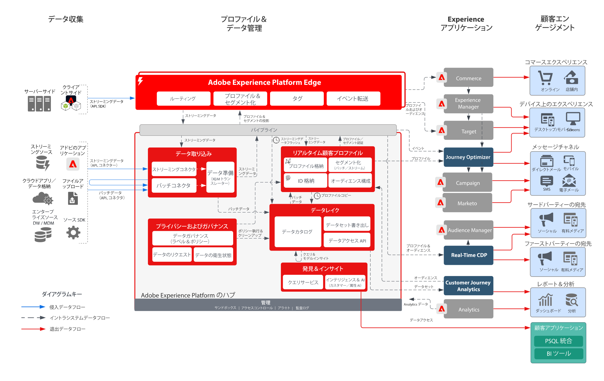

# Adobe Experience Platformとアプリケーションのアーキテクチャ図

これらのアーキテクチャ図は、Experience Platform（AEP）と他のExperience Cloud アプリケーションおよびアプリケーションサービスとの関係を示しています。

>[!MORELIKETHIS]
>
>[Experience Cloud アプリケーション統合の統合設定 ](https://experienceleague.adobe.com/docs/integrations-learn/experience-cloud/overview.html?lang=ja)

## アーキテクチャ図

このアーキテクチャ図に、Adobe Experience Platform が Adobe Experience Cloud アプリケーションおよびアプリケーションサービスとどのように関わっているかを示します。

## 概要図

## 詳細なアーキテクチャ図

>[!VIDEO](https://video.tv.adobe.com/v/3422783/?quality=12&learn=on&captions=jpn)

## AEPとExperience Cloud アプリケーションの統合

| アプリケーション | Experience Platform からアプリケーションへ | アプリケーションから Experience Platform へ |
|------------------------------|-----------------------------------|-----------------------------------|
| **Ad Cloud** | - Real-time Customer Data Platform で定義されたオーディエンスは、Audience Managerを介してターゲティングするためにAd Cloudに共有できます。 |  – 現在の統合はありません |
| **Analytics** | - Web/モバイル SDKを介して収集されたデータは、Adobe Analyticsに転送できます。 | - Analytics で収集されたデータは、Experience Platform Data Lake およびプロファイルストアに送信できます。 [Analytics Data Connector](https://experienceleague.adobe.com/docs/experience-platform/sources/connectors/adobe-applications/analytics.html?lang=ja) |
| **Audience Manager** | - Real-time Customer Data Platform で定義されたオーディエンスをAudience Managerに共有して、サードパーティの Cookie 宛先に対してアクティブ化できます。 | - Audience Managerからオーディエンスメンバーシップとともに収集および評価されたデータは、Experience Platform Data Lake およびプロファイルストアに共有できます。 [Audience Manager ソースコネクタ](https://experienceleague.adobe.com/docs/experience-platform/sources/connectors/adobe-applications/audience-manager.html?lang=ja) |
| **Adobe Campaign** | - Real-time Customer Data Platform で定義されたオーディエンスをCampaign Classicに共有してキャンペーンを開始できます。 | - Campaign で収集されたインタラクションおよびキャンペーンデータは、Experience Platformに取り込んで、オーディエンス作成、Customer Journey Analyticsおよびクエリサービスで使用できます。 |
| **Campaign Standard** | - Real-time Customer Data Platform で定義されたオーディエンスをCampaign Standardに共有してキャンペーンを開始できます。 | - Campaign で収集されたインタラクションデータとキャンペーンデータは、Experience Platformに取り込んでさらに使用することができます。 |
| **Customer Journey Analytics** | - Experience Platform Data Lake で収集され、取り込まれたデータは、Customer Journey Analyticsで処理できます。   - Real-time Customer Data Platform のプロファイルデータとオーディエンスデータをCJAに取り込むことができます。 [RTCDPとCJAの統合 ](https://experienceleague.adobe.com/docs/analytics-platform/using/cja-usecases/ingest-aep-segments.html?lang=ja) | - CJAでオーディエンスを作成し、オーディエンスの結果を Real-time Customer Data Platform に共有します。 [CJA オーディエンスの公開](https://experienceleague.adobe.com/docs/analytics-platform/using/cja-components/audiences/publish.html?lang=ja) |
| **Experience Manager** | - Experience Platform プロファイルは、サーバーサイドでアクセスして、Experience Managerでパーソナライズされたエクスペリエンスを強化できます。 |  – 現在の統合はありません。Experience Manager サイトで実行されるインタラクションは、Experience Platform Web およびモバイル SDKを介して収集されます。 |
| **Journey Optimizer** | - Experience Platformに取り込まれたデータイベントおよびプロファイルは、Journey Optimizerで使用できます。 | - Journey Optimizerで生成されたインタラクションデータとキャンペーンデータは、さらに使用するためにExperience Platformに収集されます。 |
| **Adobe Commerce** | - Real-time Customer Data Platform で作成されたプロファイルとオーディエンスは、Adobe Commerceでのパーソナライゼーションに使用できます。 | - Adobe Commerce本来のデータは、Adobe Commerce ソースコネクタ経由でExperience Platformに送信できます。 |
| **Marketo** | - Real-time Customer Data Platform で定義されたオーディエンスをMarketoと共有してキャンペーンを開始し、オブジェクトを更新できます。 | - Marketoのアカウント、連絡先およびキャンペーンデータは、さらに分析するためにExperience Platformに取り込まれます。 [Marketo Engage コネクタ ](https://experienceleague.adobe.com/docs/experience-platform/sources/connectors/adobe-applications/marketo/marketo.html?lang=ja) |
| **Real-Time CDP** | - Experience Platformに取り込まれたデータは、Real-time Customer Data Platform を強化するリアルタイム顧客プロファイルのソースです。 | - オーディエンス指標とプロファイル指標は、Experience Platform Data Lake に送信されてインサイトを得ます。 |
| **Target** | - Real-time Customer Data Platform のオーディエンスとプロファイル属性は、パーソナライゼーションのために Target に共有できます。 | - Target エクスペリエンス用に収集されたデータをExperience Platformに送信して、オーディエンスの構築と分析を行うことができます。 |
