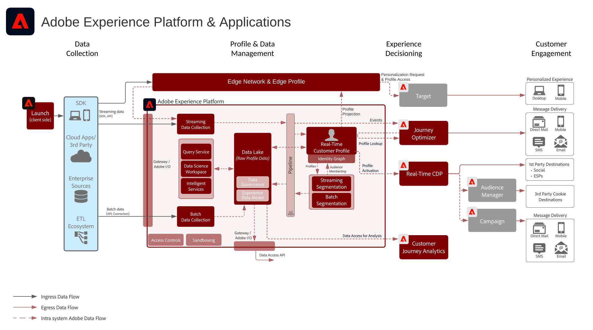

# Adobe Experience Platform&amp;アプリ

## Adobe Experience Platform およびアプリケーションアーキテクチャ図

このアーキテクチャ図は、Adobe Experience Platform が Adobe Experience Cloud アプリケーションおよびアプリケーションサービスとどのように関わっているかを示します。

>[!VIDEO](https://video.tv.adobe.com/v/32456/?quality=12&learn=on)

## Adobe Experience Platform&amp;アプリケーションの詳細なアーキテクチャ図

