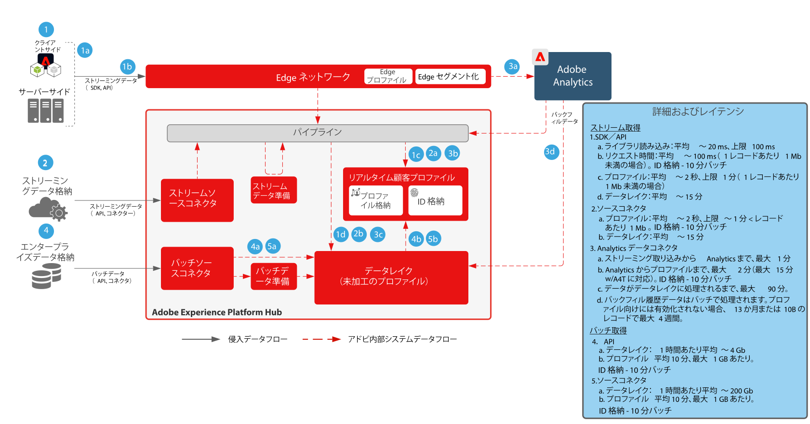

# Adobe Experience Platform データフローアーキテクチャ図

## データフロー図

次の図に、Adobe Experience Platform のデータの取り込みおよび送り出しの様々なパスを示します。

## データの入出力パターン

すべてのデータ取り込み、収集、取り込みの各パターンの詳細なリストについては、[データ準備と取り込みのブループリント](../data-ingestion/ingestion.md)を参照してください。

データの送り出しとアクセスパターンのすべての詳細なリストについては、[データアクセスと書き出しのブループリント](../data-ingestion/egress.md)を参照してください。

## データ取り込みガードレール

以下の図に、Adobe Experience Platform にデータを取り込む際の平均パフォーマンスのガードレールと待ち時間を示します。

