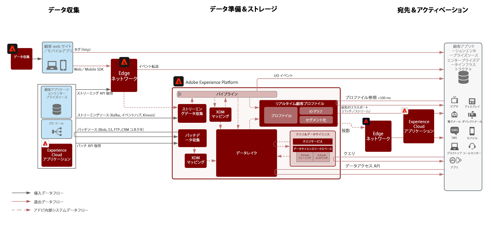
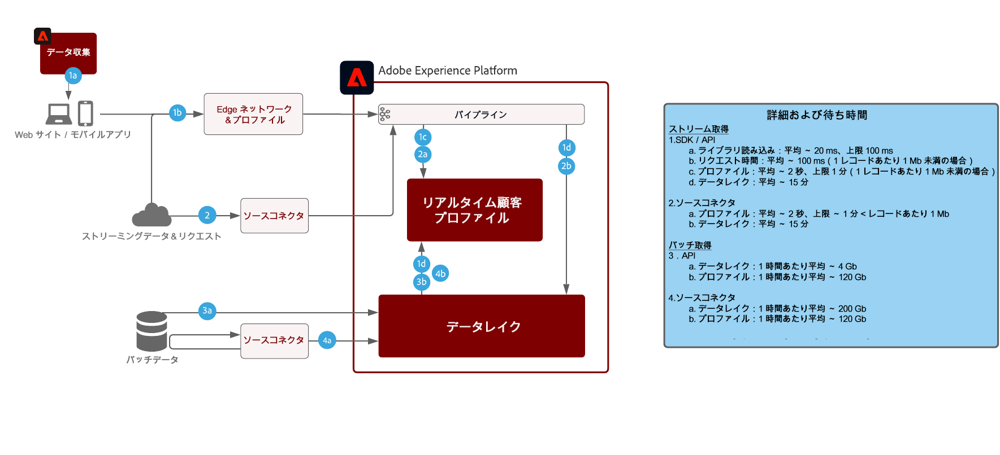

# Adobe Experience Platformのデータフローアーキテクチャ

## データフロー図

次の図は、Adobe Experience Platformからのデータの取り込みと取り出しの様々なパスを示しています。

## データ取得ガードレール

次の図は、Adobe Experience Platformにデータを取り込む際の平均パフォーマンスのガードレールと待ち時間を示しています。

