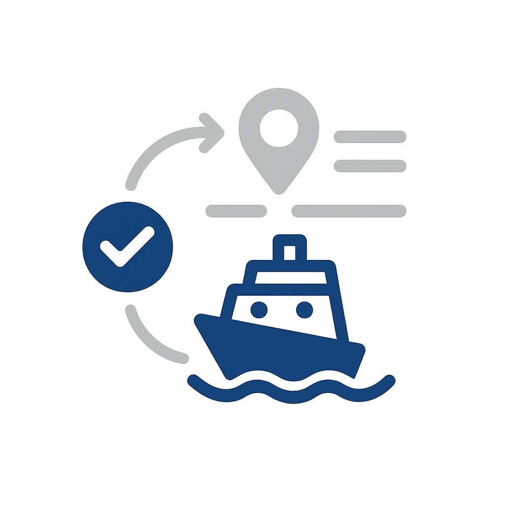

# ユースケースカタログ

業界の使用例では、特定分野の組織がAdobe Experience Platformとアプリケーションを適用して、測定可能なビジネス成果を達成する方法を示しています。 各ユースケースでは、具体的なビジネスシナリオ、予想される影響、詳細な実装ガイダンスを提供する [ ユースケースパターン ](/help/blueprints/use-case-patterns/overview.md) へのリンクについて説明します。

業界別に参照して組織に関連するユースケースを見つけたら、実装リファレンスのパターンリンク（意思決定ガイダンス、機能チェーン、Experience Leagueのドキュメントなど）に従います。

| 業種 | 主要テーマ |
| --- | --- |
| [ 自動車 ](automotive/automotive-overview.md) | 車両購入ジャーニー、サービスライフサイクル、コネクテッドカーエクスペリエンス、所有者の忠誠度 |
| [B2B](b2b/b2b-overview.md) | アカウントベースのマーケティング、リードスコアリング、パイプラインアクセラレーション、顧客拡張 |
| [ 金融サービス ](financial-services/financial-services-overview.md) | 製品レコメンデーション、チャーン防止、ライフステージオファー、不正のパーソナライゼーション |
| [ ヘルスケア ](healthcare/healthcare-overview.md) | アポイントメント管理、服薬アドヒアランス、患者のオンボーディング、ケアの調整 |
| [ 保険 ](insurance/insurance-overview.md) | ポリシー更新、請求エクスペリエンス、リスク回避、クロスセルの最適化 |
| [ メディア&amp;エンターテインメント ](media-entertainment/media-entertainment-overview.md) | コンテンツのレコメンデーション、サブスクリプションの保持、体験版のコンバージョン、クロスプラットフォームエンゲージメント |
| [ 小売 ](retail/retail-overview.md) | 製品のパーソナライゼーション、買い物かごの回復、クロスセルの最適化、ロイヤルティエンゲージメント |
| [ 電気通信 ](telecommunications/telecommunications-overview.md) | デバイスのアップグレード、チャーンの防止、プランの最適化、ネットワークエンゲージメント |
| [ 旅行・ホスピタリティ ](travel-hospitality/travel-hospitality-overview.md) | 予約パーソナライゼーション、放棄の回復、ロイヤルティプログラム、季節ごとのキャンペーン |
| [ テクノロジー](technology/technology-overview.md) | イベント収集、リアルタイムのデータ転送、分析との統合、エッジ展開 |

## ユースケースと実装ガイダンスの連携

各ユースケースは、**ユースケースパターン** にリンクしています。これは、ユースケースを実現するために必要な機能チェーン、決定ポイントおよび設定手順を説明する、繰り返し可能な実装アプローチです。 次に、ユースケースパターンが [ 主要なビジネス目標 ](/help/blueprints/business-objectives/overview.md) に関連付けられ、実装作業と戦略的成果の連携を支援します。

```
Industry Use Case → Use Case Pattern → Key Business Objective
```

## 業界別に参照

>[!BEGINTABS]

>[!TAB  小売 ]

| | ユースケース | 説明 | 成熟度 | パターン |
| --- | --- | --- | --- | --- |
|  | [ 放棄された買い物かごのメール復元 ](retail/retail-overview.md#abandoned-cart-email-recovery) | ショッピングカートを放棄した顧客に、カートの内容や関連するオファーを含むパーソナライズされたメールリマインダーを自動的に送信します。 | [!BADGE  基礎知識 ]{type=Neutral} | [ イベントトリガーメッセージ ](/help/blueprints/use-case-patterns/campaign-management-orchestration/event-triggered-messaging.md) |
|  | [ 在庫ベースの緊急度キャンペーン ](retail/retail-overview.md#inventory-based-urgency-campaigns) | 商品の在庫が少ない場合にリアルタイムのアラートやキャンペーンをトリガーし、緊急性を高め、即座に購入を促します。 | [!BADGE  基礎知識 ]{type=Neutral} | [ イベントトリガーメッセージ ](/help/blueprints/use-case-patterns/campaign-management-orchestration/event-triggered-messaging.md) |
|  | [ 価格下落アラート ](retail/retail-overview.md#price-drop-alerts) | ウィッシュリスト内の商品や以前に閲覧した商品の価格が下がった場合、メールやプッシュで顧客に通知します。 | [!BADGE  基礎知識 ]{type=Neutral} | [ イベントトリガーメッセージ ](/help/blueprints/use-case-patterns/campaign-management-orchestration/event-triggered-messaging.md) |
| | [ 在庫切れの通知 ](retail/retail-overview.md#out-of-stock-notifications) | 在庫切れの商品が利用可能になったときに通知を受け取る機能を顧客に提供し、その商品が利用可能になったときに電子メールやSMSで自動的に通知します。 | [!BADGE  基礎知識 ]{type=Neutral} | [ イベントトリガーメッセージ ](/help/blueprints/use-case-patterns/campaign-management-orchestration/event-triggered-messaging.md) |
|  | [ パーソナライズされた製品レコメンデーション ](retail/retail-overview.md#personalized-product-recommendations) | 閲覧履歴、購入履歴、類似顧客の行動にもとづいて、ホームページ、カテゴリーページ、製品詳細ページで、パーソナライズされた商品レコメンデーションを表示します。 | [!BADGE  新興 ]{type=Informative} | [ 行動に関する推奨事項 ](/help/blueprints/use-case-patterns/personalization/behavioral-recommendation.md) |
|  | [ パーソナライズされたカテゴリページ ](retail/retail-overview.md#personalized-category-pages) | 顧客の好み、過去の購入履歴、閲覧行動にもとづいて、カテゴリーページを動的にパーソナライズし、最も関連性の高い商品を最初に表示します。 | [!BADGE  新興 ]{type=Informative} | [ 行動に関する推奨事項 ](/help/blueprints/use-case-patterns/personalization/behavioral-recommendation.md) |
|  | [ 新しい Customer Welcome シリーズ ](retail/retail-overview.md#new-customer-welcome-series) | パーソナライズされた商品レコメンデーション、ブランドストーリー、特別オファーなど、新規顧客向けのマルチメールウェルカムシリーズを自動化します。 | [!BADGE  新興 ]{type=Informative} | [ 複数ステップの調整されたジャーニー](/help/blueprints/use-case-patterns/campaign-management-orchestration/multi-step-orchestrated-journey.md) |
|  | [ 補充リマインダ ](retail/retail-overview.md#replenishment-reminders) | 定期的に購入する商品（サブスクリプション商品、消耗品）に関する自動リマインダーを顧客に送信し、リピート購入を促します。 | [!BADGE  新興 ]{type=Informative} | [ 複数ステップの調整されたジャーニー](/help/blueprints/use-case-patterns/campaign-management-orchestration/multi-step-orchestrated-journey.md) |
|  | [ 購入後のフォローアップキャンペーン ](retail/retail-overview.md#post-purchase-follow-up-campaigns) | 製品ケアのヒント、関連製品、レビューリクエスト、ロイヤルティプログラム情報を含む購入後のメールを送信します。 | [!BADGE  新興 ]{type=Informative} | [ 複数ステップの調整されたジャーニー](/help/blueprints/use-case-patterns/campaign-management-orchestration/multi-step-orchestrated-journey.md) |
| | [ ソーシャルプルーフPersonalization](retail/retail-overview.md#social-proof-personalization) | 顧客のプロファイルと好みにもとづいて、パーソナライズされたソーシャルプルーフを表示できます。 | [!BADGE  新興 ]{type=Informative} | [ 既知の訪問者の Web/アプリPersonalization](/help/blueprints/use-case-patterns/personalization/known-visitor-web-app-personalization.md) |
|  | [ クロスセルとアップセルの推奨事項 ](retail/retail-overview.md#cross-sell-and-upsell-recommendations) | 購入パターンや商品の関連性にもとづいて、チェックアウト時、メール、商品ページで関連するクロスセルやアップセルの商品を表示します。 | [!BADGE  詳細 ]{type=Caution} | [Offer Decisioning](/help/blueprints/use-case-patterns/personalization/offer-decisioning.md) |
| | [VIPのお客様向け限定オファー ](retail/retail-overview.md#vip-customer-exclusive-offers) | 価値の高い顧客を特定し、限定オファー、セールスへの早期アクセス、パーソナライズされたショッピング体験を提供する。 | [!BADGE  詳細 ]{type=Caution} | [Decisioning を使用したクロスチャネルジャーニー](/help/blueprints/use-case-patterns/campaign-management-orchestration/cross-channel-journey-with-decisioning.md) |
| | [AI製品アドバイザー](retail/retail-overview.md#ai-product-advisor) | 自然なダイアログ、リアルタイムの在庫、パーソナライズされたプロファイルデータを使用して、商品の発見を通じて買い物客をガイドする会話型のAI アドバイザーを導入します。 | [!BADGE  詳細 ]{type=Caution} | [Brand Conciergeの会話体験](/help/blueprints/use-case-patterns/conversational-experience/brand-concierge-conversational-experience.md) |
| | [ クロスチャネルアトリビューション分析](retail/retail-overview.md#cross-channel-attribution-analysis) | マルチタッチアトリビューションモデルを使用して、メール、有料、実店舗のタッチポイントが、購買コンバージョンにどのように貢献しているのかを測定します。 | [!BADGE  新興 ]{type=Informative} | [Customer Analytics &amp; Insight Generation](/help/blueprints/use-case-patterns/analysis/customer-analytics-insight-generation.md) |
| | 有料メディアの[ オーディエンスのセグメント化とアクティベーション ](retail/retail-overview.md#audience-segmentation--activation-for-paid-media) | 統合された顧客プロファイルから価値の高いオーディエンスセグメントを構築し、Google Ads、Meta、The Trade Deskなどの有料メディアをまたいで活用することで、獲得やリターゲティング施策を実施できます。 | [!BADGE  新興 ]{type=Informative} | [宛先へのAudience Activation](/help/blueprints/use-case-patterns/audience-building-activation/audience-activation-to-destinations.md) |
| | [獲得キャンペーンの顧客抑制](retail/retail-overview.md#customer-suppression-for-acquisition-campaigns) | 除外オーディエンスを有料メディアの宛先にアクティベートし、無駄な支出を削減することで、既存顧客や最近のコンバージョンした顧客を獲得広告の支出から除外します。 | [!BADGE  基礎知識 ]{type=Neutral} | [宛先へのAudience Activation](/help/blueprints/use-case-patterns/audience-building-activation/audience-activation-to-destinations.md) |
| | [既知の訪問者に対してパーソナライズされたWeb エクスペリエンス ](retail/retail-overview.md#personalized-web-experiences-for-known-visitors) | リアルタイムのプロファイル、セグメントメンバーシップ、行動履歴などにもとづいて、認証されたweb サイト訪問者にパーソナライズされたヒーローバナー、製品レコメンデーション、プロモーションコンテンツを提供します。 | [!BADGE  詳細 ]{type=Caution} | [ 既知の訪問者の Web/アプリPersonalization](/help/blueprints/use-case-patterns/personalization/known-visitor-web-app-personalization.md) |
| | [ 匿名訪問者の Web Personalization](retail/retail-overview.md#anonymous-visitor-web-personalization) | 閲覧したページ、閲覧した製品カテゴリー、紹介したソースなど、セッション内の行動シグナルを使用して、識別できないweb サイト訪問者のコンテンツをパーソナライズできます。 | [!BADGE  新興 ]{type=Informative} | [ 匿名訪問者の Web Personalization](/help/blueprints/use-case-patterns/personalization/anonymous-visitor-web-personalization.md) |
|  | [ ウェルカムシリーズジャーニー](retail/retail-overview.md#welcome-series-journey) | 新規登録者に対してマルチステップのウェルカムジャーニーをオーケストレーションし、オンボーディングコンテンツ、製品エデュケーション、初回購入時のインセンティブをメールとプッシュチャネルをまたいで提供できます。 | [!BADGE  新興 ]{type=Informative} | [ 複数ステップの調整されたジャーニー](/help/blueprints/use-case-patterns/campaign-management-orchestration/multi-step-orchestrated-journey.md) |
|  | [ カート放棄の回復](retail/retail-overview.md#cart-abandonment-recovery) | ショッピングカートを放棄した際に、リアルタイムの電子メールやプッシュ通知をトリガーします。これにより、パーソナライズされた商品リマインダーと、購入完了までの時間限定のインセンティブを提供します。 | [!BADGE  新興 ]{type=Informative} | [ イベントトリガーメッセージ ](/help/blueprints/use-case-patterns/campaign-management-orchestration/event-triggered-messaging.md) |
|  | [購入後のエンゲージメントジャーニー](retail/retail-overview.md#post-purchase-engagement-journey) | オーケストレーションされたマルチステップのジャーニーを通じて、注文確認、出荷更新、クロスセルのレコメンデーション、レビューリクエストなどを含む購入後のコミュニケーションを提供します。 | [!BADGE  新興 ]{type=Informative} | [ 複数ステップの調整されたジャーニー](/help/blueprints/use-case-patterns/campaign-management-orchestration/multi-step-orchestrated-journey.md) |
| | [ ロイヤルティ層アップグレードキャンペーン ](retail/retail-overview.md#loyalty-tier-upgrade-campaign) | ロイヤルティ層のしきい値に近づいている顧客を特定し、購買履歴や嗜好にもとづいてパーソナライズされたオファーを提供して、次の層に到達するように促す、ターゲットを絞ったキャンペーンを実施します。 | [!BADGE  詳細 ]{type=Caution} | [ 複数ステップの調整されたジャーニー](/help/blueprints/use-case-patterns/campaign-management-orchestration/multi-step-orchestrated-journey.md) |
| | [ クロスチャネルキャンペーンオーケストレーション ](retail/retail-overview.md#cross-channel-campaign-orchestration) | ジャーニーの分岐、待機ステップ、頻度の上限を設定し、メール、SMS、プッシュ、web チャネルをまたいで調整されたマーケティングキャンペーンを編成し、疲れることなくエンゲージメントを最大化します。 | [!BADGE  詳細 ]{type=Caution} | [Decisioning を使用したクロスチャネルジャーニー](/help/blueprints/use-case-patterns/campaign-management-orchestration/cross-channel-journey-with-decisioning.md) |
| | [Brand Conciergeの会話体験](retail/retail-overview.md#brand-concierge-conversational-experience) | AIを活用した、ブランドの基準に即した会話型エージェントをデジタルプロパティ全体に展開して、パーソナライズされた製品ガイダンス、サイトナビゲーションに関するヘルプ、ライブエージェントへのシームレスな引き継ぎを提供します。 | [!BADGE  詳細 ]{type=Caution} | [Brand Conciergeの会話体験](/help/blueprints/use-case-patterns/conversational-experience/brand-concierge-conversational-experience.md) |

>[!TAB  自動車 ]

| | ユースケース | 説明 | 成熟度 | パターン |
| --- | --- | --- | --- | --- |
|  | [ サービス予定のリマインダー ](automotive/automotive-overview.md#service-appointment-reminders) | 車両の走行距離、サービス履歴、顧客の好みにもとづいて、パーソナライズされたサービス予約のリマインダーを送信します。 | [!BADGE  基礎知識 ]{type=Neutral} | [ イベントトリガーメッセージ ](/help/blueprints/use-case-patterns/campaign-management-orchestration/event-triggered-messaging.md) |
|  | [ 車両のリコール通知 ](automotive/automotive-overview.md#vehicle-recall-notifications) | 顧客の車両と場所にもとづいて、サービスのスケジューリングオプションや安全情報を提示し、パーソナライズされたリコール通知を送信できます。 | [!BADGE  基礎知識 ]{type=Neutral} | [ イベントトリガーメッセージ ](/help/blueprints/use-case-patterns/campaign-management-orchestration/event-triggered-messaging.md) |
|  | [ テストドライブのスケジュール設定 ](automotive/automotive-overview.md#test-drive-scheduling) | 顧客の好みや場所にもとづいて、ディーラーからのレコメンデーションや車両の在庫状況を確認し、パーソナライズされた試乗のスケジュールを実現できます。 | [!BADGE  基礎知識 ]{type=Neutral} | [ イベントトリガーメッセージ ](/help/blueprints/use-case-patterns/campaign-management-orchestration/event-triggered-messaging.md) |
|  | [ 新モデルのローンチキャンペーン ](automotive/automotive-overview.md#new-model-launch-campaigns) | 現在の車両、好み、購入履歴などにもとづいて、新しいモデルの発売に興味を持つ可能性のある顧客をターゲットにします。 | [!BADGE  基礎知識 ]{type=Neutral} | [ バッチ送信メッセージの有効化 ](/help/blueprints/use-case-patterns/campaign-management-orchestration/batch-outbound-message-activation.md) |
|  | [ 下取り価格キャンペーン ](automotive/automotive-overview.md#trade-in-value-campaigns) | 車両をアップグレードする準備ができている可能性のある顧客に、下取り価値の評価やキャンペーンを積極的に提供します。 | [!BADGE  新興 ]{type=Informative} | [ 複数ステップの調整されたジャーニー](/help/blueprints/use-case-patterns/campaign-management-orchestration/multi-step-orchestrated-journey.md) |
|  | [ パーツおよびアクセサリの推奨事項 ](automotive/automotive-overview.md#parts-and-accessories-recommendations) | 車両モデル、所有期間、顧客の好みにもとづいて、関連部品、アクセサリー、アップグレードをレコメンドします。 | [!BADGE  新興 ]{type=Informative} | [ 行動に関する推奨事項 ](/help/blueprints/use-case-patterns/personalization/behavioral-recommendation.md) |
|  | [ 保証および延長サービスプラン ](automotive/automotive-overview.md#warranty-and-extended-service-plans) | 車両の年齢、走行距離、顧客の購入パターンなどに基づいて、最適なタイミングで保証プランや延長サービスプランをレコメンドします。 | [!BADGE  新興 ]{type=Informative} | [ 複数ステップの調整されたジャーニー](/help/blueprints/use-case-patterns/campaign-management-orchestration/multi-step-orchestrated-journey.md) |
|  | [ コネクテッドカー機能の有効化 ](automotive/automotive-overview.md#connected-car-feature-activation) | 車両の機能と顧客テクノロジーの好みにもとづいて、コネクテッドカーの機能に関するレコメンデーションやアクティベーションキャンペーンをパーソナライズできます。 | [!BADGE  新興 ]{type=Informative} | [ 複数ステップの調整されたジャーニー](/help/blueprints/use-case-patterns/campaign-management-orchestration/multi-step-orchestrated-journey.md) |
|  | [ 販売店ネットワークの連携 ](automotive/automotive-overview.md#dealer-network-coordination) | 顧客の所在地、好み、ディーラーの在庫にもとづいて、パーソナライズされたディーラーのレコメンデーションと調整が可能です。 | [!BADGE  新興 ]{type=Informative} | [ 既知の訪問者の Web/アプリPersonalization](/help/blueprints/use-case-patterns/personalization/known-visitor-web-app-personalization.md) |
|  | [ 車両購入ジャーニーPersonalization](automotive/automotive-overview.md#vehicle-purchase-journey-personalization) | 関連する自動車レコメンデーション、融資オプション、ディーラー情報を利用して、調査から購入に至るまでの自動車購入ジャーニーをパーソナライズできます。 | [!BADGE  詳細 ]{type=Caution} | [Decisioning を使用したクロスチャネルジャーニー](/help/blueprints/use-case-patterns/campaign-management-orchestration/cross-channel-journey-with-decisioning.md) |
|  | [ 資金及び保険の申込み ](automotive/automotive-overview.md#financing-and-insurance-offers) | 顧客のクレジットプロファイル、自動車の選択肢、購入タイムラインにもとづいて、パーソナライズされた融資と保険オファーを提示します。 | [!BADGE  詳細 ]{type=Caution} | [Offer Decisioning](/help/blueprints/use-case-patterns/personalization/offer-decisioning.md) |
|  | [ 所有者ロイヤルティプログラム ](automotive/automotive-overview.md#owner-loyalty-programs) | 所有者の履歴とロイヤルティ層にもとづいて、所有者のロイヤルティプログラム、コミュニケーション、特典、限定オファーをパーソナライズできます。 | [!BADGE  詳細 ]{type=Caution} | [Decisioning を使用したクロスチャネルジャーニー](/help/blueprints/use-case-patterns/campaign-management-orchestration/cross-channel-journey-with-decisioning.md) |

>[!TAB  金融サービス ]

| | ユースケース | 説明 | 成熟度 | パターン |
| --- | --- | --- | --- | --- |
| | [ 取引ベースのアラート及び推奨事項 ](financial-services/financial-services-overview.md#transaction-based-alerts-and-recommendations) | トランザクションにリアルタイムのアラートを送信し、支出パターンやアカウントのアクティビティにもとづいてパーソナライズされたレコメンデーションを提供します。 | [!BADGE  基礎知識 ]{type=Neutral} | [ イベントトリガーメッセージ ](/help/blueprints/use-case-patterns/campaign-management-orchestration/event-triggered-messaging.md) |
| | [ クレジットカード申込放棄の回収 ](financial-services/financial-services-overview.md#credit-card-application-abandonment-recovery) | クレジットカードの申し込みを開始したものの、完了しなかった顧客を特定し、パーソナライズされたメッセージやオファーを提供して、リエンゲージメントします。 | [!BADGE  基礎知識 ]{type=Neutral} | [ イベントトリガーメッセージ ](/help/blueprints/use-case-patterns/campaign-management-orchestration/event-triggered-messaging.md) |
| | [ 不正行為に対する警告Personalization](financial-services/financial-services-overview.md#fraud-alert-personalization) | 顧客のコミュニケーション嗜好や過去のインタラクション履歴にもとづいて、不正行為のアラートやセキュリティコミュニケーションをパーソナライズできます。 | [!BADGE  基礎知識 ]{type=Neutral} | [ イベントトリガーメッセージ ](/help/blueprints/use-case-patterns/campaign-management-orchestration/event-triggered-messaging.md) |
|  | [ 高価値鉛育成 ](financial-services/financial-services-overview.md#high-value-lead-nurturing) | プロファイルデータや行動にもとづいて価値の高い見込み顧客を特定し、自動化されたジャーニーを通じて、パーソナライズされたコンテンツやオファーで育成できます。 | [!BADGE  新興 ]{type=Informative} | [ 複数ステップの調整されたジャーニー](/help/blueprints/use-case-patterns/campaign-management-orchestration/multi-step-orchestrated-journey.md) |
|  | [ パーソナライズされたアカウントダッシュボード ](financial-services/financial-services-overview.md#personalized-account-dashboard) | 顧客アカウントのアクティビティ、好み、財務目標にもとづいて、オンラインバンキングダッシュボードやモバイルアプリ体験をパーソナライズできます。 | [!BADGE  新興 ]{type=Informative} | [ 既知の訪問者の Web/アプリPersonalization](/help/blueprints/use-case-patterns/personalization/known-visitor-web-app-personalization.md) |
| | [ 投資Portfolioの提言 ](financial-services/financial-services-overview.md#investment-portfolio-recommendations) | 顧客のリスクプロファイル、投資履歴、財務目標に基づいて、パーソナライズされた投資レコメンデーションを提供します。 | [!BADGE  新興 ]{type=Informative} | [ 行動に関する推奨事項 ](/help/blueprints/use-case-patterns/personalization/behavioral-recommendation.md) |
| | [ 住宅ローン事前承認キャンペーン ](financial-services/financial-services-overview.md#mortgage-pre-approval-campaigns) | プロファイルデータ、行動、ライフステージの指標にもとづいて、住宅ローン市場に参入する可能性の高い顧客をターゲットにします。 | [!BADGE  新興 ]{type=Informative} | [ 複数ステップの調整されたジャーニー](/help/blueprints/use-case-patterns/campaign-management-orchestration/multi-step-orchestrated-journey.md) |
|  | [ 既存顧客への製品レコメンデーション ](financial-services/financial-services-overview.md#product-recommendation-for-existing-customers) | プロファイル、取引履歴、ライフステージに基づいて、既存顧客に関連性の高い金融商品をレコメンドします。 | [!BADGE  詳細 ]{type=Caution} | [Offer Decisioning](/help/blueprints/use-case-patterns/personalization/offer-decisioning.md) |
|  | [ チャーン防止キャンペーン ](financial-services/financial-services-overview.md#churn-prevention-campaigns) | AIを活用した予測ツールを使用して、チャーン（離脱）のリスクがある顧客を特定し、顧客維持に関するオファーやパーソナライズされたコミュニケーションを提供して、エンゲージできます。 | [!BADGE  詳細 ]{type=Caution} | [Decisioning を使用したクロスチャネルジャーニー](/help/blueprints/use-case-patterns/campaign-management-orchestration/cross-channel-journey-with-decisioning.md) |
|  | [ ライフステージベースの製品オファー ](financial-services/financial-services-overview.md#life-stage-based-product-offers) | 新しいライフステージに入る顧客を特定し、関連性の高い金融商品やサービスを積極的に提供します。 | [!BADGE  詳細 ]{type=Caution} | [Decisioning を使用したクロスチャネルジャーニー](/help/blueprints/use-case-patterns/campaign-management-orchestration/cross-channel-journey-with-decisioning.md) |
| | [ ロイヤルティプログラムのエンゲージメント ](financial-services/financial-services-overview.md#loyalty-program-engagement) | 顧客層、ポイント残高、引き換え履歴などにもとづいて、ロイヤルティプログラムのコミュニケーション、報酬、オファーをパーソナライズできます。 | [!BADGE  詳細 ]{type=Caution} | [Decisioning を使用したクロスチャネルジャーニー](/help/blueprints/use-case-patterns/campaign-management-orchestration/cross-channel-journey-with-decisioning.md) |
| | [ パーソナライズされた金融教育コンテンツ ](financial-services/financial-services-overview.md#personalized-financial-education-content) | 顧客の財務プロファイル、目標、興味に基づいて、パーソナライズされた金融エデュケーションコンテンツ、ヒント、リソースを提供します。 | [!BADGE  詳細 ]{type=Caution} | [Decisioning を使用したクロスチャネルジャーニー](/help/blueprints/use-case-patterns/campaign-management-orchestration/cross-channel-journey-with-decisioning.md) |
| | [AI金融商品ガイド ](financial-services/financial-services-overview.md#ai-financial-product-guide) | コンプライアンス対応のレビュー済みコンテンツとリアルタイムのプロファイルデータにもとづいた会話型AIにより、顧客が金融商品を理解し、アカウントオプションを操作できるようにします。 | [!BADGE  詳細 ]{type=Caution} | [Brand Conciergeの会話体験](/help/blueprints/use-case-patterns/conversational-experience/brand-concierge-conversational-experience.md) |
| | [製品の導入Funnelと解約ドライバー分析](financial-services/financial-services-overview.md#product-adoption-funnel-and-churn-driver-analysis) | オンボーディングフローのどこで顧客が脱落するのか、どの行動が製品の離反を予測しているのかを特定します。 | [!BADGE  新興 ]{type=Informative} | [Customer Analytics &amp; Insight Generation](/help/blueprints/use-case-patterns/analysis/customer-analytics-insight-generation.md) |
|  | [次善のOffer Decisioning](financial-services/financial-services-overview.md#next-best-offer-decisioning) | 一元化された意思決定ロジックを使用して、適格性ルール、ビジネスの制約、AIを活用したランキング戦略を組み合わせ、チャネルをまたいで各顧客に最も関連性の高いオファーを選択します。 | [!BADGE  詳細 ]{type=Caution} | [Offer Decisioning](/help/blueprints/use-case-patterns/personalization/offer-decisioning.md) |
| | [Customer Journey Analytics ダッシュボード ](financial-services/financial-services-overview.md#customer-journey-analytics-dashboard) | web、アプリ、電子メール、コールセンターのデータを組み合わせたクロスチャネル分析ワークスペースを構築して、カスタマージャーニーを可視化し、ドロップオフポイントを特定し、キャンペーンのアトリビューションを測定します。 | [!BADGE  新興 ]{type=Informative} | [Customer Analytics &amp; Insight Generation](/help/blueprints/use-case-patterns/analysis/customer-analytics-insight-generation.md) |

>[!TAB  ヘルスケア ]

| | ユースケース | 説明 | 成熟度 | パターン |
| --- | --- | --- | --- | --- |
|  | [ 予定リマインダ自動処理 ](healthcare/healthcare-overview.md#appointment-reminder-automation) | 患者の好みや予約タイプにもとづいて、パーソナライズされた予約リマインダーを電子メール、SMS、プッシュ通知で送信できます。 | [!BADGE  基礎知識 ]{type=Neutral} | [ イベントトリガーメッセージ ](/help/blueprints/use-case-patterns/campaign-management-orchestration/event-triggered-messaging.md) |
|  | [ 訪問後のフォローアップキャンペーン ](healthcare/healthcare-overview.md#post-visit-follow-up-campaigns) | 訪問の種類や患者のニーズにもとづいて、訪問後の調査、ケアの指示、フォローアップの予約リマインダーを自動的に送信できます。 | [!BADGE  基礎知識 ]{type=Neutral} | [ イベントトリガーメッセージ ](/help/blueprints/use-case-patterns/campaign-management-orchestration/event-triggered-messaging.md) |
| | [ ラボ結果通知 ](healthcare/healthcare-overview.md#lab-results-notification) | ラボの結果が好みのコミュニケーションチャネルを通じて利用可能になると、パーソナライズされたメッセージで患者に通知します。 | [!BADGE  基礎知識 ]{type=Neutral} | [ イベントトリガーメッセージ ](/help/blueprints/use-case-patterns/campaign-management-orchestration/event-triggered-messaging.md) |
| | [ 保険金額の検証等 ](healthcare/healthcare-overview.md#insurance-coverage-verification) | 請求上の問題を軽減し、患者エクスペリエンスを向上させるために、予約前に保険カバレッジ情報を患者に積極的に確認し、伝えます。 | [!BADGE  基礎知識 ]{type=Neutral} | [ イベントトリガーメッセージ ](/help/blueprints/use-case-patterns/campaign-management-orchestration/event-triggered-messaging.md) |
| | [ テレヘルスの予定のリマインダー ](healthcare/healthcare-overview.md#telehealth-appointment-reminders) | 接続手順、準備のヒント、テクニカルサポート情報などを記載した、パーソナライズされたリマインダーを遠隔医療の予約に送信します。 | [!BADGE  基礎知識 ]{type=Neutral} | [ イベントトリガーメッセージ ](/help/blueprints/use-case-patterns/campaign-management-orchestration/event-triggered-messaging.md) |
|  | [ 予防ケアに関するリマインダー ](healthcare/healthcare-overview.md#preventive-care-reminders) | 年齢、病歴、危険因子に基づいて推奨される予防ケアについて患者に積極的にリマインドする。 | [!BADGE  基礎知識 ]{type=Neutral} | [ バッチ送信メッセージの有効化 ](/help/blueprints/use-case-patterns/campaign-management-orchestration/batch-outbound-message-activation.md) |
|  | [ 服薬遵守キャンペーン ](healthcare/healthcare-overview.md#medication-adherence-campaigns) | パーソナライズされたリマインダーや教育コンテンツを送信し、患者が投薬スケジュールや治療計画を遵守できるようにします。 | [!BADGE  新興 ]{type=Informative} | [ 複数ステップの調整されたジャーニー](/help/blueprints/use-case-patterns/campaign-management-orchestration/multi-step-orchestrated-journey.md) |
| | [ 慢性疾患管理プログラム ](healthcare/healthcare-overview.md#chronic-disease-management-programs) | 患者の状態や治療計画にもとづいて、慢性疾患管理に関するコミュニケーション、教育コンテンツ、モニタリングリマインダーをパーソナライズできます。 | [!BADGE  新興 ]{type=Informative} | [ 複数ステップの調整されたジャーニー](/help/blueprints/use-case-patterns/campaign-management-orchestration/multi-step-orchestrated-journey.md) |
| | [ 新規患者オンボーディングジャーニー](healthcare/healthcare-overview.md#new-patient-onboarding-journey) | ウェルカム情報、ポータルへのアクセス手順、予約のスケジューリングガイダンスにより、新規患者に対するマルチステップのオンボーディングジャーニーを自動化します。 | [!BADGE  新興 ]{type=Informative} | [ 複数ステップの調整されたジャーニー](/help/blueprints/use-case-patterns/campaign-management-orchestration/multi-step-orchestrated-journey.md) |
| | [ ウェルネスプログラムへの参加 ](healthcare/healthcare-overview.md#wellness-program-engagement) | 患者の健康目標、活動レベル、嗜好などにもとづいて、ウェルネスプログラムのコミュニケーション、課題、報酬をパーソナライズできます。 | [!BADGE  新興 ]{type=Informative} | [ 複数ステップの調整されたジャーニー](/help/blueprints/use-case-patterns/campaign-management-orchestration/multi-step-orchestrated-journey.md) |
| | [ ケアチームの連携 ](healthcare/healthcare-overview.md#care-team-coordination) | ケアプランや嗜好にもとづいて、患者とケアチームメンバーとのパーソナライズされたコミュニケーションと調整を実現します。 | [!BADGE  新興 ]{type=Informative} | [ 複数ステップの調整されたジャーニー](/help/blueprints/use-case-patterns/campaign-management-orchestration/multi-step-orchestrated-journey.md) |
| | [ パーソナライズされたヘルスコンテンツ配信 ](healthcare/healthcare-overview.md#personalized-health-content-delivery) | 患者の状態、興味、健康目標に基づいて、パーソナライズされた健康教育コンテンツ、健康に関するヒント、リソースを提供します。 | [!BADGE  詳細 ]{type=Caution} | [Decisioning を使用したクロスチャネルジャーニー](/help/blueprints/use-case-patterns/campaign-management-orchestration/cross-channel-journey-with-decisioning.md) |
| | [患者Funnelとケアギャップ分析](healthcare/healthcare-overview.md#patient-journey-funnel-and-care-gap-analysis) | 患者がどこでケア経路から離脱しているのか、どの会員集団が推奨ケアにギャップがあるのかを特定する。 | [!BADGE  新興 ]{type=Informative} | [Customer Analytics &amp; Insight Generation](/help/blueprints/use-case-patterns/analysis/customer-analytics-insight-generation.md) |
| | [Patient Portal Content Personalization](healthcare/healthcare-overview.md#patient-portal-content-personalization) | セッション中の閲覧行動とエンゲージメント履歴にもとづいて、患者のポータル体験をパーソナライズします | [!BADGE  新興 ]{type=Informative} | [ 行動に関する推奨事項 ](/help/blueprints/use-case-patterns/personalization/behavioral-recommendation.md) |
| | [患者のエンゲージメントと予約に関するリマインダー](healthcare/healthcare-overview.md#patient-engagement--appointment-reminders) | コンプライアンスに準拠し、同意に応じたマルチチャネルジャーニーを通じて、パーソナライズされた予約リマインダー、健康のヒント、フォローアップケアコミュニケーションを送信します。 | [!BADGE  新興 ]{type=Informative} | [ イベントトリガーメッセージ ](/help/blueprints/use-case-patterns/campaign-management-orchestration/event-triggered-messaging.md) |

>[!TAB  保険 ]

| | ユースケース | 説明 | 成熟度 | パターン |
| --- | --- | --- | --- | --- |
|  | [ 政策更新キャンペーン ](insurance/insurance-overview.md#policy-renewal-campaigns) | 顧客ポリシーの履歴、要求、嗜好にもとづいて、パーソナライズされたポリシー更新リマインダーとオファーを送信します。 | [!BADGE  基礎知識 ]{type=Neutral} | [ 複数ステップの調整されたジャーニー](/help/blueprints/use-case-patterns/campaign-management-orchestration/multi-step-orchestrated-journey.md) |
| | [ ポリシー変更の通知 ](insurance/insurance-overview.md#policy-change-notifications) | 顧客のポリシーと好みにもとづいて、ポリシーの変更、更新、新しいカバレッジオプションに関するパーソナライズされた通知を送信します。 | [!BADGE  基礎知識 ]{type=Neutral} | [ イベントトリガーメッセージ ](/help/blueprints/use-case-patterns/campaign-management-orchestration/event-triggered-messaging.md) |
| | [ 見積もり放棄のリカバリ ](insurance/insurance-overview.md#quote-abandonment-recovery) | パーソナライズされたフォローアップとオファーにより、保険見積もりを開始したものの完了しなかった顧客とリエンゲージメントします。 | [!BADGE  基礎知識 ]{type=Neutral} | [ イベントトリガーメッセージ ](/help/blueprints/use-case-patterns/campaign-management-orchestration/event-triggered-messaging.md) |
| | [ 不正請求防止等 ](insurance/insurance-overview.md#claims-fraud-prevention) | AIを活用した不正検知により、顧客の信頼を維持しながら疑わしい請求を特定し、調査コミュニケーションをパーソナライズできます。 | [!BADGE  基礎知識 ]{type=Neutral} | [ イベントトリガーメッセージ ](/help/blueprints/use-case-patterns/campaign-management-orchestration/event-triggered-messaging.md) |
| | [ 致命的なイベントの応答 ](insurance/insurance-overview.md#catastrophic-event-response) | パーソナライズされたサポートと請求情報により、自然災害や災害の発生時に、被災地の顧客と積極的にコミュニケーションを取ることができます。 | [!BADGE  基礎知識 ]{type=Neutral} | [ イベントトリガーメッセージ ](/help/blueprints/use-case-patterns/campaign-management-orchestration/event-triggered-messaging.md) |
| | [ 代理及び媒介の連携 ](insurance/insurance-overview.md#agent-and-broker-coordination) | ポリシーのニーズや好みにもとづいて、顧客と代理店/仲介業者の間でパーソナライズされたコミュニケーションと調整が可能です。 | [!BADGE  基礎知識 ]{type=Neutral} | [ バッチ送信メッセージの有効化 ](/help/blueprints/use-case-patterns/campaign-management-orchestration/batch-outbound-message-activation.md) |
|  | [ 請求プロセスのPersonalization](insurance/insurance-overview.md#claims-process-personalization) | 請求のタイプ、顧客の好み、請求履歴などにもとづいて、請求プロセスのコミュニケーション、更新、サポートをパーソナライズできます。 | [!BADGE  新興 ]{type=Informative} | [ 複数ステップの調整されたジャーニー](/help/blueprints/use-case-patterns/campaign-management-orchestration/multi-step-orchestrated-journey.md) |
| | [ リスクの評価及び予防 ](insurance/insurance-overview.md#risk-assessment-and-prevention) | 顧客ポリシーの種類、場所、リスク要因にもとづいて、パーソナライズされたリスク評価情報と予防のヒントを提供します。 | [!BADGE  新興 ]{type=Informative} | [ 複数ステップの調整されたジャーニー](/help/blueprints/use-case-patterns/campaign-management-orchestration/multi-step-orchestrated-journey.md) |
| | [ 健康増進予防事業 ](insurance/insurance-overview.md#wellness-and-prevention-programs) | 参加と目標にもとづいて、健康/生命保険の顧客に対するウェルネスプログラムのコミュニケーションと報酬をパーソナライズします。 | [!BADGE  新興 ]{type=Informative} | [ 複数ステップの調整されたジャーニー](/help/blueprints/use-case-patterns/campaign-management-orchestration/multi-step-orchestrated-journey.md) |
|  | [ クロスセル製品レコメンデーション ](insurance/insurance-overview.md#cross-sell-product-recommendations) | 顧客の既存の方針、ライフステージ、リスクプロファイルにもとづいて、追加的な保険商品をレコメンドします。 | [!BADGE  詳細 ]{type=Caution} | [Offer Decisioning](/help/blueprints/use-case-patterns/personalization/offer-decisioning.md) |
|  | [ ライフステージベースの製品オファー ](insurance/insurance-overview.md#life-stage-based-product-offers) | 新しいライフステージに入る顧客を特定し、関連性の高い金融商品やサービスを積極的に提供します。 | [!BADGE  詳細 ]{type=Caution} | [Decisioning を使用したクロスチャネルジャーニー](/help/blueprints/use-case-patterns/campaign-management-orchestration/cross-channel-journey-with-decisioning.md) |
| | [ 割引及び貯蓄の機会 ](insurance/insurance-overview.md#discount-and-savings-opportunities) | 顧客プロファイルと行動にもとづいて、パーソナライズされた割引機会を特定し、コミュニケーションできます。 | [!BADGE  詳細 ]{type=Caution} | [Offer Decisioning](/help/blueprints/use-case-patterns/personalization/offer-decisioning.md) |
| | [保険契約者ポータル コンテンツ Personalization](insurance/insurance-overview.md#policyholder-portal-content-personalization) | 行動とポリシーポートフォリオに基づいて、認証済みポータルとアプリ体験をパーソナライズします | [!BADGE  新興 ]{type=Informative} | [ 行動に関する推奨事項 ](/help/blueprints/use-case-patterns/personalization/behavioral-recommendation.md) |

>[!TAB  メディア&amp;エンターテインメント ]

| | ユースケース | 説明 | 成熟度 | パターン |
| --- | --- | --- | --- | --- |
|  | [ 新しいコンテンツリリースの通知 ](media-entertainment/media-entertainment-overview.md#new-content-release-notifications) | 好みや視聴履歴に合わせて、新しいコンテンツがリリースされたことをオーディエンスに通知できます。 | [!BADGE  基礎知識 ]{type=Neutral} | [ イベントトリガーメッセージ ](/help/blueprints/use-case-patterns/campaign-management-orchestration/event-triggered-messaging.md) |
| | [ ウォッチリストとお気に入りのリマインダー ](media-entertainment/media-entertainment-overview.md#watchlist-and-favorites-reminders) | ウォッチリストのコンテンツやまだ視聴していないお気に入りに関するリマインダーをユーザーに送信します。 | [!BADGE  基礎知識 ]{type=Neutral} | [ イベントトリガーメッセージ ](/help/blueprints/use-case-patterns/campaign-management-orchestration/event-triggered-messaging.md) |
| | [ ライブイベント表示リマインダー ](media-entertainment/media-entertainment-overview.md#live-event-viewing-reminders) | 興味や視聴履歴に一致する今後のライブイベント、スポーツゲーム、プレミア番組について、ユーザーに通知します。 | [!BADGE  基礎知識 ]{type=Neutral} | [ イベントトリガーメッセージ ](/help/blueprints/use-case-patterns/campaign-management-orchestration/event-triggered-messaging.md) |
| | [ コンテンツ完了キャンペーン ](media-entertainment/media-entertainment-overview.md#content-completion-campaigns) | リマインダーを送り、視聴を開始したものの完了しなかったコンテンツを視聴します。 | [!BADGE  基礎知識 ]{type=Neutral} | [ イベントトリガーメッセージ ](/help/blueprints/use-case-patterns/campaign-management-orchestration/event-triggered-messaging.md) |
|  | [ コンテンツ推奨エンジン ](media-entertainment/media-entertainment-overview.md#content-recommendation-engine) | web、電子メール、アプリ内チャネルで配信される行動シグナルと選択戦略を活用して、パーソナライズされたコンテンツレコメンデーションを生成します。 | [!BADGE  新興 ]{type=Informative} | [ 行動に関する推奨事項 ](/help/blueprints/use-case-patterns/personalization/behavioral-recommendation.md) |
| | [ パーソナライズされたホームページのエクスペリエンス ](media-entertainment/media-entertainment-overview.md#personalized-homepage-experience) | ホームページとコンテンツ発見ページを動的にパーソナライズして、ユーザープロファイルと行動にもとづいて、最も関連性の高いコンテンツを最初に表示します。 | [!BADGE  新興 ]{type=Informative} | [ 行動に関する推奨事項 ](/help/blueprints/use-case-patterns/personalization/behavioral-recommendation.md) |
| | [ パーソナライズされたプレイリストの生成 ](media-entertainment/media-entertainment-overview.md#personalized-playlist-generation) | ユーザーのリスニング履歴、好み、ムード指標にもとづいて、パーソナライズされたプレイリストを自動的に生成および更新します。 | [!BADGE  新興 ]{type=Informative} | [ 行動に関する推奨事項 ](/help/blueprints/use-case-patterns/personalization/behavioral-recommendation.md) |
| | [ 無料トライアルコンバージョンキャンペーン ](media-entertainment/media-entertainment-overview.md#free-trial-conversion-campaigns) | パーソナライズされたコンテンツのレコメンデーションやオファーを無料トライアルユーザーに提供し、トライアル終了前にサブスクリプションのコンバージョンを促進できます。 | [!BADGE  新興 ]{type=Informative} | [ 複数ステップの調整されたジャーニー](/help/blueprints/use-case-patterns/campaign-management-orchestration/multi-step-orchestrated-journey.md) |
| | [ クロスプラットフォームコンテンツ同期 ](media-entertainment/media-entertainment-overview.md#cross-platform-content-sync) | 視聴履歴、嗜好、レコメンデーションをリアルタイムで同期することで、デバイスをまたいでシームレスなコンテンツエクスペリエンスを提供できます。 | [!BADGE  新興 ]{type=Informative} | [ 既知の訪問者の Web/アプリPersonalization](/help/blueprints/use-case-patterns/personalization/known-visitor-web-app-personalization.md) |
| | [ ソーシャル共有Personalization](media-entertainment/media-entertainment-overview.md#social-sharing-personalization) | 利用者のソーシャル上のつながりやコンテンツの環境設定にもとづいて、ソーシャル共有のプロンプトやレコメンデーションをパーソナライズできます。 | [!BADGE  新興 ]{type=Informative} | [ 既知の訪問者の Web/アプリPersonalization](/help/blueprints/use-case-patterns/personalization/known-visitor-web-app-personalization.md) |
|  | [ 購読チャーンの防止 ](media-entertainment/media-entertainment-overview.md#subscription-churn-prevention) | キャンセルのリスクがある購読者を特定し、パーソナライズされたコンテンツのレコメンデーション、オファー、リテンション施策でエンゲージします。 | [!BADGE  詳細 ]{type=Caution} | [Decisioning を使用したクロスチャネルジャーニー](/help/blueprints/use-case-patterns/campaign-management-orchestration/cross-channel-journey-with-decisioning.md) |
| | [Premium 機能のアップセル ](media-entertainment/media-entertainment-overview.md#premium-feature-upsell) | プレミアム機能から恩恵を受けるユーザーを特定し、その使用パターンにもとづいてパーソナライズされたアップセルオファーを提供します。 | [!BADGE  詳細 ]{type=Caution} | [Offer Decisioning](/help/blueprints/use-case-patterns/personalization/offer-decisioning.md) |
| | [ サブスクライバーの解約ドライバーとコンテンツエンゲージメント分析](media-entertainment/media-entertainment-overview.md#subscriber-churn-driver-and-content-engagement-analysis) | 解約に先立つコンテンツのエンゲージメントパターンを特定し、コンテンツのタイプとコホートごとにリテンションの影響を測定できます。 | [!BADGE  新興 ]{type=Informative} | [Customer Analytics &amp; Insight Generation](/help/blueprints/use-case-patterns/analysis/customer-analytics-insight-generation.md) |

>[!TAB  電気通信 ]

| | ユースケース | 説明 | 成熟度 | パターン |
| --- | --- | --- | --- | --- |
| | [ データ使用に関するアラートと推奨事項 ](telecommunications/telecommunications-overview.md#data-usage-alerts-and-recommendations) | 顧客がデータ制限に近づくと、パーソナライズされたアラートを送信し、使用パターンに基づいてプランのアップグレードやアドオンを推奨します。 | [!BADGE  基礎知識 ]{type=Neutral} | [ イベントトリガーメッセージ ](/help/blueprints/use-case-patterns/campaign-management-orchestration/event-triggered-messaging.md) |
| | [ サービス停止通知 ](telecommunications/telecommunications-overview.md#service-outage-notifications) | パーソナライズされた更新情報や補償オファーを提供し、地域をまたいでサービスの停止を顧客に積極的に通知します。 | [!BADGE  基礎知識 ]{type=Neutral} | [ イベントトリガーメッセージ ](/help/blueprints/use-case-patterns/campaign-management-orchestration/event-triggered-messaging.md) |
| | [ 手形支払リマインダー ](telecommunications/telecommunications-overview.md#bill-payment-reminders) | 支払いオプションやアカウント残高情報を備えた、パーソナライズされた請求書支払いリマインダーを、好みのチャネルを通じて送信できます。 | [!BADGE  基礎知識 ]{type=Neutral} | [ イベントトリガーメッセージ ](/help/blueprints/use-case-patterns/campaign-management-orchestration/event-triggered-messaging.md) |
| | [5G アップグレードキャンペーン ](telecommunications/telecommunications-overview.md#5g-upgrade-campaigns) | 5G ネットワークのアップグレードの対象となる顧客を、場所や利用パターンに基づいてパーソナライズされたオファーやメリットでターゲティングします。 | [!BADGE  基礎知識 ]{type=Neutral} | [ バッチ送信メッセージの有効化 ](/help/blueprints/use-case-patterns/campaign-management-orchestration/batch-outbound-message-activation.md) |
|  | [ 計画の最適化キャンペーン ](telecommunications/telecommunications-overview.md#plan-optimization-campaigns) | 顧客の利用パターンを分析し、最適なプランの変更を提案することで、コストを削減したり、ニーズにもとづいてより優れた機能を提供したりできます。 | [!BADGE  新興 ]{type=Informative} | [ 複数ステップの調整されたジャーニー](/help/blueprints/use-case-patterns/campaign-management-orchestration/multi-step-orchestrated-journey.md) |
| | [ 新しいカスタマーオンボーディングのジャーニー](telecommunications/telecommunications-overview.md#new-customer-onboarding-journey) | ウェルカム情報、アカウント設定ガイダンス、機能チュートリアルにより、新規顧客向けにパーソナライズされたオンボーディングジャーニーを自動化します。 | [!BADGE  新興 ]{type=Informative} | [ 複数ステップの調整されたジャーニー](/help/blueprints/use-case-patterns/campaign-management-orchestration/multi-step-orchestrated-journey.md) |
| | [ ネットワークパフォーマンスのPersonalization](telecommunications/telecommunications-overview.md#network-performance-personalization) | 顧客の場所、デバイス、利用パターンなどに基づいて、ネットワークパフォーマンス情報やレコメンデーションをパーソナライズできます。 | [!BADGE  新興 ]{type=Informative} | [ 既知の訪問者の Web/アプリPersonalization](/help/blueprints/use-case-patterns/personalization/known-visitor-web-app-personalization.md) |
|  | [ デバイスアップグレードの推奨事項 ](telecommunications/telecommunications-overview.md#device-upgrade-recommendations) | デバイスのアップグレードの対象となる顧客を特定し、パーソナライズされたデバイスのレコメンデーションとアップグレードオファーを提示します。 | [!BADGE  詳細 ]{type=Caution} | [Decisioning を使用したクロスチャネルジャーニー](/help/blueprints/use-case-patterns/campaign-management-orchestration/cross-channel-journey-with-decisioning.md) |
|  | [ 高価値顧客のチャーン防止 ](telecommunications/telecommunications-overview.md#churn-prevention-for-high-value-customers) | チャーンするリスクがある価値の高い顧客を特定し、パーソナライズされたリテンションオファーと先見的なカスタマーサービスを提供してエンゲージします。 | [!BADGE  詳細 ]{type=Caution} | [Decisioning を使用したクロスチャネルジャーニー](/help/blueprints/use-case-patterns/campaign-management-orchestration/cross-channel-journey-with-decisioning.md) |
| | [ 家族計画管理 ](telecommunications/telecommunications-overview.md#family-plan-management) | 家族の利用パターンや個々のメンバーのニーズにもとづいて、ファミリープラン管理者向けのコミュニケーションやオファーをパーソナライズします。 | [!BADGE  詳細 ]{type=Caution} | [Decisioning を使用したクロスチャネルジャーニー](/help/blueprints/use-case-patterns/campaign-management-orchestration/cross-channel-journey-with-decisioning.md) |
| | [ アドオンサービスの推奨事項 ](telecommunications/telecommunications-overview.md#add-on-service-recommendations) | 顧客の計画、利用状況、嗜好にもとづいて、関連性の高いアドオンサービスをレコメンドします。 | [!BADGE  詳細 ]{type=Caution} | [Offer Decisioning](/help/blueprints/use-case-patterns/personalization/offer-decisioning.md) |
| | [ ロイヤルティプログラムのエンゲージメント ](telecommunications/telecommunications-overview.md#loyalty-program-engagement) | 顧客層、ポイント残高、引き換え履歴などにもとづいて、ロイヤルティプログラムのコミュニケーション、報酬、オファーをパーソナライズできます。 | [!BADGE  詳細 ]{type=Caution} | [Decisioning を使用したクロスチャネルジャーニー](/help/blueprints/use-case-patterns/campaign-management-orchestration/cross-channel-journey-with-decisioning.md) |
| | [AI プラン アドバイザー](telecommunications/telecommunications-overview.md#ai-plan-advisor) | リアルタイムの利用データ、アカウントプロファイル、プランカタログ全体に基づいた会話型AIを活用して、パーソナライズされたプランの選択を加入者に促します。 | [!BADGE  詳細 ]{type=Caution} | [Brand Conciergeの会話体験](/help/blueprints/use-case-patterns/conversational-experience/brand-concierge-conversational-experience.md) |
| | [解約傾向とネットワークエクスペリエンス分析](telecommunications/telecommunications-overview.md#churn-propensity-and-network-experience-analytics) | ネットワーク品質のイベントとサービス連絡先を購読者の離反と関連付け、どのエクスペリエンスの失敗が離脱を促進するかを特定します。 | [!BADGE  新興 ]{type=Informative} | [Customer Analytics &amp; Insight Generation](/help/blueprints/use-case-patterns/analysis/customer-analytics-insight-generation.md) |
|  | [解約防止とウィンバック ](telecommunications/telecommunications-overview.md#churn-prevention--win-back) | 予測モデルと行動シグナルを活用して、リスクの高い顧客を特定し、顧客が離れる前にパーソナライズされたオファーを提供して、パーソナライズされたリテンションキャンペーンをトリガーします。 | [!BADGE  詳細 ]{type=Caution} | [Decisioning を使用したクロスチャネルジャーニー](/help/blueprints/use-case-patterns/campaign-management-orchestration/cross-channel-journey-with-decisioning.md) |

>[!TAB  旅行・ホスピタリティ ]

| | ユースケース | 説明 | 成熟度 | パターン |
| --- | --- | --- | --- | --- |
|  | [ 買い物かご放棄の復元ジャーニー](travel-hospitality/travel-hospitality-overview.md#cart-abandonment-recovery-journey) | 顧客がカートを放棄したことを自動的に検出し、パーソナライズされたオファーを含むマルチステップのメールジャーニーをトリガーして、完了を促します。 | [!BADGE  基礎知識 ]{type=Neutral} | [ イベントトリガーメッセージ ](/help/blueprints/use-case-patterns/campaign-management-orchestration/event-triggered-messaging.md) |
|  | [ マルチチャネル予約のリマインダー ](travel-hospitality/travel-hospitality-overview.md#multi-channel-booking-reminders) | 予約を開始したものの完了しなかった顧客に、電子メール、SMS、プッシュ通知でパーソナライズされた予約リマインダーを送信します。 | [!BADGE  基礎知識 ]{type=Neutral} | [ イベントトリガーメッセージ ](/help/blueprints/use-case-patterns/campaign-management-orchestration/event-triggered-messaging.md) |
|  | [ 季節ごとのキャンペーンのPersonalization](travel-hospitality/travel-hospitality-overview.md#seasonal-campaign-personalization) | 季節の嗜好、過去の季節の予約、現在の季節のトレンドなどにもとづいて、キャンペーンやオファーをパーソナライズできます。 | [!BADGE  基礎知識 ]{type=Neutral} | [ バッチ送信メッセージの有効化 ](/help/blueprints/use-case-patterns/campaign-management-orchestration/batch-outbound-message-activation.md) |
|  | [ 新規訪問者向けパーソナライズされたホームページ ](travel-hospitality/travel-hospitality-overview.md#personalized-homepage-for-new-visitors) | 訪問者の位置情報、閲覧行動、セグメントメンバーシップにもとづいて、ホームページにパーソナライズされたレコメンデーションを表示します。 | [!BADGE  新興 ]{type=Informative} | [ 匿名訪問者の Web Personalization](/help/blueprints/use-case-patterns/personalization/anonymous-visitor-web-personalization.md) |
|  | [ ハイインテント訪問者ターゲティング ](travel-hospitality/travel-hospitality-overview.md#high-intent-visitor-targeting) | AIを活用した傾向スコアリングを使用して、購買意欲の高い訪問者を特定し、パーソナライズされたオファーやコンテンツでターゲティングできます。 | [!BADGE  新興 ]{type=Informative} | [ 既知の訪問者の Web/アプリPersonalization](/help/blueprints/use-case-patterns/personalization/known-visitor-web-app-personalization.md) |
|  | [ 予約後のアップセルキャンペーン ](travel-hospitality/travel-hospitality-overview.md#post-booking-upsell-campaigns) | 顧客が予約を完了すると、アップグレードや小旅行などの補助金を求めて、アップセルキャンペーンが自動的にトリガーされます。 | [!BADGE  新興 ]{type=Informative} | [ 複数ステップの調整されたジャーニー](/help/blueprints/use-case-patterns/campaign-management-orchestration/multi-step-orchestrated-journey.md) |
|  | [ 失効した顧客に対する勝者キャンペーン ](travel-hospitality/travel-hospitality-overview.md#win-back-campaigns-for-lapsed-customers) | 離脱した顧客を特定し、過去の嗜好にもとづいてパーソナライズされたウィンバックオファーやコンテンツを提供して、エンゲージします。 | [!BADGE  新興 ]{type=Informative} | [ 複数ステップの調整されたジャーニー](/help/blueprints/use-case-patterns/campaign-management-orchestration/multi-step-orchestrated-journey.md) |
|  | [ ダイナミックな旅程の推奨事項 ](travel-hospitality/travel-hospitality-overview.md#dynamic-itinerary-recommendations) | 顧客の過去の予約、閲覧履歴、嗜好にもとづいて、パーソナライズされた旅程と目的地を表示します。 | [!BADGE  新興 ]{type=Informative} | [ 既知の訪問者の Web/アプリPersonalization](/help/blueprints/use-case-patterns/personalization/known-visitor-web-app-personalization.md) |
|  | [ ホームページで最近参照した製品 ](travel-hospitality/travel-hospitality-overview.md#recently-browsed-products-on-homepage) | 最近閲覧した宛先をホームページに表示することで、訪問者に興味を思い出してもらい、再訪問を促すことができます。 | [!BADGE  新興 ]{type=Informative} | [ 既知の訪問者の Web/アプリPersonalization](/help/blueprints/use-case-patterns/personalization/known-visitor-web-app-personalization.md) |
|  | [ グループ予約の推奨事項 ](travel-hospitality/travel-hospitality-overview.md#group-booking-recommendations) | グループ旅行を頻繁に予約する顧客を特定し、グループパッケージや家族向けのオプションを積極的に推奨します。 | [!BADGE  新興 ]{type=Informative} | [ 行動に関する推奨事項 ](/help/blueprints/use-case-patterns/personalization/behavioral-recommendation.md) |
|  | [ ターゲットオファーを使用した出口の意図モーダル ](travel-hospitality/travel-hospitality-overview.md#exit-intent-modal-with-targeted-offers) | 訪問者が離脱の意思を示した場合、セグメントや閲覧行動にもとづいて、パーソナライズされた適切なオファーを表示できます。 | [!BADGE  詳細 ]{type=Caution} | [Offer Decisioning](/help/blueprints/use-case-patterns/personalization/offer-decisioning.md) |
|  | [ ロイヤルティプログラムPersonalization](travel-hospitality/travel-hospitality-overview.md#loyalty-program-personalization) | 顧客のロイヤルティ層にもとづいて、web サイト体験、オファー、コミュニケーションをパーソナライズします。 | [!BADGE  詳細 ]{type=Caution} | [Decisioning を使用したクロスチャネルジャーニー](/help/blueprints/use-case-patterns/campaign-management-orchestration/cross-channel-journey-with-decisioning.md) |
| | [AI予約コンシェルジュ ](travel-hospitality/travel-hospitality-overview.md#ai-booking-concierge) | リアルタイムの可用性とロイヤルティプロファイルデータにもとづいた会話型AIを活用して、旅程のプランニング、部屋の選択、付随オプションなどを通じて、ゲストをガイドします。 | [!BADGE  詳細 ]{type=Caution} | [Brand Conciergeの会話体験](/help/blueprints/use-case-patterns/conversational-experience/brand-concierge-conversational-experience.md) |

>[!TAB B2B]

| | ユースケース | 説明 | 成熟度 | パターン |
| --- | --- | --- | --- | --- |
|  | [ ウェビナーおよびデモのスケジュール設定 ](b2b/b2b-overview.md#webinar-and-demo-scheduling) | 見込み顧客の興味、業界、エンゲージメント履歴などにもとづいて、ウェビナーの招待やデモのスケジュールをパーソナライズできます。 | [!BADGE  基礎知識 ]{type=Neutral} | [ イベントトリガーメッセージ ](/help/blueprints/use-case-patterns/campaign-management-orchestration/event-triggered-messaging.md) |
|  | [Account-Based MarketingPersonalization](b2b/b2b-overview.md#account-based-marketing-personalization) | 購入シグナルに基づいて、ターゲットアカウントのマーケティングコミュニケーションをパーソナライズします | [!BADGE  新興 ]{type=Informative} | [B2B Audience アクティベーション](/help/blueprints/use-case-patterns/audience-building-activation/b2b-audience-activation.md) |
|  | [ リードスコアリング・育成 ](b2b/b2b-overview.md#lead-scoring-and-nurturing) | プロファイルデータと行動にもとづいてリードを自動的にスコアリングし、高度なスコアリングのリードを営業部門に引き渡して、パーソナライズされたナーチャリングキャンペーンを展開できます。 | [!BADGE  新興 ]{type=Informative} | [ 複数ステップの調整されたジャーニー](/help/blueprints/use-case-patterns/campaign-management-orchestration/multi-step-orchestrated-journey.md) |
|  | [ 見込み客向けのコンテンツPersonalization](b2b/b2b-overview.md#content-personalization-for-prospects) | 見込み顧客の業界、役割、企業規模、エンゲージメント履歴などにもとづいて、web サイトのコンテンツ、リソース、オファーをパーソナライズできます。 | [!BADGE  新興 ]{type=Informative} | [ 既知の訪問者の Web/アプリPersonalization](/help/blueprints/use-case-patterns/personalization/known-visitor-web-app-personalization.md) |
|  | [ イベントの登録及びフォローアップ ](b2b/b2b-overview.md#event-registration-and-follow-up) | イベントのタイプや参加者のプロファイルにもとづいて、パーソナライズされたイベント登録の確認、リマインダー、イベント後のフォローアップを自動化できます。 | [!BADGE  新興 ]{type=Informative} | [ 複数ステップの調整されたジャーニー](/help/blueprints/use-case-patterns/campaign-management-orchestration/multi-step-orchestrated-journey.md) |
|  | [ 製品体験版コンバージョンキャンペーン ](b2b/b2b-overview.md#product-trial-conversion-campaigns) | パーソナライズされた商品レコメンデーション、トレーニングリソース、オファーなどでトライアルユーザーを惹きつけ、有料プランへのコンバージョンを促進します。 | [!BADGE  新興 ]{type=Informative} | [ 複数ステップの調整されたジャーニー](/help/blueprints/use-case-patterns/campaign-management-orchestration/multi-step-orchestrated-journey.md) |
|  | [ カスタマーサクセスとオンボーディング ](b2b/b2b-overview.md#customer-success-and-onboarding) | 購入した製品や顧客プロファイルにもとづいて、適切なトレーニング、リソース、サポートにより、顧客オンボーディングジャーニーをパーソナライズします。 | [!BADGE  新興 ]{type=Informative} | [ 複数ステップの調整されたジャーニー](/help/blueprints/use-case-patterns/campaign-management-orchestration/multi-step-orchestrated-journey.md) |
|  | [ 競合製品の代替キャンペーン ](b2b/b2b-overview.md#competitive-replacement-campaigns) | パーソナライズされたメッセージ、移行オファー、競合製品との比較を利用して、見込み顧客をターゲティングできます。 | [!BADGE  新興 ]{type=Informative} | [ 複数ステップの調整されたジャーニー](/help/blueprints/use-case-patterns/campaign-management-orchestration/multi-step-orchestrated-journey.md) |
|  | [ 導入事例と ROIPersonalization](b2b/b2b-overview.md#case-study-and-roi-personalization) | 見込み顧客の業界、企業規模、ユースケースにもとづいて、パーソナライズされたケーススタディ、ROI計算機、成功事例を提供します。 | [!BADGE  新興 ]{type=Informative} | [ 既知の訪問者の Web/アプリPersonalization](/help/blueprints/use-case-patterns/personalization/known-visitor-web-app-personalization.md) |
| | [ 顧客アドボカシープログラム ](b2b/b2b-overview.md#customer-advocacy-programs) | 利用状況と満足度に関するデータにもとづいて、満足度の高い顧客を特定し、支持者を獲得できます。 | [!BADGE  新興 ]{type=Informative} | [ 複数ステップの調整されたジャーニー](/help/blueprints/use-case-patterns/campaign-management-orchestration/multi-step-orchestrated-journey.md) |
|  | [ 契約更新キャンペーン ](b2b/b2b-overview.md#contract-renewal-campaigns) | パーソナライズされたオファー、利用状況に関するインサイト、更新インセンティブを提供し、契約更新に近づいている顧客と積極的にエンゲージします。 | [!BADGE  詳細 ]{type=Caution} | [Decisioning を使用したクロスチャネルジャーニー](/help/blueprints/use-case-patterns/campaign-management-orchestration/cross-channel-journey-with-decisioning.md) |
|  | [ アップセルと拡張の機会 ](b2b/b2b-overview.md#upsell-and-expansion-opportunities) | 使用パターンや成長指標にもとづいて、製品のアップグレードや追加ライセンスが必要な顧客を特定できます。 | [!BADGE  詳細 ]{type=Caution} | [Decisioning を使用したクロスチャネルジャーニー](/help/blueprints/use-case-patterns/campaign-management-orchestration/cross-channel-journey-with-decisioning.md) |
| | [B2B アカウントベースのAudience Activation](b2b/b2b-overview.md#b2b-account-based-audience-activation) | 企業特性データ、購買グループのシグナル、個人レベルのエンゲージメントを組み合わせたアカウントレベルのオーディエンスを構築し、LinkedIn、デマンドサイドプラットフォーム、CRMの宛先にアクティベートできます。 | [!BADGE  詳細 ]{type=Caution} | [B2B Audience アクティベーション](/help/blueprints/use-case-patterns/audience-building-activation/b2b-audience-activation.md) |
| | [購買グループ Journey Orchestration](b2b/b2b-overview.md#buying-group-journey-orchestration) | 役割、エンゲージメントスコア、アカウント適格ステータスに基づいて購買グループのメンバーを育成し、営業部門への自動化された引き継ぎを可能にするアカウントレベルのジャーニーを編成できます。 | [!BADGE  詳細 ]{type=Caution} | [購買グループベースマーケティング ](/help/blueprints/use-case-patterns/campaign-management-orchestration/buying-group-based-marketing.md) |
| | [Account-Based Marketing （ABM） Personalization](b2b/b2b-overview.md#account-based-marketing-abm-personalization) | アカウントプロファイル、エンゲージメント履歴、購買シグナルなどにもとづいて、ターゲットアカウント向けのマーケティングコミュニケーションやコンテンツをパーソナライズできます。 | [!BADGE  詳細 ]{type=Caution} | [B2B Audience アクティベーション](/help/blueprints/use-case-patterns/audience-building-activation/b2b-audience-activation.md) |

>[!TAB  テクノロジー]

| | ユースケース | 説明 | 成熟度 | パターン |
| --- | --- | --- | --- | --- |
| | [ リアルタイムイベント転送](technology/technology-overview.md#real-time-event-forwarding) | Edge Networkを通じて収集したリアルタイムの行動イベントを、分析ツール、データウェアハウス、パートナーツールに転送し、エンリッチメントとアクティベーションを実現します。 | [!BADGE  基礎知識 ]{type=Neutral} | [ イベント転送](/help/blueprints/use-case-patterns/audience-building-activation/event-forwarding.md) |

>[!ENDTABS]
