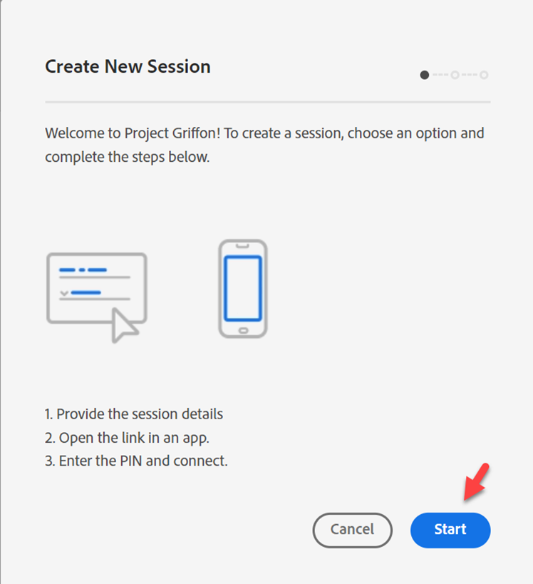
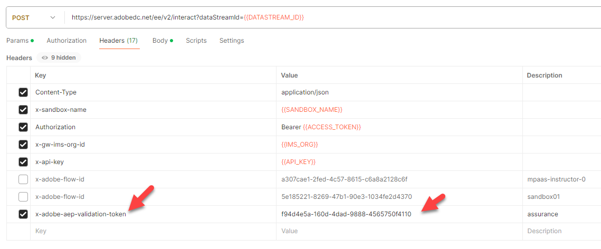

# イベントの監視

## Assuranceに移動します

[Adobe Experience Platform Assurance](https://experienceleague.adobe.com/ja/docs/experience-platform/assurance/home)は、Adobe Experience Platform Edgeにデータを収集する方法の調査、検証、シミュレーション、検証を支援するAdobe Experience Cloudの製品です。

1. Adobe Experience Platform/Assurance/Create Sessionに移動します

&#x200B;2. 「**開始**」ボタンをクリックします

## セッションの設定

1. 名前 – > \[Sandbox] Edge Session
1. URL —> https\://www\.adobe.com
   - このURLは、お客様の実際のサイトに置き換えられます
1. 「次へ」ボタンをクリックします

&#x200B;4. 後で参照できる場所にリンクをコピー

&#x200B;5. 「**完了**」ボタンをクリックします

&#x200B;6. **設定**&#x200B;に移動します

&#x200B;7. **+** ボタンをクリックして&#x200B;**イベントトランザクション**&#x200B;および&#x200B;**Edge Delivery**&#x200B;を有効にし、**完了**&#x200B;します

## Postmanを開く

Postman/Web イベントの作成/Edge（認証なし）/ヘッダーに移動します

1. 上記のAssuranceからコピーしたリンクを含む&#x200B;**x-adobe-aep-validation-token**&#x200B;をHeadersに追加します。 Assuranceからコピーしたリンクで、=の後のID **の値だけを**&#x200B;取得します。 e.g. [https://www.adobe.com/?adb\_validation\_sessionid=](https://www.adobe.com/?adb_validation_sessionid=efa4a9ed-02d8-4647-80fa-f01a5be273d0) [`efa4a9ed-02d8-4647-80fa-f01a5be273d0`](https://www.adobe.com/?adb_validation_sessionid=efa4a9ed-02d8-4647-80fa-f01a5be273d0)
1. 完全なURLではなく、[`efa4a9ed-02d8-4647-80fa-f01a5be273d0`](https://www.adobe.com/?adb_validation_sessionid=efa4a9ed-02d8-4647-80fa-f01a5be273d0)値だけを使用します

&#x200B;3. Postmanで、**Web イベントの作成Edge （認証なし）** リクエストを保存して実行します

## Assurance ログの表示

Assuranceに戻ると、たくさんのイベントが表示されます。 検索にデータストリーム IDを配置して、関連するイベントタイプだけを絞り込むことができます

イベントを選択し、必要に応じて右側のパネルでメッセージを開きます。

確認するイベントタイプ：

- hitReceived （Edgeが受信したペイロードを表示）
- evaluatingRule （SSFを設定した場合、評価されるルールが表示されます）
- firedDestinations （この宛先が送信された宛先）
- segmentsDiscovered （任意のエッジセグメントに適格でした）
- com.adobe.experience\_platform.edge\_segmentation/response （どのセグメントで応答したか）

Assuranceが各ステップをどのように解釈しているかを説明します。
