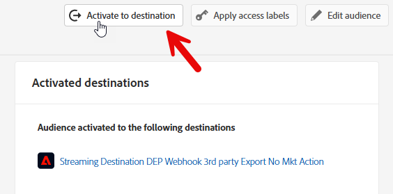
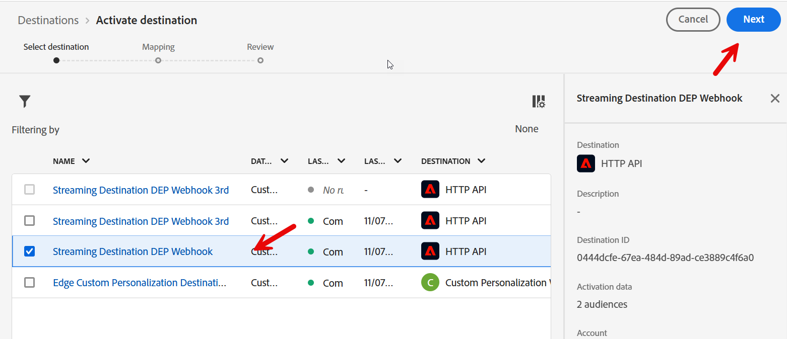
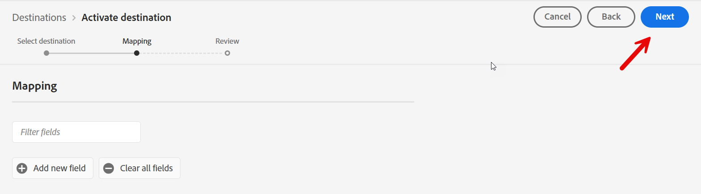
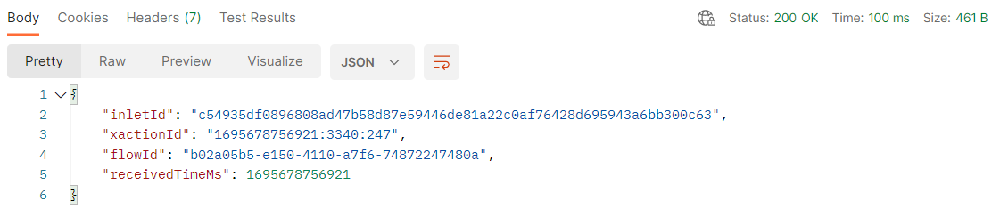

# Hubへの注文イベントの送信

## HubへのストリーミングとEdgeの比較

イベン#1をEdgeに送信したユースケースの例です。  イベントでストリーミングするバックエンドシステムがありますが、Edgeに送信する必要がない場合があります。  このラボでは、Order イベントをHubにストリーミングする方法について説明します。

## 注文セグメントを作成する（まだ作成していない場合）

左側のパネルで「オーディエンス」をクリックし、右上の「オーディエンスを作成」ボタンをクリックします。


「Order Placed」イベントタイプカードを見つけて、キャンバスにドラッグします。


## イベントルールを更新

イベントルールに次の変更を加えます（イベントを展開する必要がある場合があります）

1. In Last
1. 15
1. 分
1. ストリーミング評価の変更

**注文イベントストリーミングとして保存（15分以内）**


## 宛先にアクティベート

作成したオーディエンスが閉じられている場合は、そのオーディエンスを開きます。

「Activate to Destination」をクリックします




### 宛先

前に作成したストリーミング宛先を選択します（Streaming DEP Webhook）




### マッピング

マッピングを単独のままにして、「次へ」をクリックします



「Finish」をクリックします

## Postmanを開く

コンピューターでpostmanを起動し、次のAPI呼び出しに移動します。

1. **Postman左サイドバー** —> `Collections`
1. **コレクション** —> `AEP Foundations Bootcamps (labs)`
1. **フォルダー** —> プロファイルラボ
1. **API リクエスト** —> `Create Order Event`


## API リクエストを変更

サンプル API リクエストを作成するには、API リクエストの本文に次の部分を入力する必要があります。

まず、次の値を収集します。

## アカウントストリーミングエンドポイントの検索

1. 左側のパネルの&#x200B;**ソース**&#x200B;に移動し、上部のナビゲーションの&#x200B;**アカウント**&#x200B;をクリックします
1. **dep: HTTP API \[raw]**&#x200B;を検索し、行を強調表示して、**ストリーミングエンドポイント**&#x200B;の値を後で参照できる場所にコピーして保存します

 アカウントを作成し、そのストリーミングエンドポイントをコピーします] （assets/send-order-event-to-hub-http-api-raw-streaming-endpoint.png &quot;dep: HTTP API \[raw]&quot;）

## データフローIDの検索

1. **dep: Orders （stream）**&#x200B;のレコードを検索し、データフローリンクをクリックします
1. 右側のパネルのコピーで、**データフローID**&#x200B;値を後で参照できる場所に保存します

>[!NOTE]
>
>行の空のスペースをクリックします。  青いリンクをクリックしないでください。


## 最終的なAPI リクエストの作成

前の手順で保存した値を、以下に強調表示されている場所にコピーします。

- **赤** —> `Streaming Endpoint URL`
- **緑** —> `Dataflow ID`

最終的なAPI リクエストは、次のようになります

>[!CAUTION]
>
>まだ実行しないでください。


## APIの実行

1. **保存** ボタンをクリックして、API呼び出しを保存します
1. **送信** ボタンをクリックして、リクエストを実行します

呼び出しが成功すると、次の応答が返されます…



## 検証

1. プロファイルに移動し、プロファイルを検索して、イベントがプロファイルに取り込まれていることを確認します。  秒単位で表示されます。
   1. 注文のメールを使用してプロファイルを検索します
1. プロファイルがセグメントに適格であることを検証します（数分かかる場合があります）。 数秒から数分で表示されます。
   1. 注文イベントストリーミング（15分以内）
1. 宛先がセグメントのWebhookに「通知」を通知したかどうかを確認するには、Webhookを確認します。  5～10分で現れるはずです。
1. 15～30分後には、次のデータセットを確認することもできます。
   1. 下のテーブル名をサンドボックスのテーブル名に変更します。  見つけるには、データセット リストに移動し、「`dest`」でフィルターを実行し、データセットを開いて、右側のパネルにテーブル名をコピーします。

```sql
SELECT * FROM profile_export_for_destination_merge_policy_xxx
WHERE extSourceSystemAudit.LASTREFERENCEDDATE >= CURRENT_DATE
AND identitymap['email'][0].ID in ('depche.mode@dep.com')
ORDER BY extSourceSystemAudit.LASTREFERENCEDDATE DESC
LIMIT 10
```
