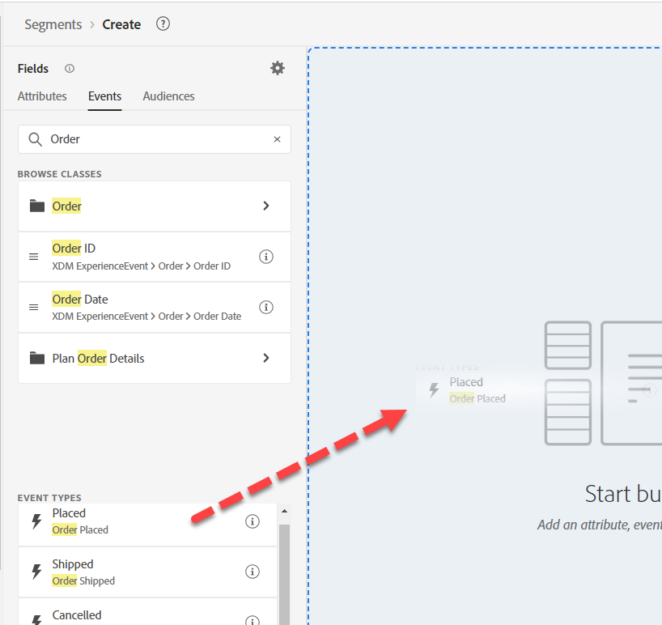
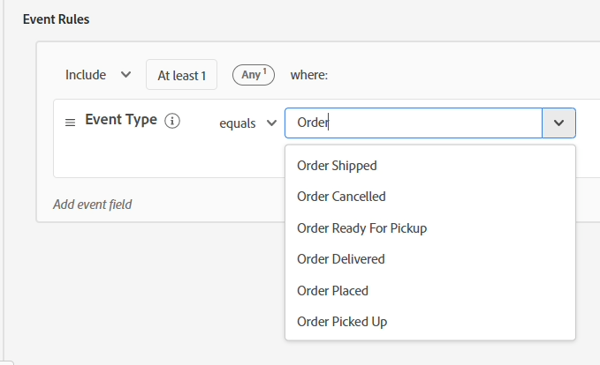
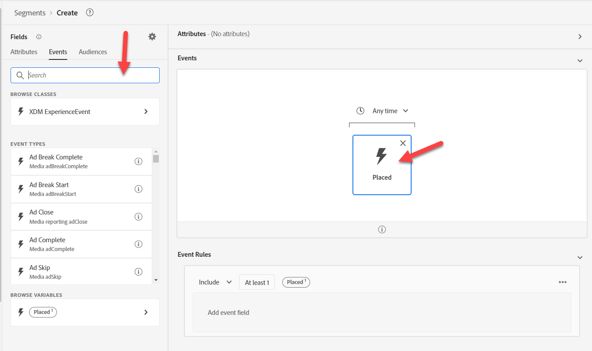
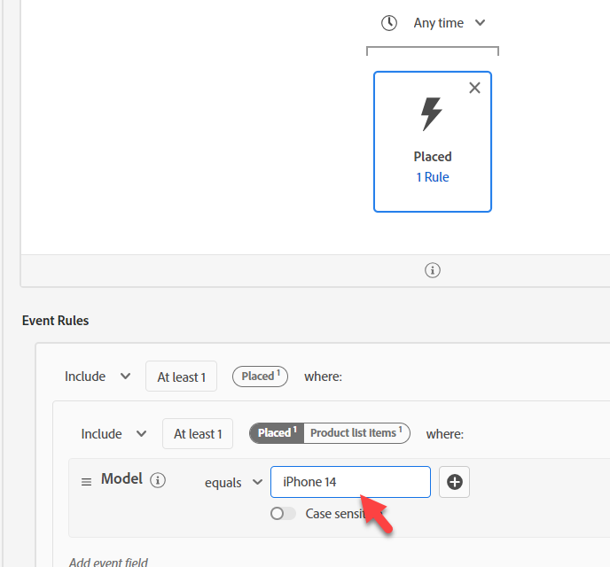
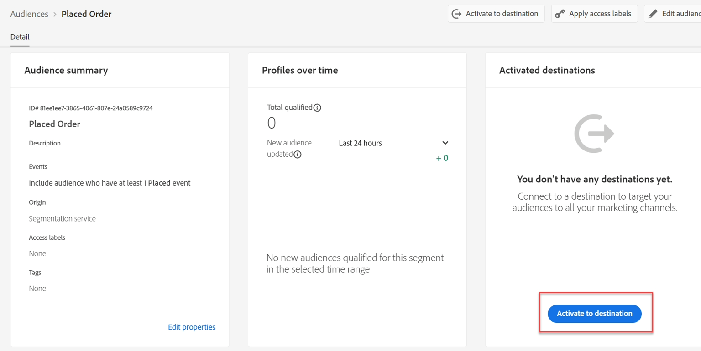
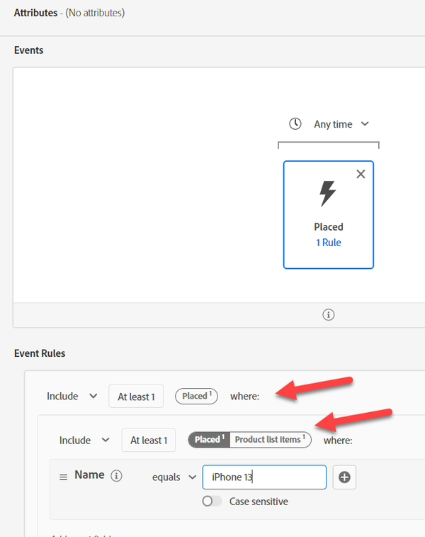

# Audience #1の構築

## Labの目的

IPhone 14の注文を行ったプロファイルのみを検索するオーディエンスを作成する

## オーディエンスの分類

まず、最初のオーディエンスを作成します。 これは、組み込む必要がある多くの要素で構成されています。 左側のパネルで「オーディエンス」をクリックし、右上の「オーディエンスを作成」ボタンをクリックします。

このユースケースを細分化し、複数のオーディエンスで解決します。 その理由は、これをストリーミングにしようとしていることです。2つのことが妨げられています。

1. exclude句「no order exists for iPhone 14/Pixel 7」
1. exclude句「アクティブなiPhone 14/Pixel 7」はありません。 最後にこれの影響について説明します。

## パート 1 – 発見

オーディエンスの最初の部分は、「iPhone 14には注文が存在しません」を探すことです。 AEPの新しいマーケターが、スキーマを設計しなかったとします。 左側のパネルの「イベント」タブで「注文」を検索します

注文に関連する多くのオブジェクトを取得できます

- 属性：例：注文ID、注文日
- フォルダー：例：注文、プランの注文の詳細
- イベントタイプ：注文済み、発送済みなど

>[!NOTE]
>
>&#x200B;* 注文「フォルダー」には「i」がありません。 説明は入力されていても内容が記載されておらず、マーケターがその説明を試して使用したり、説明を知りたがったりする可能性があるため、混乱の原因となる可能性があります。
>&#x200B;* イベントカードの「i」は、イベントタイプが1つのフィールドであり、多くはないので、タイプが何であるかを繰り返すだけです。
>&#x200B;* 概要データは、結合されたプロファイルの2%以上に値が存在する場合にのみ表示されます。 これは、文字列をフィルタリングする際のオートコンプリートも駆動します。

「Order Placed Event Type」カードを使用し、キャンバスにドラッグします。

&#x200B;> [!TIP]
>
>**オプション：**
>
>すべてのイベントにはイベントタイプがあります。  イベントタイプカードを使用する代わりに、イベントタイプでフィルタリングできます。
>
>注文スキーマイベントタイプを拡張したときのことを思い出してください。 ドロップダウンに表示されている値を追加しました。  これらの値は、イベントタイプカードと同じように表示されます
>
>必要に応じてどちらのアプローチでも使用できます。
>
>新しいオーディエンスで、XDM Experience Eventに移動し、「イベントタイプ」をドラッグします。
>
>
>
>イベントタイプカードを使用したフィルタリングは、イベントタイプフィールドを使用したフィルタリングと同じです
>
>
>
>イベントタイプカードを使用する利点：
>
>- オーディエンスにイベントタイプの名前が表示されるので、わかりやすく素早く理解できます
>- 迅速かつ少ない手順で実行できます
>
>イベントタイプフィールドを使用するメリット：
>
>- 1つの基準に複数のタイプを含める場合は、複数のイベントタイプ（例：「注文受取」または「配達済み」など）を選択できます
>- 大文字と小文字の区別をサポートします

>[!NOTE]
>
>「注文が存在しない」ために考慮すべきオプションがいくつかあります。  私たちはシンプルなアプローチを選んでいますが、現実の世界で考えるべきことはここにあります。
>
>- 注文したが受け取られたか発送された
>- 注文は行われましたがキャンセルされました
>- 複数件の注文がキャンセルされました

マーケターは、トレーニングから、1つ以上のデータソースが読み込まれたことを知っています。

- 注文（すべてのチャネルで注文システムによって取得）
- Web （サイトでの注文など、顧客がクリックしたコンテンツのクライアント側での追跡）
- e コマース （サイトのe コマースシステムでキャプチャ）

どのソースを使うべきか？ それらはすべて論理的に同じイベント「注文された」を表します。 物理的に異なるシステムに保存されています。 どのフィールドを使うべきか？ 最善の方法は、各スキーマオブジェクトと各フィールドに関する説明を確認することです。

>[!NOTE]
>
>説明には、次のような意思決定に役立つ関連情報が必要です。
>
>1. データはどこから来るのか？
>2. 何が含まれているか、含まれていないか？
>3. 待ち時間はいくらですか？
>4. 「信頼できる唯一の情報源」と指定されているシステムはありますか？
>5. 考慮すべきニュアンスはありますか？

当社では、Order Placedを使用しますが、ユースケースによっては、次の要件が発生する可能性があることに注意してください。これは、どのソースから取得するかによって影響を受ける可能性があります。

- 過去30分間のオンサイト購入
- 注文が完了し、キャンセルされなかった
- 準備が整ってから1日以内に受注

>[!TIP]
>
>オプションの思考の演習は、我々は今日私たちのサイト上で単一の注文を置いたことを想像する（注文は、すべての3つのシステムによって記録されていることを忘れないでください）:
>
>1. 今日発注された注文に対して何件のイベントがカウントされますか？
>2. 顧客の観点から見た注文の数は？
>3. Shipping Method =を一晩でフィルタリングした場合、イベントの数はカウントされますか（これを選択した場合）?
>4. どのように対処すべきか（オーディエンスまたはデータモデル）?

分析を行った後、`Orders Event of Event Type=”order. placed”`を使用します。 「私たちは、オーディエンスがスピードのトレードオフで真実のソースを使用していることを確認したいと考えています（注文が送信される前に何らかの処理を行う間、web データはクリックごとに流れます）。 さらに、将来的には、キャンセルされた人や、任意のチャネルを通じて行うことができる人を除外したい場合があります。

## パート 2 - オーディエンスの構築

「完全なスキーマを表示」をオンにする

テクノロジースタックを。  「配置」カードをクリックし、左側のパネルの「検索&#x200B;**」から「**&#x200B;配置」をクリアして、次の場所にドリルダウンします。

XDM エクスペリエンスイベント/製品リスト項目フォルダー

>[!WARNING]
>
>マーケターの一般的な混乱は、ここでは商品ではなくデバイスを使用することです（iPhoneでフィルタリングされるため）。 繰り返しますが、良い説明のもう1つの理由です。

IPhoneで絞り込める機能を探しています。 選択肢は3つあります

- 名前
- 製品
- SKU

全員が良い候補者かもしれませんが、私たちは知りません。  各項目の詳細については、「i」をクリックしてください。

>[!NOTE]
>
>任意のOOTB フィールドの説明を変更できます。 ユーザーの混乱を軽減するために使用されていないフィールドを更新または非表示にすることもできます。 これらのOOTB説明は、業界やビジネスでは意味がないかもしれません。
>
>適切な説明には例も含まれます
>
>- 名前説明=この製品ビューのユーザーに表示される製品の表示名。 例：iPhone 14、Pixel 7
>- SKU説明= SKU （在庫保管単位）。ベンダーによって定義された商品の一意の識別子。 例：iP14、Pix7
>- 製品説明=製品自体のXDM ID。 例：123、456

「データのあるフィールドのみを表示」をオンにする

>[!NOTE]
>
>**観測可能なスキーマ**
>
>これは、フィールドにデータが含まれている場合のみです。  これは、AEP上に構築されたアプリが、効果的に役に立たないフィールドを使用しないようにする方法です。
>
>**完全なXDM スキーマ**
>
>データが読み込まれているかどうかに関係なく、結合スキーマのすべてのフィールドです。

「データを含むフィールドのみを表示」をオンにすると、使用しようと考えていたフィールドが消えます。

XDM ExperienceEvent/製品リスト項目/開発/モデルにドリルダウンします

にドリルダウンします

モデルはこのように見えますが、説明はありません。

配置したイベントカードにドラッグします。

IPhone 14を追加

配置されたイベントの上で、「Any time」を「Today」に変更します

>[!NOTE]
>
>「私たちは今日、1週間、1 ヶ月、1年前の注文には気を配らないのでフィルタリングしています。  また、より長いルックバックについては、次の節で説明します。  ある時点で、注文は「*所有*」に変わり、そのセグメントを作成します。

説明を入力

評価方法を&#x200B;**ストリーミング**&#x200B;に変更します

**オーディエンス**&#x200B;を「*発注済みiPhone 14*」として保存

青いボタン **Activate Audience**&#x200B;をDestinationにクリックします

」をクリック

「**Streaming DEP Webhook** Destination」を選択し、「Next」をクリックします

マッピングを変更しないで、「次へ」と「終了」をクリックします

>[!NOTE]
>
>**コンテナ**
>
>製品リストの「名前」でフィルターを実行すると、一部のコンテナが自動的に追加されます。 これは、製品リスト項目が配列データタイプであるためです。 配列でフィルタリングする場合、コンテナが作成されます（この例では「製品リスト項目」と呼ばれます）。
>
>
>
>にコンテナが自動的に追加されました
>
>コンテナは、イベント変数または配列要素を参照する方法です。 この記事では、このラミフィケーションについて詳しく説明していますが、簡単に説明するために、配列内の単一の要素が両方の条件を満たしているか、条件を2つの要素に分散できるかを指定できます。
>
>[https://experienceleaguecommunities.adobe.com/t5/adobe-experience-platform-blogs/how-exactly-do-containers-work-in-aep-segmentation-a-deeper-look/ba-p/458780](https://experienceleaguecommunities.adobe.com/t5/adobe-experience-platform-blogs/how-exactly-do-containers-work-in-aep-segmentation-a-deeper-look/ba-p/458780)

>[!WARNING]
>
>**時間フィルター**
>
>要件には何も指定されていませんが、このオーディエンスには、ビジネスに戻って明確にすべき問題があります。
>
>要件には時間フィルターがありませんでした。 つまり、1年前や5年前に注文した場合、その注文に応じる資格があるということです。 メソッドを常に組み込んで、この罠に陥らないようにしたり、新しいバージョンが出てきたときにオーディエンスを常に更新する必要がないようにしたりしてください。
>
>追加した時間フィルターを変更した場合、Edge セグメントがストリーミングやバッチに移行するまでにどの程度時間を遡ることができますか？

>[!CAUTION]
>
>**商品は2か所に保存されますか？**
>
>パスの命名規則と説明を確認します。 以前のオーディエンスとの比較
>
>- XDM個人プロファイル/開発/アクティブ製品/製品ID プロパティ/製品名
>  - 説明：製品の名前。
>- XDM ExperienceEvent >製品リスト項目>開発> モデル
>  - 説明：この製品ビューのユーザーに表示される製品の表示名。
>
>異なる理由や目的のために同じ値を異なる場所に保存し始めると、ユーザーへの影響と、プロファイルがこれらをどのように統合するか（必要に応じて結合ポリシーがこの競合をどのように解決するかを考える必要があります）を考える必要があります。
>
>現在の説明では、マーケターがどれを使うべきかを知ることは難しいです
