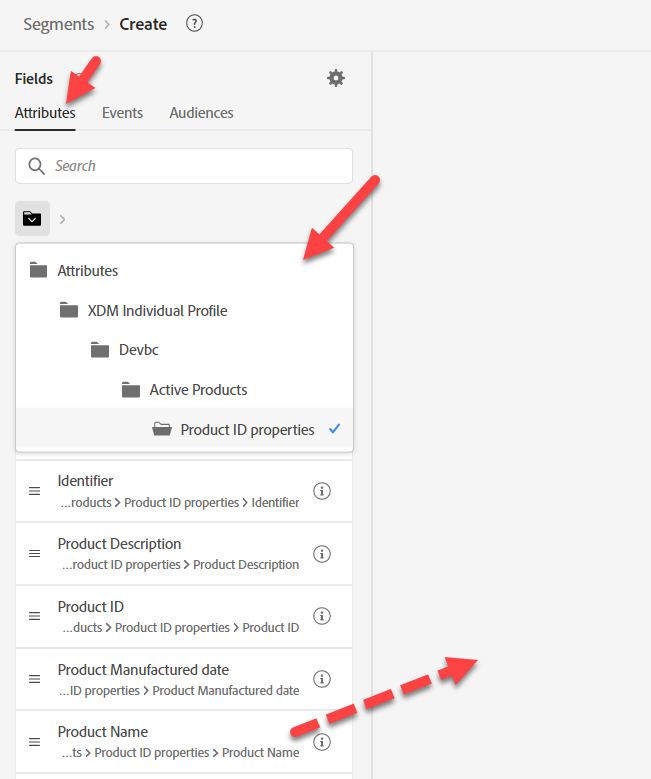
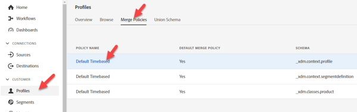
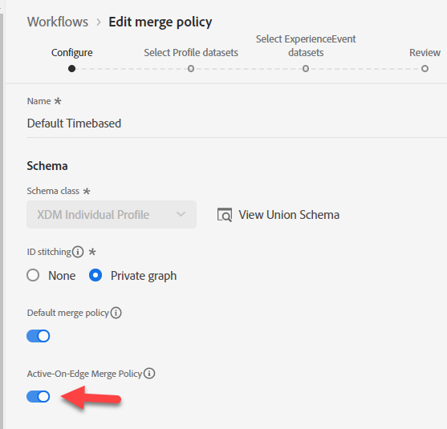
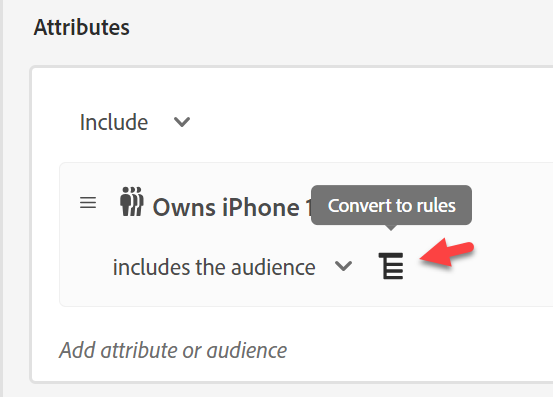
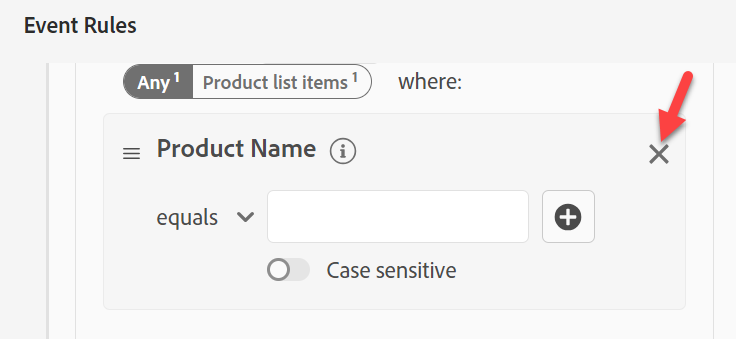
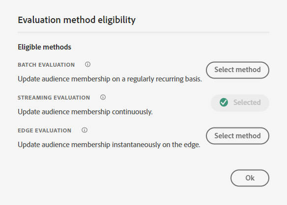
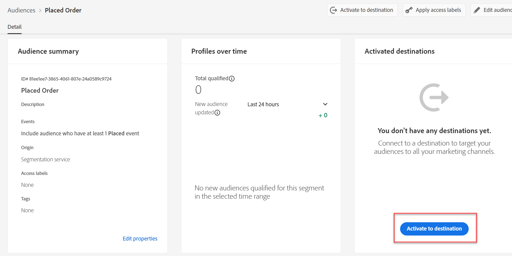

# Audience #2の構築

## Labの目的

IPhone 14のアクティブな行を持たないすべてのプロファイルを見つけるオーディエンスを作成します

## 分析タスク

このオーディエンスは、「アクティブなiPhone 14をお持ちでない方」です

- 誰かが「アクティブなiPhone 14」を持っていないことを知るにはどうすればよいですか？  アイデア：
  - IPhone 14を購入した人を含める
  - IPhone 14の請求データを持っている人を含める
  - IPhone 14から取得したweb データを持っているユーザーを含めます
  - 他に回答したい人は？

最終的に、これはマーケティング対象となる顧客に関するビジネスの選択に帰着します。 当社の場合、当社はこれを非常に重要と考え、アクティブラインを定義するスキーマを構築したので、それを使用します。

>[!NOTE]
>
>アクティブラインはプロファイルに保存される配列なので、これはアカウントの所有者とデバイスの個々の所有者を選択します。 マーケティング部門がそれを認識し、望んでいることを確認しましょう。 それ以外の場合は、別のアプローチを使用することもできます。

## 新しいオーディエンスの作成（所有者はiPhone 14）

1. 左側のパネルの「属性」タブで、「製品名」に移動します（または検索します）。
   - XDM個人プロファイル —> \&lt; テナント名> —> アクティブな製品 – >製品ID プロパティ —>製品名
1. 製品名をキャンバスにドラッグします

## オーディエンスを保存

1. IPhone 14と入力します（バッチ評価として保持）
1. 説明を入力
1. オーディエンスを「*様はiPhone 14*&#x200B;を所有しています」として保存
   - 上記のPixel 7と同じ手順を実行します（時間がある場合）。

>[!TIP]
>
>**サイド思考、「プロファイルに別のフィールドが同じものを保存するのではなく、イベントにフィルターを適用することはできませんか」**
>
>私たちにできることはありますが、オーディエンスを複雑にしたり、いくつかの課題を導入したりするビジネスや技術的なニュアンスについて説明する必要があります。
>
>1. 購入イベントを使用する場合：
>   1. アクティブなラインがあるにもかかわらず、購入しなかった場合は？
>   1. 2年前に購入した場合、私のルールはN年を振り返る必要があり、1年のイベントのみをプロファイルに保持していました。
>1. 請求イベントの方が適しているようです。
>   1. 現在のデータは1か月のものです。
>   1. 最後の請求イベントが2年前の場合、顧客ではない人が含まれる可能性があります
>   1. データの読み込みに失敗した場合、古いデータを除外するために1か月しか振り返っていない場合、カウントが0に下がることがあります
>   1. 請求イベントのデバイスもキャプチャしますか？ いいえ、データフィードを変更して
>
>最終的に、このオーディエンスのトレードオフを行う必要があります。 このルールでイベントを使用することに心が惹かれる場合は、このブログをお読みください。https\://experienceleaguecommunities.adobe.com/t5/adobe-experience-platform-blogs/how-to-capture-latest-experience-event-in-adobe-experience/ba-p/430941

>[!NOTE]
>
>**Edgeの結合ポリシーの有効化**
>
>結合ポリシーがEdge オーディエンス用に設定されていることを確認します。 結合ポリシーに移動し、\_xdm.context.profileのデフォルトの結合ポリシーを編集します。  Active-On-Edge結合ポリシーをオンにして保存します。
>
>の既定の結合ポリシーを編集
>
>
>
>

## オーディエンスの再構築

「今日、マーケティング部門から、このストリーミングを利用するための要件が提示されました。残念なことに、この仕組みはバッチで構築されています」 修正：

1. 「*Owns iPhone 14*」オーディエンスを開き、名前を「*Owns iPhone 14 Batch*」に変更します。

   >[!WARNING]
   >
   >現在、UIの評価方法は変更できません。 このオーディエンスを参照するオーディエンスも削除する必要があります。 セグメント内でセグメントを使用する構築戦略を決定する際には、この点に留意してください。

2. 新しいオーディエンスを作成します。 「Owns iPhone 14 Audience Batch」オーディエンスをカンバスに追加し、「Convert to Rules」をクリックします。

   

   

3. 右下隅の「説明」、「名前」、「評価方法」を「ストリーミング」に更新し、評価方法の横にあるフォルダーアイコンをクリックします。 これを確認する必要があります。

   

   これは明らかではありませんが、その理由は、ルックアップスキーマで製品名を使用しているためです

   >[!NOTE]
   >
   >ルックアップを使用するたびに、評価方法はバッチ処理を強制されます。
   >
   >パスを見て、どこかに「プロパティ」がある場合は、これを示すことができます
   >
   >に強制的に渡されます

4. 製品名の既存の値を置き換えて、XDM個人プロファイルスキーマから取得します

   次のパスを置き換えます。

   - XDM個人プロファイル/開発/アクティブ製品/製品ID プロパティ/製品名

   新しいパスを追加します。

   - XDM個人プロファイル/開発/アクティブ製品/モデル

   

   

5. 「評価方法」を「ストリーミング」に変更し、フォルダーアイコンをクリックします

   をクリックします

6. 新しいストリーミング対象オーディエンスの場合は、説明を入力します。

   - オーディエンスを「*様はiPhone 14*」オーディエンスとして保存します。
   - 青いボタン **Activate Audience**&#x200B;をDestinationにクリックします

   

7. **Streaming DEP Webhook**&#x200B;宛先を選択し、**Next**&#x200B;をクリックします

8. 「**次へ**」と「**終了**」をクリックします

>[!NOTE]
>
>バッチとストリーミングまたはEdgeを選択する理由：
>
>最新のガードレール：[https://experienceleague.adobe.com/docs/experience-platform/profile/guardrails.html?lang=en](https://experienceleague.adobe.com/docs/experience-platform/profile/guardrails.html?lang=ja)

>[!TIP]
>
>**オプションのチャレンジラボ**
>
>早く終わった？
>
>1つのファミリで「Apple Device Loyalty」のオーディエンスを作成します。  プランのすべてのユーザーは、同じ種類のデバイス（Apple）を持っています。
