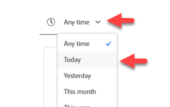
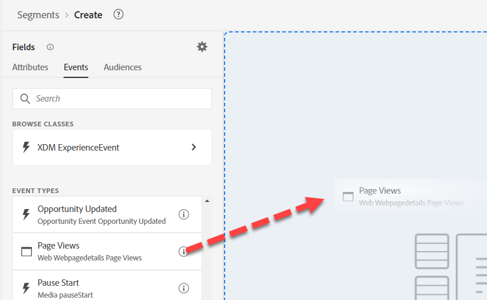
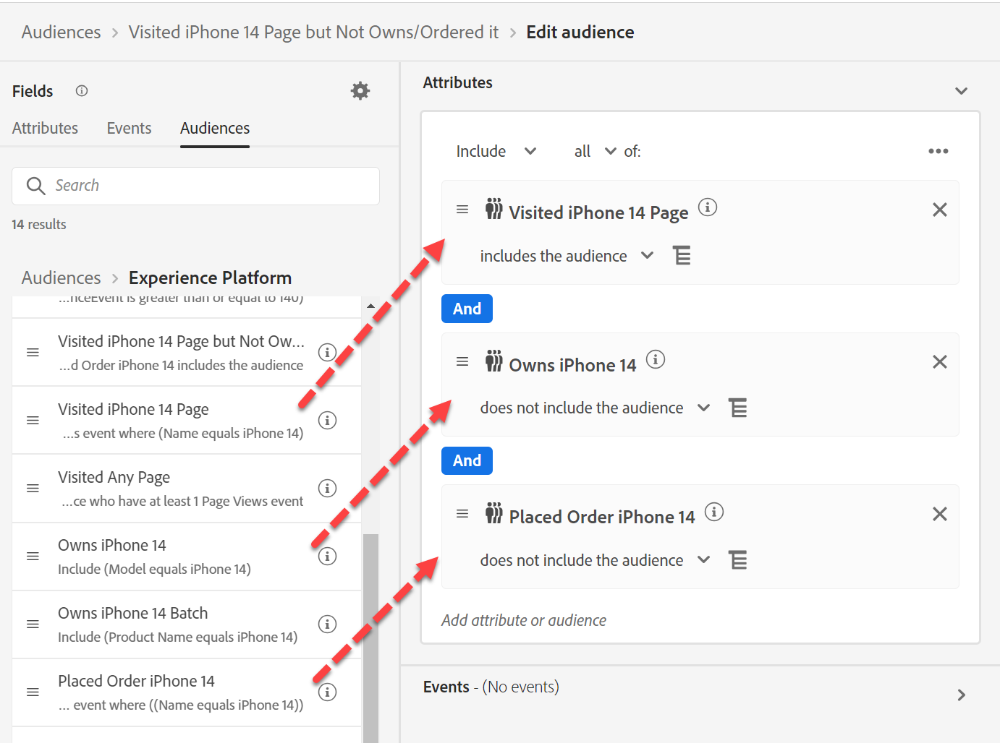

# Audience #3の構築

## Labの目的

IPhone 14の製品ページを訪問したオーディエンスを構築する

## 分析タスク

オーディエンスは率直であるべきです。  複数の製品ページがあるかもしれませんが、ここでは特に難しいことはありません。

## オーディエンスの作成（任意のページを訪問）

1. 左側のパネルの「イベントタイプ」の「イベント」タブでページビューイベントを検索し、オーディエンスに追加します

   

   >[!NOTE]
   >
   >**イベントタイプの使用**
   >
   >ページビューイベントを使用すると、オーディエンスはページビューのコンテキスト内でページ名のみを評価します。 ページ名はページビューにのみ存在しますが、次の2つの利点があるため、冗長である必要があります。
   >
   >- UIを参照する際に、ユーザーに高レベルのビジュアルドキュメントを提供します
   >- 新しいイベントが追加されたときに、それが意図していなかったときに含まれていないことを確認するためのフィルタリングを提供します
   >
   >そのため、構築する各イベントスキーマには、使用するイベントタイプに多くの考えを持たせることをお勧めします。 フィルターとビジュアルガイドの基本です。

2. 説明を入力してストリーミングにします。

3. 配置されたイベントの上で、「Any time」を「Today」に変更します

   

4. このオーディエンスを「*任意のページを訪問*」として保存

5. 青いボタン **Activate Audience**&#x200B;をDestinationにクリックします

6. 「**Streaming DEP Webhook** Destination」を選択し、「Next」をクリックします

7. 「次へ」をクリックして終了

## オーディエンスの作成（iPhone 14 ページを訪問したが、所有/注文していない）

1. 新しいオーディエンスを作成し、ページビューイベントを追加する

   

2. 「ページ名」に移動し、「ページ名」フィールドをイベントに追加して、フィルタリングできるようにします。

   - XDM ExperienceEvent —> Web —> Web ページの詳細 – >名前

   に移動します

3. Addに「iPhone 14」が含まれる

   

   >[!TIP]
   >
   >**「ページ」の検索中**
   >
   >フィールドに移動するのではなく、「ページ」を検索してみてください
   >
   >ページ名が表示されません。 その名前は次のようになっています。
   >
   >- XDM ExperienceEvent > Web > Web ページの詳細>名前
   >
   >フォルダーは表示されますが、フィールド自体は表示されません。 命名規則をまとめる際には、次のような一般的な用語も考慮に入れて、それらを名前に組み込んでください。
   >
   >検索で説明が検索されない
   >
   >

4. 配置されたイベントの上で、「Any time」を「Today」に変更します

   

   >[!NOTE]
   >
   >今日起こったイベントに基づいてアクティブ化しているので、今日はページビューのみに焦点を当てています。

5. これがストリーミングであることを検証し、説明を入力します。

6. オーディエンスを「*訪問済みiPhone 14 Page*」として保存

   

7. 青いボタン **Activate Audience**&#x200B;をDestinationにクリックします

8. 「**Streaming DEP Webhook** Destination」を選択し、「Next」をクリックします

9. 「次へ」をクリックして終了

## オーディエンスのオーディエンスの作成

1. 左上のナビゲーションの「オーディエンス」タブに移動します
1. Experience Platformにドリルダウンする
1. アドビが以前に作成した3つのオーディエンスを
1. 「含める」を「含まない」に変更して、オーナーのiPhone 14およびプレースドオーダーのiPhone 14を指定します。

   

&#x200B;5. 説明を入力してください。

&#x200B;6. ストリーミングに変更

&#x200B;7. 「*iPhone 14 Pageを訪問しましたが、所有/注文していません*」として保存

&#x200B;8. 青いボタン **Activate Audience**&#x200B;をDestinationにクリックします

&#x200B;9. 「**Streaming DEP Webhook** Destination」を選択し、「Next」をクリックします

&#x200B;10. 「次へ」をクリックして終了

>[!NOTE]
>
>**時間フィルター**
>
>要件には時間の要件がありませんでしたので、3年前に誰かが訪問した場合、彼らは資格を得るでしょう。 これらが機能する場合とそうでない場合もあります。 尋ねる価値があります。 1つ追加したのは、現在web サイトを訪問した人々に基づいてアクティブ化しているからです。  あらゆるユースケースで機能するとは限りません。  時間フィルターを追加した場合、Edge オーディエンスがストリーミングやバッチに移行するまでにどの程度時間を遡ることができますか？

>[!NOTE]
>
>**これを分割するメリット**
>
>簡単な要件ですが、いくつかの理由により、多くのオーディエンスに分割しました。 要件はストリーミングですが、これらの2つの要件により、オーディエンスがバッチに変わります。 ストリーミングの適格性ルールについて詳しくは、こちらを参照してください。
>
>[https://experienceleague.adobe.com/docs/experience-platform/segmentation/ui/streaming-segmentation.html?lang=ja](https://experienceleague.adobe.com/docs/experience-platform/segmentation/ui/streaming-segmentation.html?lang=ja)

>[!NOTE]
>
>**ストリーミングするオーディエンスのオーディエンス**
>
>アドビのブログ「*オーディエンスのフードの下をのぞく*」（下のリンク）では、これについて少しお話しします。 オーディエンスの結果がプロファイルにどのように保存されるかを示します。 データストリームはプロファイルに保存されたオーディエンスの結果を確認するため、その時点でオーディエンスを再実行することはありません。 単純なニュアンスですが、理解する価値があります。 ほとんどのプロファイル属性は定期的に更新されるので、このアプローチは理にかなっています。
>
>オーディエンス内でオーディエンスを使用する場合、AEPは可能な場合にシーケンス化を試みることを理解する必要があります。 例えば、これが不可能なエッジケースがあります。オーディエンスのオーディエンスを使用すると、プロファイルの失格は24時間ごとに発生します。
>
>[https://experienceleaguecommunities.adobe.com/t5/adobe-experience-platform-blogs/peeking-underneath-the-hood-of-segments-in-aep-adobe-experience/ba-p/453535?profile.language=ja](https://experienceleaguecommunities.adobe.com/t5/adobe-experience-platform-blogs/peeking-underneath-the-hood-of-segments-in-aep-adobe-experience/ba-p/453535?profile.language=ja)

## 複数のオーディエンスを作成する理由？

これらのオーディエンスをすべて4つではなく1つのオーディエンスに構築した場合、各オーディエンスが個別にストリーミングされていても、バッチ評価方法が適用されます。

これらのオーディエンスを分割し、オーディエンスのオーディエンスを使用することで、この行動が得られます。  データストリームとしてのリアルタイムの選定は

- 注文したiPhone 14
- IPhone 14を所有
- IPhone14 ページを訪問

>[!WARNING]
>
>今日は、オーディエンスの毎日/24時間の待ち時間の失格があります

結論：私たちは、オーディエンスに素早く入力することを24時間の待ち時間で分割し、オーディエンスから脱落させることで取引しました。

>[!TIP]
>
>**オプションのチャレンジラボ**
>
>早く終わった？
>
>古い電話がある人にメールを送りたい。  「古い電話がある」オーディエンスを作成します。  どうすればターゲットできるのか？
