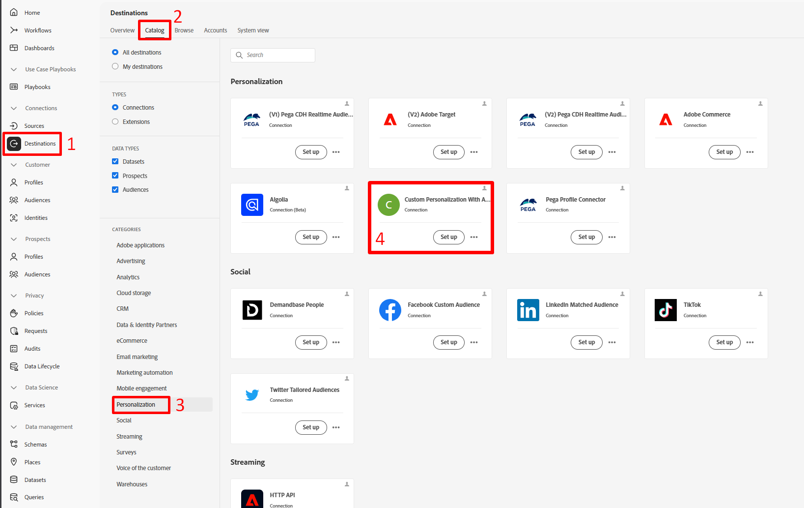
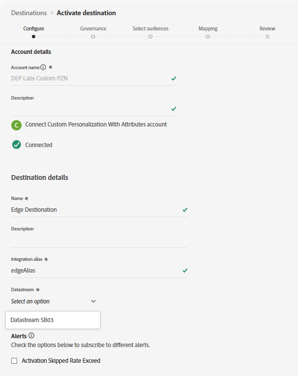
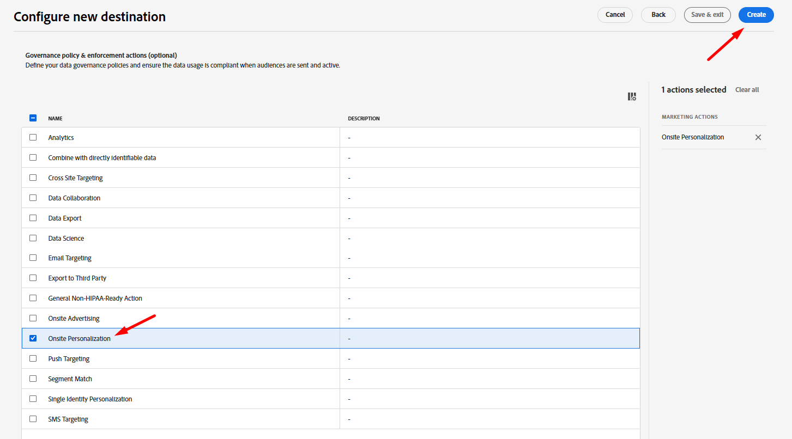
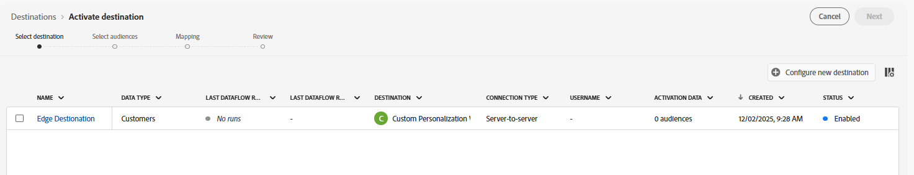
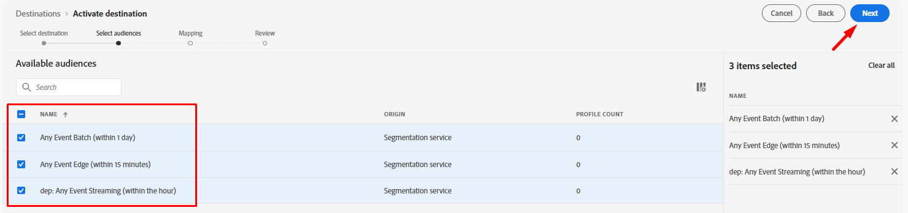
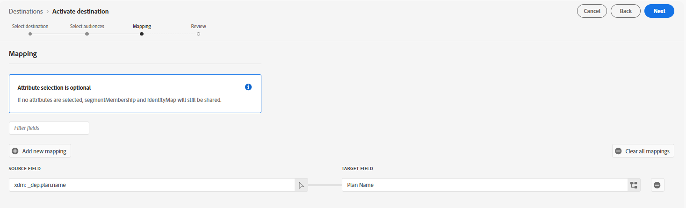

# カスタム Personalizationの宛先の設定

[ カスタム Personalization Destination](https://experienceleague.adobe.com/en/docs/experience-platform/destinations/catalog/personalization/custom-personalization)を使用すると、Edgeでオーディエンスを利用できるようになります。これは、通常はNetwork Server APIを使用して、パーソナライズに使用します。

このラボでは、プロファイル属性をEdgeに送信できるように、カスタム Personalizationの宛先を設定します。

## 宛先カタログを参照

>[!NOTE]
>
>Adobe Targetを使用したパーソナライズには、[Adobe Target Destination.](https://experienceleague.adobe.com/en/docs/experience-platform/destinations/catalog/personalization/adobe-target-v2)を使用します。 このビヘイビアーは、カスタム Personalizationと同じです。

1. 左側のパネルで「**宛先**」をクリックします
1. 上部パネルで「**カタログ**」をクリックします
1. 次に、**Personalization**&#x200B;のカテゴリを選択します
1. 画面の中央に、**属性を持つカスタム Personalization**&#x200B;というタイトルの宛先が表示されます。 そのカードの「**設定**」ボタンをクリックします。

## 宛先の設定

### アカウントの設定

アカウントに`DEP Labs Custom PZN`という名前を付け、**宛先に接続ボタン**&#x200B;をクリックします

### 宛先の詳細を追加

次の宛先の詳細を入力します。

1. 名前 – > **Edge Destination**
1. 統合エイリアス -> **edgeAlias**
1. データストリーム ID -> *以前に作成したデータストリーム名を選択*
1. 完了したら、**次へ** ボタンをクリックします

>[!CAUTION]
>
>「次へ」をクリックすると、**名前**&#x200B;または&#x200B;**統合エイリアス**&#x200B;を変更できません。  これらについては、後ほどEdge Networkの応答で説明します

### ガバナンスポリシーを選択

**オンサイト Personalization**&#x200B;を選択し、**作成** ボタンをクリックします

>[!NOTE]
>
>この手順はオプションですが、作成する宛先には、プロファイルを誤ってアクティブ化しないようにガバナンスポリシーが割り当てられていることを強くお勧めします

完了したら、この画面が成功を示す必要があります。

## 宛先をアクティブ化

### オーディエンスの選択

行をクリックして作成した宛先を選択し、**次へ** ボタンをクリックします

**すべてのオーディエンス**&#x200B;を選択し、**次へ**&#x200B;をクリックします

### マッピング

次のように&#x200B;**新しいマッピング**&#x200B;を追加します。

| Sourceフィールド | ターゲットフィールド |
| ---------------------- | ------------ |
| \_tenantName.plan.name | プラン名 |

> [!NOTE]
>
>**\_tenantName**&#x200B;をテナント名に置き換えることを忘れないでください

>[!NOTE]
>
>Target フィールドでは、XDM名とは異なるフレンドリ名を指定できます

完了すると、画面は下の画像のようになります。  次へ&#x200B;**ボタン**&#x200B;をクリックします

>[!NOTE]
>
>プロファイル属性には機密データが含まれる場合があるため、Edge上で属性を取得するには、すべての[Edge Network Server API](https://experienceleague.adobe.com/en/docs/experience-platform/edge-network-server-api/overview)呼び出しを認証済みコンテキストで実行する必要があります。

### レビュー

最後の画面で、設定の詳細を確認し、「完了」ボタンをクリックします。

>[!NOTE]
>
>これは、[自動適用](https://experienceleague.adobe.com/en/docs/experience-platform/data-governance/enforcement/auto-enforcement)が[ データ使用ポリシー](https://experienceleague.adobe.com/en/docs/experience-platform/data-governance/policies/overview)と照合するポイントです。 作成したルールでマーケティングアクションを確認し、エラーを発生させます。
