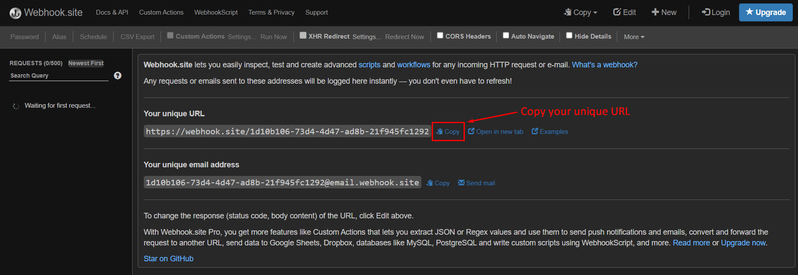
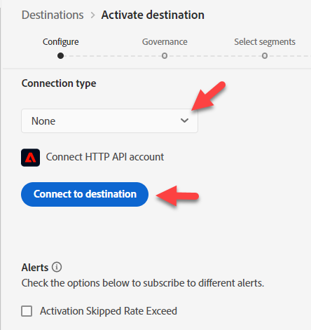
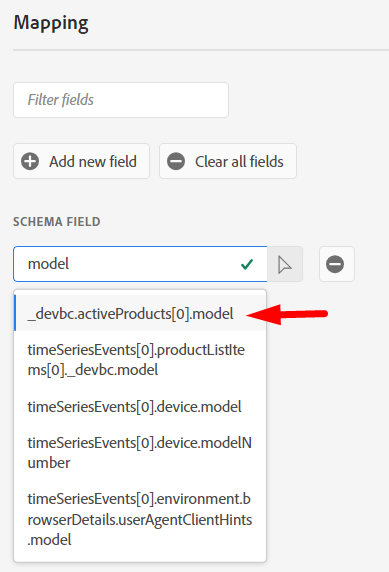
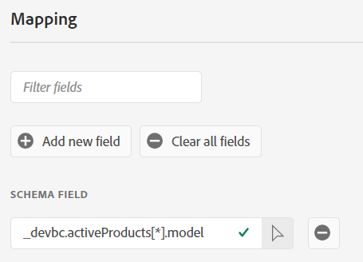
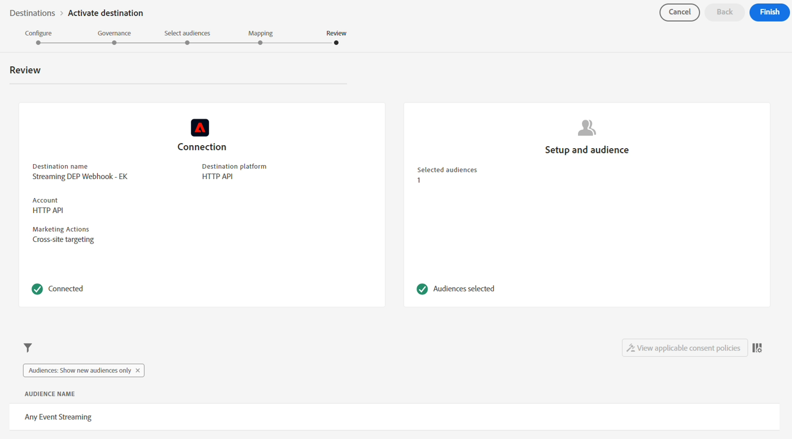

# ストリーミング宛先の設定

>[!NOTE]
>
>ストリーミング宛先を既に設定している場合は、次の手順に進んでください。

## Webhook URLの取得

>[!NOTE]
>
>ここではWebhookを使用して、データが送信先に到着したかどうかを確認します。 現実世界のシナリオでは、代わりにその宛先にログインし、そのツールを使用して何が到着したかを確認します。

1. ブラウザーの新しいタブで次のリンクを開きます – > [https://webhook.site](https://webhook.site/)
1. 表示された一意のURLをコピーし、安全な場所に保存します

## HTTP API宛先の設定

>[!NOTE]
>
>このデータをサードパーティ（Facebookなど）に送信するためのプロキシとして、ストリーミング宛先を使用しています。 実際のシナリオでは、HTTP API Destinationの代わりにFacebook Destinationを使用して、データをFacebookに送信します。

Experience Platform UIで、次の操作を行って、宛先カタログに移動します

1. 左側のパネルの&#x200B;**宛先**&#x200B;をクリックします
1. 上部パネルの&#x200B;**カタログ**&#x200B;をクリックします
1. 検索ボックスに&#x200B;**http**&#x200B;と入力します
1. 「**設定**」ボタンをクリックして、HTTP API宛先を設定します

>[!NOTE]
>
>ラボのHTTP API ストリーミング宛先を使用して、実世界のストリーミングコネクタがどのように機能するかを示します。

## 設定

1. 接続タイプ **なし**
1. **宛先に接続**&#x200B;をクリックします

>[!NOTE]
>
>通常、この段階では認証資格情報を追加しますが、このWebhookには必要ありません。

&#x200B;3. 宛先の設定の詳細を次のように入力します。

- **名前** -> `Streaming DEP Webhook - [Your Initials]`
- **説明** -> `[your webhook endpoint you copied above]`
- **Endpoint** -> ` [your webhook endpoint you copied above]`
- **クエリパラメーター** -> `leave blank`
- **Headers** -> `leave blank`
- セグメント名を含める/切り替え
- セグメントタイムスタンプを含める/オンに切り替える

完了したら、設定が以下と一致していることを確認します。  問題がなければ、右上の「**次へ**」ボタンをクリックして、次の手順に進みます

>[!CAUTION]
>
>保存したエンドポイント、ヘッダー、クエリのパラメーターは、UIで変更できません

## ガバナンスを定義

1. マーケティングアクションから&#x200B;**クロスサイトターゲティング**&#x200B;を選択します
1. 完了したら、「**次へ**」ボタンをクリックして、次の手順に進みます

>[!NOTE]
>
>Experience Leagueのガバナンスポリシーの詳細については、こちらをご覧ください
>
>[https://experienceleague.adobe.com/docs/experience-platform/data-governance/policies/overview.html?lang=ja#core-actions](https://experienceleague.adobe.com/docs/experience-platform/data-governance/policies/overview.html?lang=ja#core-actions)

## オーディエンスの選択

1. すべてのオーディエンスを選択
1. 完了したら、「**次へ**」ボタンをクリックして、次の手順に進みます

## マッピングの追加

>[!NOTE]
>
>ここではプロファイルからフィールドを追加しています。 そのフィールドにデータがない場合は、宛先に渡されたものが何も表示されない可能性があります。 プロファイルとイベントの間で時間の経過に伴う複数の更新が発生すると、配信先が複数回トリガーされ、複数のペイロードが送信される場合があります。

1. **新しいフィールドを追加**&#x200B;をクリックして、スキーマにフィールドを追加します
1. スキーマフィールド入力ボックスに&#x200B;**model**&#x200B;と入力し、表示されるフィールドのリストから&#x200B;**\_dep.activeProducts\[0].model** フィールドを選択します
1. フィールド名の&#x200B;**\[0]**&#x200B;を&#x200B;**\[\*]**&#x200B;に変更します。  これで、最後のフィールドは&#x200B;**\_dep.activeProducts\[\*].model**&#x200B;として表示されます
1. 完了したら、「**次へ**」ボタンをクリックして、次の手順に進みます

>[!NOTE]
>
>これは、エクスペリエンスイベントではなく、プロファイルのフィールドのマッピングです。 オーディエンスの選定に基づいてプロファイルを宛先に送信する場合でも、何が起こっているかを考慮する必要があります。
>
>1. イベントが発生します
>2. オーディエンスは、ルールに基づいてプロファイルを選定します
>3. 選定はプロファイルに保存されます
>4. 宛先には、プロファイルが適格であることを通知します
>5. 宛先はプロファイルを送信します。 つまり、宛先がプロファイルを送信しようとすると、オーディエンス評価をトリガーしたイベントに対する認識がなくなります。

## レビューステップ

最終宛先が正常に表示されていることを検証し、**完了** ボタンをクリックします

>[!NOTE]
>
>宛先が設定され、評価スピードに基づいて追加されたすべてのセグメントからのセグメントの選定を待つようになりました。
>
>- Edge
>- ストリーム
>- バッチ

>[!NOTE]
>
>最初に宛先を設定する際は、次の点を覚えておくことが重要です。
>
>- バックフィル（既存の適格プロファイル）がアクティブ化されるまでに最大2時間かかります
>- 新しく追加されたオーディエンスがアクティブ化されるまでに最大20分かかります
