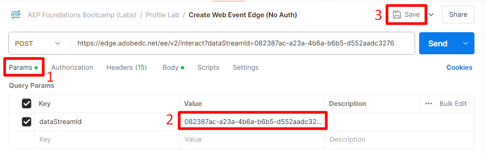
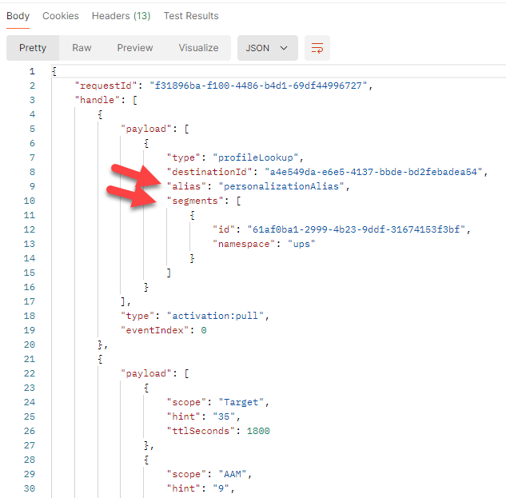
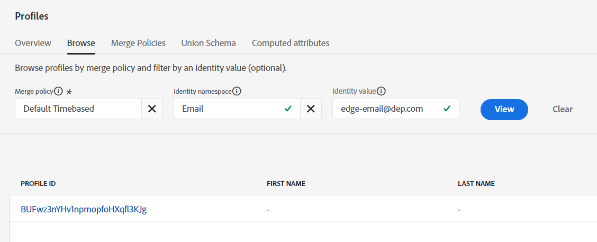
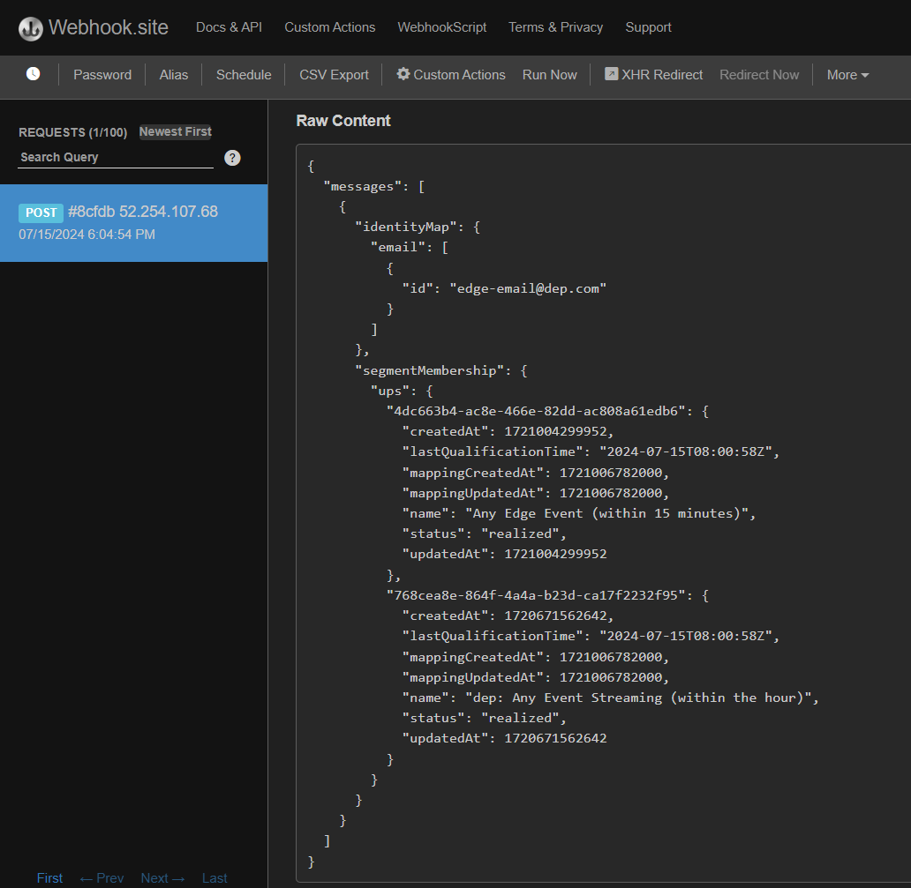

# Edge イベントの送信

すべての設定が完了したら、Edgeにイベントを送信して、すべての動作を確認します。 これを行うには、Postmanを使用して、作成したデータストリームにWeb イベントを送信します。 これにより、OAuth トークン **を持たないイベント**&#x200B;で送信され、webからEdgeに表示されるページビューをシミュレートできます。  このラボを実行するには、コンピューターでPostmanが開いていることを確認します。

>[!NOTE]
>
>認証トークンを渡していないため、属性は返されません。

## ラボの期待

1. Edgeを打つエクスペリエンスイベント
1. イベント転送サービスを使用するデータストリーム設定
1. Webhookにイベントを送信するためのイベント転送
1. AEP サービスを使用するデータストリーム設定
   1. Edge Audience to run
   2. イベントをハブに送信
1. Edge オーディエンスを含めるPostmanの応答（属性なし）
1. イベントを受信し、イベントプロファイルフラグメントを追加するプロファイルストア
1. 関係を追加するID ストア
1. データを受信し、データレイクに保存するデータセット
1. Hubのプロファイルで結果を評価して保存するためのストリーミングオーディエンス
1. ストリーミングオーディエンスの「エントリ」をEdgeに送り返すカスタム Personalizationの宛先
1. HTTP API Destinationsを使用して、ストリーミングオーディエンスの「エントリ」をWebhookに送信する
1. 最終的にHTTP API宛先を使用して、ストリーミングオーディエンスを「終了」してWebhookに送信します
1. 最終的にPersonalizationの宛先をカスタムして、ストリーミングオーディエンスを「離脱」してEdgeに送信します


## 通話に移動

1. **Postman左サイドバー** -> コレクション
1. **Collection** -> AEP Foundations Bootcamps （Labs）
1. **フォルダー** -> プロファイルラボ
1. **API リクエスト** -> Web イベント Edgeの作成（認証なし）


## API リクエストを変更

既に実行している場合は、「APIを実行」にスキップします。

API リクエストを実行する前に、リクエストに追加の情報を追加する必要があります。 まず、次の値を収集します。

## データストリーム IDの収集

1. 左側のパネルで「**データストリーム**」（「データ収集」見出しの下）をクリックします
1. データストリームを選択し、**データストリーム ID**&#x200B;値をコピーします


## Postman クエリパラメーターの更新

1. リクエスト自体で「**パラメーター**」をクリックします
1. 前の手順のデータストリーム IDで&#x200B;**値**&#x200B;を更新します
1. 「**保存**」ボタンをクリックして、更新を保存します
1. メールアドレスを変更




## APIの実行

**送信** ボタンをクリックして、リクエストを実行します。

から返されました


回答で返ってくるのは、次の重要なことです。

- 200 OKの応答は、データが正常に送信され、Edge Networkによって受け入れられたことを意味します
- ペイロード応答には、次の情報も表示されます。
  - 設定したカスタム Personalizationの宛先のdestinationId
  - 宛先のエイリアス名（customPersonalizationと呼ばれます）
  - プロファイルが適格であるセグメントのうち、エッジに存在するセグメントを

>[!NOTE]
>
>ストリーミングセグメントとバッチセグメントは、最初にハブで評価されるまで表示されません

>[!NOTE]
>
>ベアラートークンを使用してserver.adobedc.netに送信する場合は、カスタム Personalizationの宛先で設定した属性も表示されます

## 発生する可能性のあるエラー

以下は、発生する可能性のあるエラーの例です。 つまり、エッジセグメント化の評価は、エッジネットワークに送信されるデータを評価するためにまだ利用できません。

```none
"errors": [
        {
            "type": "https://ns.adobe.com/aep/errors/EXEG-0203-502",
            "status": 502,
            "title": "The service call has failed.",
            "detail": "An error occurred while calling the 'com.adobe.experience_platform.edge_segmentation' service for this request. Try again.",
            "report": {
                "eventIndex": 0
            }
        }
    ]
```

## イベント転送の検証

Webhook.siteでは、Postman リクエストを介して送信したのと同じペイロード本文がすぐに表示されます。


>[!NOTE]
>
>ペイロードが、エッジ設定で使用したデータストリームの設定時に要求した位置情報を追加していることに注意してください

## プロファイルを検索

Adobe Experience Platformでは、Edge Networkに送信したばかりのイベントから、送信したばかりのプロファイルを検索できます。  プロファイル/参照に移動して、次の情報を使用してルックアップを実行します。

- 結合ポリシー – > デフォルトの時間ベース
- ID名前空間 – > メール
- ID値 – > edge-email\@dep.com


1. **表示**&#x200B;をクリックしてプロファイルを検索します
1. **プロファイル ID**&#x200B;をクリックしてプロファイルを開きます




3. 上部のナビゲーションの&#x200B;**イベント**&#x200B;をクリックすると、送信したばかりのイベントが表示されます


4. 上部のナビゲーションの「オーディエンスメンバーシップ」タブを確認して、プロファイルがオーディエンスに適格であることを検証します。  次の項目が表示されます。

- Any Event Edge（過去15分以内）
- 任意のイベントストリーミング（過去1時間以内）
- ユースケース#1ら、次のオーディエンスも確認する必要があります。
  - IPhone 14 Pageを訪問しましたが、所有/注文していません
  - IPhone14 ページを訪問


## ストリーミング宛先のアクティベーションの検証

Webhookで、設定したストリーミング宛先でセグメントがアクティブ化されているかどうかを確認します。  彼らは\～5分で現れるはずです。



>[!NOTE]
>
>2つのIDがまだリンクされていない場合、ストリーミング宛先は、別のセグメント選定ペイロードを送信する可能性があります。

ECIDと電子メールがまだリンクされていない場合、その数分後にIDMapを除く同じ値を持つ別のペイロードが2つのID （電子メールとecid）を持つようになりました

時間が経つにつれて、「離脱」ステータスのWebhookにペイロードをさらに受け取り始める必要があります。


## すべてのチェックを解釈する方法

1. Postmanで200の応答を確認します（適切にフォーマットされたペイロード）
1. Webhookにイベントがあるかどうかを確認します（適切に設定されたイベント転送）
1. プロファイルにイベント（正しく設定されたAEP サービス、ハブで受信および処理されたイベント）があるかどうかを確認します
1. プロファイルに2つのIDがあるかどうかを確認します（ID グラフがハブ上でリンクされています）
1. プロファイルがオーディエンス（適切に定義されたオーディエンス）に適格かどうかを確認します
1. Webhookがストリーミングオーディエンスを受信したかどうかを確認します（適切に設定されたHTTP API宛先）
1. Postmanの応答にセグメントが含まれているかどうかを確認します（適切に設定されたカスタムPersonalizationの宛先）
1. データレイクに送信ログがあるかどうかを確認します（適切に設定され、オーディエンスの選定とストリーミング宛先が送信されます）。 以下を参照してください。

## 宛先のデータレイク「ログ」

少なくとも60分後、データセットに送信したイベントがあるかどうかも確認できます。 そのためには、クエリサービスを使用して次のクエリを実行します。

下のテーブル名をサンドボックスのテーブル名に変更します。 見つけるには、データセット リストに移動し、「`dest`」でフィルターを実行し、データセットを開いて、右側のパネルにテーブル名をコピーします。

```sql
SELECT * FROM profile_export_for_destination_merge_policy_xxx
WHERE extSourceSystemAudit.LASTREFERENCEDDATE >= CURRENT_DATE
AND identitymap['email'][0].ID in ('edge-email@dep.com')
ORDER BY extSourceSystemAudit.LASTREFERENCEDDATE DESC
LIMIT 10
```
