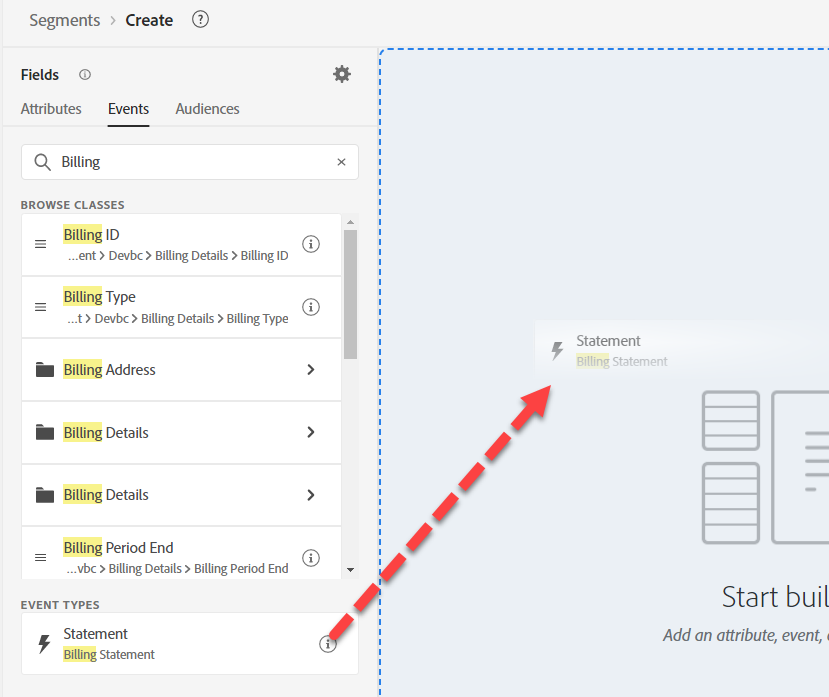
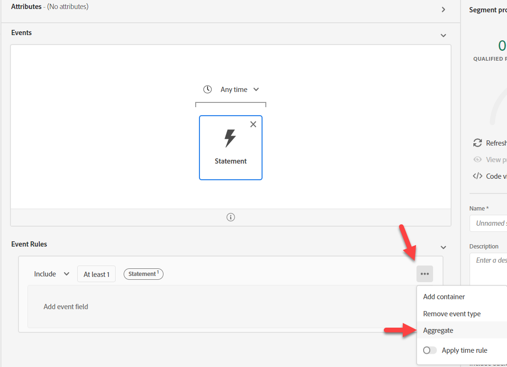
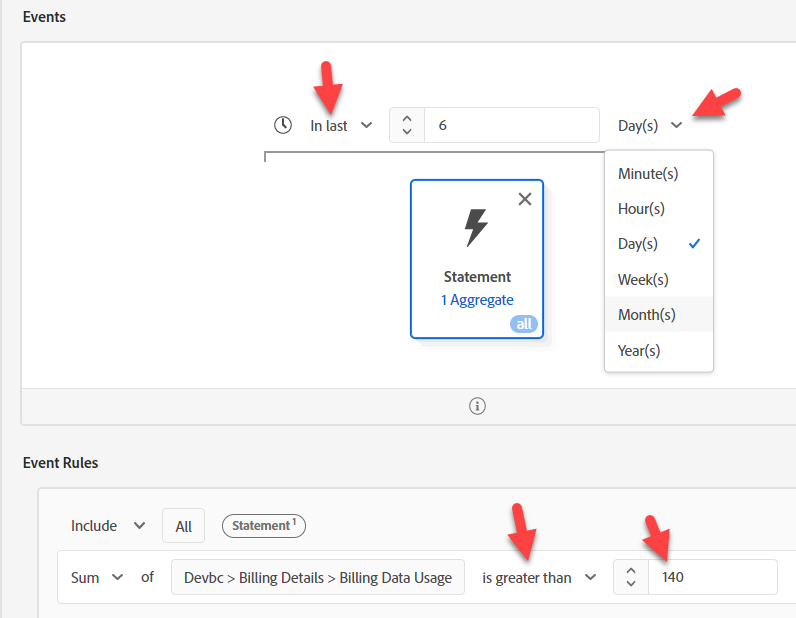
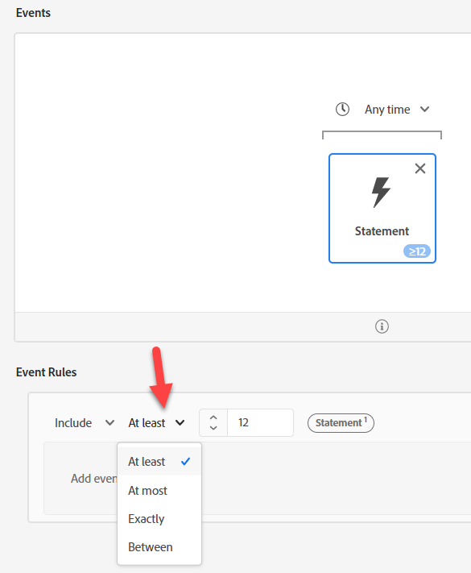
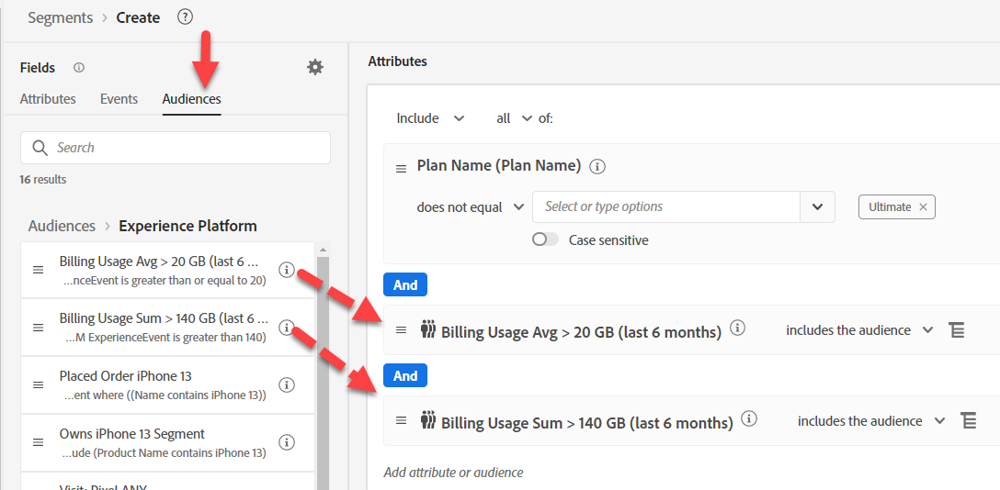
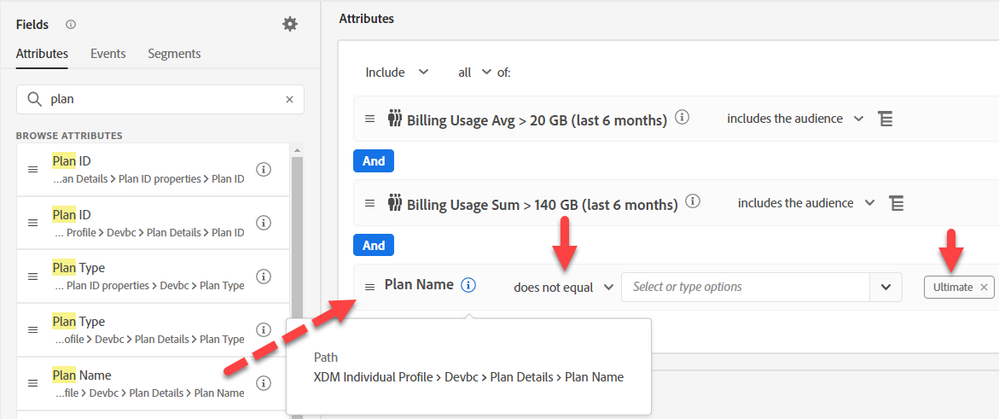

# オプション#1 - オーディエンスを使用した集計

オーディエンスの集計を使用すると、オーディエンスルールのイベントを集計できます。 一度に1つの集計しか実行できないので、2つをユースケースから分割する必要があります。

## Audience #1 – 過去6か月間の請求データ使用量> 140 GB

このオーディエンスビルドでは、過去6か月間の合計請求データ使用量を140 gbを超えて決定します。 これを行うには、次の操作を実行します。

1. 新しいオーディエンスを作成します。  請求ステートメントイベントカードを使用します。

   

   >[!NOTE]
   >
   >優れたイベントタイプ構造は、ユーザーが使いやすく、理解しやすくします。  時間をかけて、スキーマ全体で標準化されたアプローチを開発します。
   >
   >スペルの間違いに役立ちます。
   >
   >「イベントタイプ」フィールドにいつでもフォールバックして、手動で入力することができます。

2. 右下のルールの楕円形をクリックし、「集計」を選択します。 「属性を選択」をクリックし、「使用状況」と入力します。 「請求データ使用」フィールドを選択します。

   

   属性リストで

3. 「次に等しい」を「次より大きい」に、値を「140」に変更します。

4. イベントカードの上の時間を「任意の時間」から「最後の時間」に変更し、値を6日に変更します

   

5. 説明を入力して保存します。

6. オーディエンスに「*請求使用量合計> 140 GB （過去6か月間）*」という名前を付けます

>[!NOTE]
>
>集約オーディエンスは、バッチとしてのみ保存できます

>[!NOTE]
>
>オーディエンスで集計を使用する方法は2つあります。
>
>- 合計/カウント/最小/最大/平均（上記と同様）
>- カウントのみ（各イベントを1としてカウントします）
>
>としてカウントします
>
>必要に応じて、両方を併用できます
>
>

## Audience #2 - 6か月平均ローリング。 月間データ使用量>= 20 GB

1. ハイパーリンクをクリックせずに、オーディエンスリスト UIの行を選択すると、先ほど作成した行がハイライト表示されます。 ハイライト表示されたら、「コピー」をクリックします。

   」をクリックします

2. コピーをクリックして編集します。  イベントカードをクリックし、合計を平均に変更します。 「以上」を「以上」に、値を「20」に変更します。 説明に疑似コードをコピーします。

   

3. オーディエンスに「*請求使用量平均> 20 GB （過去6か月間）*」という名前を付けます

## Audience #3 – 究極の電話プランがありません

1. 新しいオーディエンスの作成
1. 「属性」で、「プラン名」を検索します
1. プラン名を追加（プラン名）
1. 「Ultimate」を選択します。  次と等しくないに変更

   >[!NOTE]
   >
   >事前作業を覚えていますか？ これは、ルックアップディメンションのフィールドを使用します。
   >
   >XDM個人プロファイル/開発/プラン詳細/プラン ID プロパティ/**プラン名（プラン名）**

   

&#x200B;5. オーディエンス / Experience Platformをクリックします。 「プラン名」の横に、「請求使用量合計」 > 140 GBおよび「請求使用量平均」 >= 20 GBをドラッグします。

   の横にある請求使用オーディエンスをドラッグします

&#x200B;6. 説明に疑似コードをコピーします

&#x200B;7. これはストリーミング可能か確認してください。 **ストリーミングできません**。 次のように変更します。

   >[!NOTE]
   >
   >ルックアップデータセットを使用すると、マルチエンティティオーディエンスが作成され、バッチで評価されます。  オーディエンスのフィールドを使用しました。
   >
   >XDM個人プロファイル/開発/プラン詳細/プラン ID プロパティ/プラン名（プラン名）

&#x200B;8. **プラン名（プラン名）**&#x200B;をXDM個人プロファイル/Devbc/プラン詳細>**プラン名**&#x200B;に置き換えます

   

   >[!NOTE]
   >
   >LID非正規化ステップでプラン名がプロファイルに追加されていることを思い出してください。 これにより、オーディエンスで参照できるようになります。 これにより、ルックアップへの結合が削除され、評価方法のストリーミングを行うことができます。
   >
   >ここでのトレードオフは、このロジックを、オーディエンスの評価時ではなく、データインジェスト前にアップストリームで移動したことです。
   >
   >また、プラン名が変更された場合は、プロファイルを更新する必要があります。
   >
   >しかし、その利点は、リアルタイムで対応できることです。

&#x200B;9. これをストリーミングとして保存できることを検証します。 オーディエンスを「*請求データ使用率は高いが、Ultimate プランはありません*」として保存します

>[!NOTE]
>
>この評価方法はストリーミングですが、2つのバッチオーディエンスに基づいてオーディエンスの選定を行います。

>[!NOTE]
>
>このアプローチは機能しますが、現在はバッチオーディエンス（24時間に1回実行）を使用したストリーミングオーディエンス（リアルタイム）があります。 これがユースケースとデータロードで機能する場合は、これは良い選択です（例えば、請求データは毎日または毎月ロードされますが、すべてのユースケースがこのようになるとは限りません）。 そうでない場合は、AEPに送信する前にデータを集計するのが一般的な方法です。 よりリアルタイムなアプローチが必要な場合は、別のオプションを検討しましょう。
