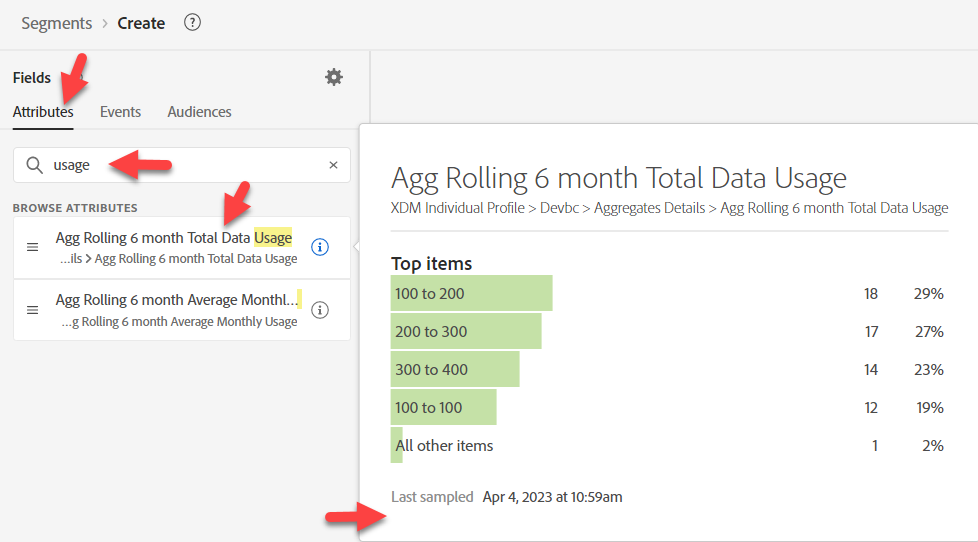
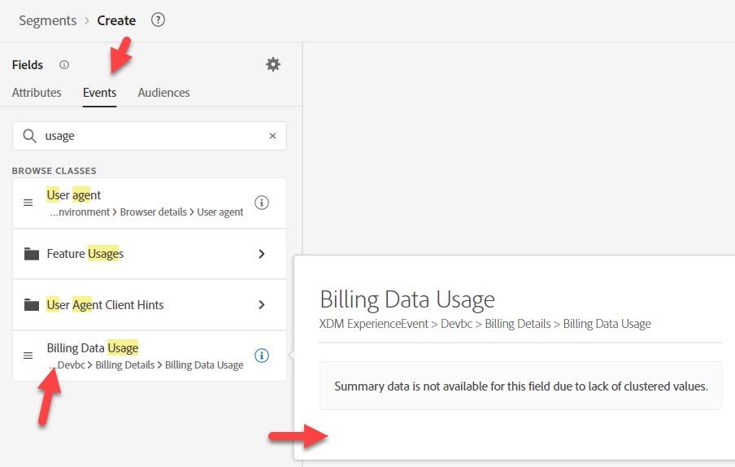
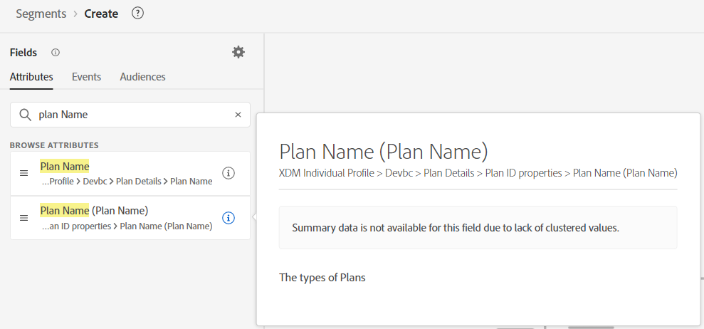
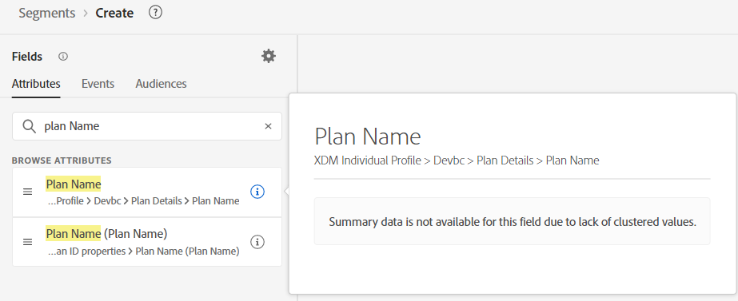

# 事前作業

このユースケースでは、事前に必要な作業があまりありません。 私たちは基本的に、1）使用状況、2）計画という2つのものを探しています。  顧客がどこにいるか把握。

## 請求データの使用

1. 新しいオーディエンスの作成
1. 属性で「使用状況」を検索します。 「i」をクリックして説明を確認します（なし）。

&#x200B;3. イベントで「使用状況」を検索します。  「i」をクリックして説明を確認します（なし）。

&#x200B;> [!NOTE]
>
>これらにはどちらも説明がないので、マーケターはいくつかの仮定を立て、間違って推測する可能性があります。
>
>説明は重要です。  説明がない場合、マーケターは次のことを把握できます。
>
>- どちらを使うか？
>- データの遅延：
>- 特定のユースケースで推奨/推奨されるか？
>
>これらの情報を説明することで、より的確に誘導できます。
> [!NOTE]
>
>「請求」を検索してみてください。  プロファイル属性として表示されないことに注意してください。  「請求データ使用状況」フィールドとともに、イベントタイプカードとして表示されます。
>
>マーケターにも命名規則が存在します。  顧客が何を検索しているのか、イベントやプロファイルに関する情報を探している/期待しているかどうかに応じて、顧客が検索して最終的に使用するものに影響します。

## プラン

属性で「プラン」を検索します。  いくつか選択しなければならないことがあることに気づきます。  「プラン名」に絞り込みます。  2つのプラン名があり？!

プランの検索時に

プランの検索時に

プラン名（プラン名）は、説明に基づいて必要なプラン名のようです。もう1つは説明がありません。
