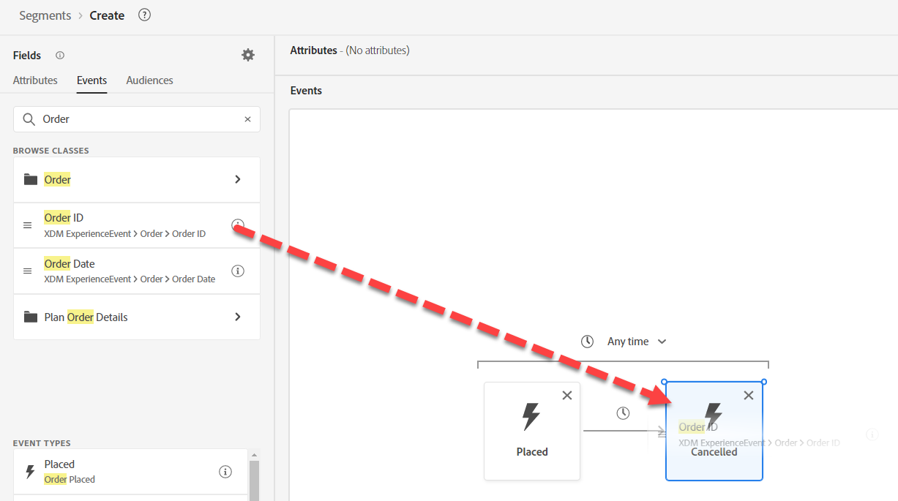
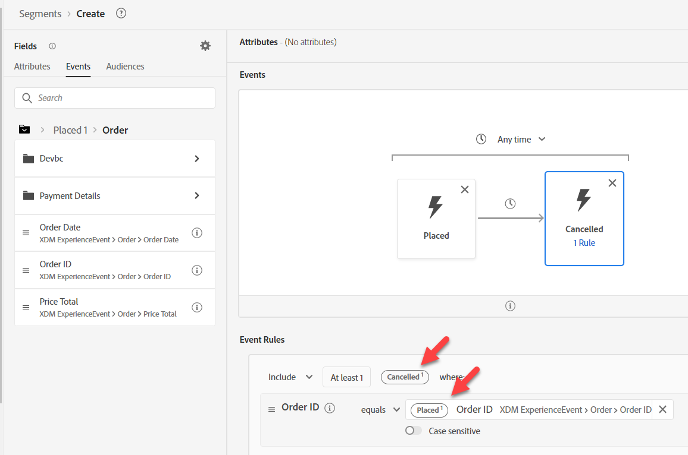

# ユースケース#3ースを構築する

## オーディエンスの作成

1. 新しいオーディエンスの作成
1. カンバスへの注文済みイベントの追加
1. 「注文キャンセル済み」イベントを「注文が完了」イベントの右側に追加します。
1. 1週間以内に時間を変更する

>[!NOTE]
>
>**イベントタイプフィールド**
>
>次のように使用できます。
>
>- イベントタイプ=order.placedでフィルタリングされたイベント
>- イベントタイプ=order.canceledでフィルタリングされたイベント

>[!NOTE]
>
>**時間**
>
>オーディエンスエンジンは、イベントの順序を解釈するためにタイムスタンプのみを使用します。 したがって、イベントに複数の日時フィールドがある場合は、タイムスタンプフィールドが使用されるものであることに注意してください。

## キャンセル済みイベントの設定

「注文ID」を検索し、フィールドを「注文キャンセル済みイベント」にドラッグします。

>[!NOTE]
>
>注文IDのフィルターを追加して、注文がキャンセルされた注文と同じであることを確認します

任意の検索をクリアし、**変数を参照**&#x200B;の下の&#x200B;**配置**&#x200B;をクリックします

の下に配置をクリック

「注文ID」までドリルダウンし、ドラッグして比較オペランドを追加します

>[!WARNING]
>
>**変数内の検索を使用しない**
>
>変数のコンテキストは保持されません

最終結果は以下のようになります

>[!NOTE]
>
>**コンテナ**
>
>これは、変数コンテナを使用して、「キャンセルされた注文」が「配置された注文」と同じであることを確認します
>
>以前は、コンテナを使用して配列内の要素を分離していました。 ここでは、コンテナを使用して、別のイベント内のフィルター条件で特定のイベントを参照しています。
>
>注文キャンセル済みイベントは、自分の注文IDが配置された注文IDと同じであることを確認します
>
>ほかに、どのように使えるでしょうか？
>
>- ページビューの製品SKUの比較は、購入済みの製品SKUです
>- 船と都市の比較は、ビルと都市の比較とは異なります
>- イベントは異なるスキーマから取得できても、同じデータタイプの2つのフィールドを比較することは可能です
>
>https\://experienceleaguecommunities.adobe.com/t5/adobe-experience-platform-blogs/how-exactly-do-containers-work-in-aep-segmentation-a-deeper-look/ba-p/458780

>[!NOTE]
>
>**コンテナ名**
>
>コンテナーは変数名をコンテキストから継承します。
>
>例：Any Event カードを使用する場合、コンテナ名はAny1になります

## オーディエンスの保存

1. 説明を入力してください。 評価方法をバッチとして設定します。
1. オーディエンスを「*注文済み、1週間以内にキャンセル済み*」として保存します

>[!TIP]
>
>**オプションのチャレンジラボ**
>
>早く終わった？ これを試して…
>
>「カート放棄」の施策を新たに始めたいと考えています。  カート放棄に対してオーディエンスを作成しますが、1時間にわたってターゲティングを開始しないようにします。
>
>
>
>まだ時間がありますか？ これを試して…
>
>同社は合併により、次の2つの新しい事業部門を買収しました。
>
>- ISP
>- ケーブル
>
>スキーマをどのように修正する必要があるのでしょうか？
