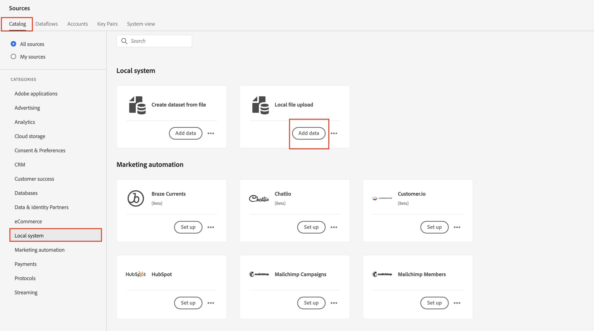

# 新しいデータフローの作成

## ソースに移動

1. Adobe Experience Platform UIで、次の場所に移動します。\
   **ソース** -> **カタログ** -> **ローカルシステム**
1. 次に、**ローカルファイルアップロード** カードの「**データを追加**」ボタンをクリックします

## データフローの設定

1. データフローの詳細画面で、**既存のデータセット**&#x200B;を選択します。
1. 以前に作成したデータセットを使用します。名前は&#x200B;**顧客アカウント - \&lt; イニシャル >**&#x200B;です
1. **プロファイルデータセット**&#x200B;の切り替えがオンになっていることを確認します。
（これをオンにしない場合、プロファイルストアはこのデータセットに入力される新しいデータを監視できず、このデータをプロファイルに取り込むことができません）
1. **部分取り込みを有効にする** トグルがオンになっていることを確認してください
（このオプションをオンにしない場合、レコードの1つにエラーがある場合、取り込み全体が失敗する可能性があります）
1. データフロー名を&#x200B;**Customer Account Batch v2 - \&lt;Your Initials>**&#x200B;に設定します
1. すべてのアラートを有効にする&#x200B;**ソースデータフローの開始/成功/失敗**
1. 問題がなければ、画面の右上隅にある「**次へ**」ボタンをクリックして、次の手順に進みます。

## サンプルファイルをアップロード

1. UIに&#x200B;**Lab\_Customer\_Account.csv** ファイルをドラッグ&amp;ドロップまたはアップロードします。  完了すると、画面は以下のようになります。

## マッピングの読み込み

すべてのマッピングを再度設定する代わりに、マッピング画面で、以前に作成したマッピングを読み込むことができます。

1. 「**マッピングをインポート**」ボタンをクリックします
1. 以前に作成したマッピングを持つデータフローを選択します

>[!NOTE]
>
>マッピングのインポートは、他のデータフローからマッピングを再利用し、実行する必要があるマッピング作業を削減する便利な方法です
