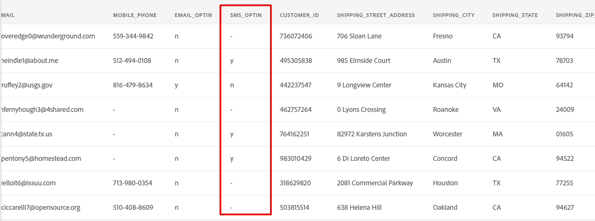
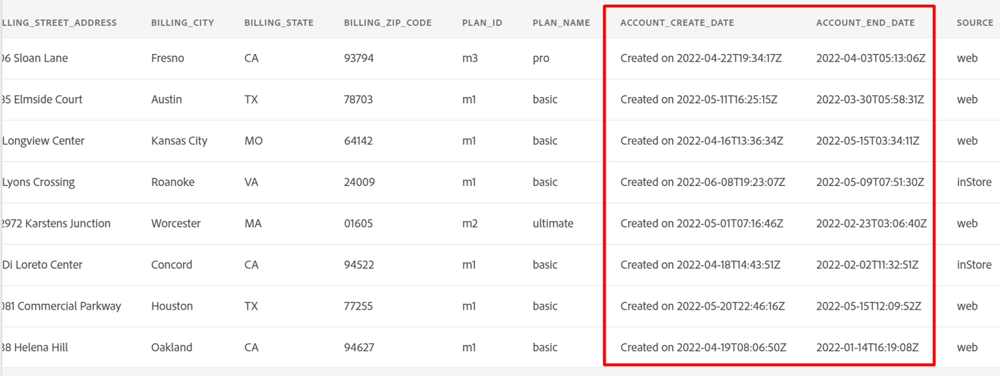

# データフローの作成

## ソースに移動

1. Adobe Experience Platform UIで、次の場所に移動します。\
   **ソース** -> **カタログ** -> **ローカルシステム**
1. 次に、**ローカルファイルアップロード** カードの「**データを追加**」ボタンをクリックします

## データフローの設定

1. データフローの詳細画面で、**新しいデータセット**&#x200B;を選択します。
1. 出力データセットに&#x200B;**顧客アカウント - \&lt; イニシャル >**&#x200B;という名前を付けます
1. ドロップダウンリストから「**dep：顧客アカウント**」スキーマを選択します。
1. 「**プロファイルデータセット**」トグルボックスをオンにします。
（これをオンにしない場合、プロファイルストアはこのデータセットに入力される新しいデータを監視できず、したがって、このデータをプロファイルに取り込むことができません）
1. **部分取り込みを有効にする**をオンにします。
（このオプションをオンにしない場合、レコードの1つにエラーがある場合、取り込み全体が失敗する可能性があります）
1. データフロー名を&#x200B;**顧客アカウントバッチ - \&lt; イニシャル >**&#x200B;に設定します
1. すべてのアラートを有効にする&#x200B;**ソースデータフローの開始/成功/失敗**

   新しいデータセット、プロファイル、部分的な取り込み設定が設定された

   >[!NOTE]
   >
   >**部分取り込みを有効にする**&#x200B;は、データフロー全体が失敗と宣言されるまでに失敗する可能性のあるレコードの合計数（**INGEST**&#x200B;および&#x200B;**DCVS**）に対するエラー数の割合を指定します。

   >[!CAUTION]
   >
   >続行する前に、プロファイルと部分的な取り込みの両方で&#x200B;**データセットを**&#x200B;有効にしていることを確認してください。

1. 問題がなければ、画面の右上隅にある「**次へ**」ボタンをクリックして、次の手順に進みます。

## サンプルファイルをアップロード

1. このラボで使用するサンプルファイルを[ サンプルファイル ](../sample-files.md)からダウンロードします
1. UIに&#x200B;**Lab\_Customer\_Account.csv** ファイルをドラッグ&amp;ドロップまたはアップロードします。  完了すると、画面は以下のようになります。

   

1. プレビューペインで、次の属性を確認し、次の点に注意してください。

   - **sms\_optIn**&#x200B;は、同意フィールドに欠落している値がいくつかあります（「 – 」としてプレビューに表示）
   - **account\_create\_date**&#x200B;に適切な日付形式がありません。 1つの文字列に、日付と時刻の値と共に文字列値が含まれます。
   - **account\_end\_date**&#x200B;の日付形式が適切です。

   

   

   >[!NOTE]
   >
   >このラボの後のマッピングステップで、欠落している値、日付、不適切な形式のフィールドを処理する必要があります

1. 画面の右上隅にある「**次へ**」ボタンをクリックして、次の手順に進みます
