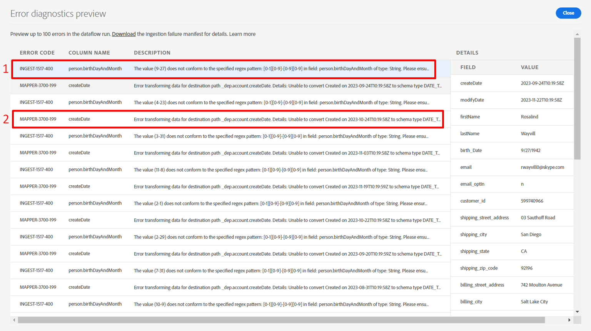

# エラーのデバッグ

## エラー診断のプレビュー

数分後、**ステータス**&#x200B;にエラーが表示されます。 エラーの詳細をドリルダウンして、エラーの原因を確認します。

1. **データフロー実行開始日**&#x200B;をクリック
1. **エラー診断のプレビュー**&#x200B;をクリックして、失敗した各行の具体的な詳細を確認します

失敗を示す


画面には、エラーコードが完全なエラーメッセージと失敗した行の意味に関する詳細が表示されます。

エラーコード、メッセージ、失敗した行を表示する

>[!NOTE]
>
>右側にスクロールして、このエラーコードに関連付けられているソースデータを表示します


## エラータイプについて

### INGEST-XXXX-XXX エラー

このエラーは、**person.birthDayAndMonth**&#x200B;が2桁の月と2桁の日の形式で想定されているために発生します（4月27日は04-27としてフォーマットする必要があります）

```none
The value (9-27) does not conform to the specified
regex pattern: [0-1][0-9]-[0-9][0-9] in field: 
person.birthDayAndMonth of type: String
```

>[!CAUTION]
>
>person.birthDayAndMonthは必須フィールドではありませんが、正規表現に準拠していない場合、システムは「データ破損の問題」として扱い、重大なエラーであることに注意してください。


### MAPPER-XXXX-XXX エラー

このエラーは、**createDate**&#x200B;のソースフィールドの文字列値が`Created on 2022-04-22T19:34:17Z`であるため発生します。 先頭のテキスト `Created on`のため、この値を自動的に日付に変換できません。 計算フィールドを使用してデータをクレンジングする必要があります。

```none
Error transforming data for destination path 
_dep.account.createDate. Details: Unable to convert 
Created on 2023-09-24T10:19:58Z to schema type DATE_TIME
```

>[!NOTE]
>
>このエラーは、マッピング中に警告のみが発生するため、深刻なエラーではありません。 このため、データフローの実行は失敗しないため、このラボでは、このエラーを修正しません。
