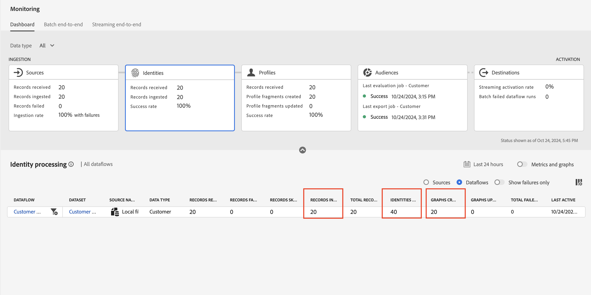
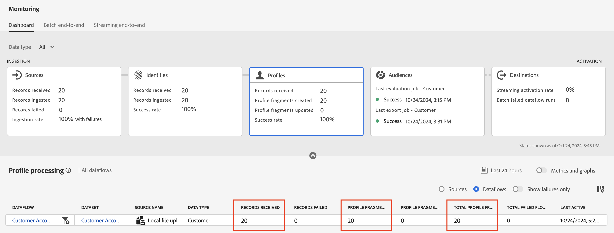

# エラーの修正

## 生年月日を修正

1. **person.birthDayAndMonth** XDM フィールドに入力する計算フィールドの横にある矢印アイコンをクリックします


1. 以下の計算フィールドコードを使用して式を更新し、**プレビュー**&#x200B;をクリックします

```none
concat(date_part("mm", date(birth_Date, "M/d/yyyy")).toString(),"-", date_part("dd", date(birth_Date, "M/d/yyyy")).toString())
```

>[!NOTE]
>
>データは2桁の月と2桁の日として表示されます（例：4月27日を04-27として示します）。 `mm`と`dd` パラメーターは0個のパディングを追加します。

1. すべてが正常に見える場合&#x200B;**計算フィールドを保存**&#x200B;します

1. 次に、**終了**&#x200B;をクリックして、データフローの取り込みを実行します。


## 取り込みを検証

数分後、データフロー実行が実行され、成功が表示されます。

顧客アカウントの取り込みに成功したことを示す


## 監視画面

1. **データ管理** セクションの&#x200B;**監視** アイコンの左側のパネルをクリックして、監視画面に移動します。
1. **ソース** カードをクリックし、下部バーをスクロールして、データフロー実行の詳細を確認します。 次の点に注意してください。
   - 受信した&#x200B;**レコード：** 20件のレコードが処理のためにソースから受信されました
   - 取り込まれた&#x200B;**レコード：** 20件のレコードが、マッピングとデータ処理の後にデータレイクに取り込まれました。
   - **レコードが失敗しました：**&#x200B;ここに0が表示されます。 これは、取り込みエラーとDCVS エラーの合計数を表します。 MAPPERの警告は除外されます。
   - **取り込み率：**&#x200B;これは、受信したレコードに対して取り込まれたレコードの比率です。 受信したレコードの100%が正常に処理されました

監視画面の

>[!NOTE]
>
>部分的データ取り込みが有効になっている場合、特定のデータフロー実行の&#x200B;**取り込みレート**&#x200B;は、データフローの詳細の一部として設定したしきい値まで\&lt;100%にすることができます。 また、データが取り込まれなかったデータフロー実行については、100%の成功が報告されます。

>[!NOTE]
>
>レコードは失うことはできません。
>
>**受信したレコード** = **取り込んだレコード** + **レコードが失敗しました**
>
>**取り込み率=取り込まれたレコード / 受信したレコード**
>
>**部分取り込みしきい値= レコードが失敗しました/ レコードを受信しました**


## ID

**ID** カードをクリックし、下部バーをスクロールして、データフロー実行の詳細を確認します。 ID サービスで次の点に注意してください

- 受信した&#x200B;**レコード：** 20件のレコードは、新しいバッチを監視しているときに&#x200B;*ID ストア*&#x200B;によって受信されました。つまり、データセットはプロファイル用にマークされました。
- **取り込まれたレコード：** 20件のレコードが取り込まれました（ID情報のために処理されました）
- **レコードがスキップされました：**&#x200B;新しいID関係を持つ単一のID レコードまたはレコードがなかったため、なし。
- **成功率（カード内でのみ利用可能）:**&#x200B;これは、受信したレコードと取り込んだレコードの比率です。
- 追加された&#x200B;**ID:** 40個のID （CustomerIDごとに20個、電子メールアドレスに20個）が、リアルタイム顧客プロファイルの全体的なID グラフに追加されました
- **作成されたグラフ：**&#x200B;処理されたレコード（データの各行に見つかった関係）に基づいて、20個の一意のグラフが作成されました
- **グラフが更新されました：**&#x200B;これは、IDがグラフに追加されたかどうかを示します。

監視画面の


## プロファイル

**プロファイル** カードをクリックし、下部バーをスクロールして、データフロー実行の詳細を確認します。 プロファイルサービスで次の点に注意してください。

- 受信した&#x200B;**レコード：** 20件のレコードがプロファイルストアで処理のために受信されました
- **レコードが失敗しました：** レコードのいずれも失敗しませんでした。 しかし、失敗した場合は、プロファイルの問題への取り込みであったことがわかります。
- **プロファイルフラグメントが作成されました：** 20個のプロファイルフラグメントが作成されました
- **プロファイルフラグメントが更新されました：** 20個のプロファイルフラグメント全体がタッチされました
- **成功率：**&#x200B;これは100%です。 これは、受信したレコードに失敗したレコードの割合です。

>[!NOTE]
>
>**スキップされたレコード**&#x200B;指標は、プロファイルでは使用できません。

監視画面の

>[!NOTE]
>
>宛先カードがあり、このラボで調べたものと類似した指標があることに注意してください。 これらの指標は、オーディエンスやデータセットを活用してからのみ理解できます。
