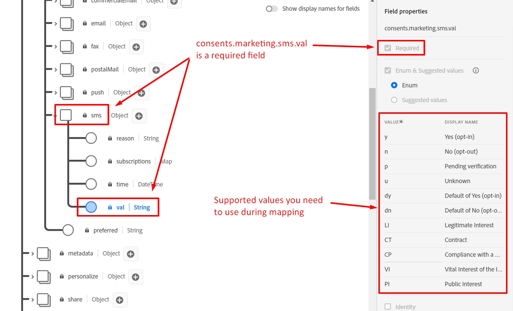
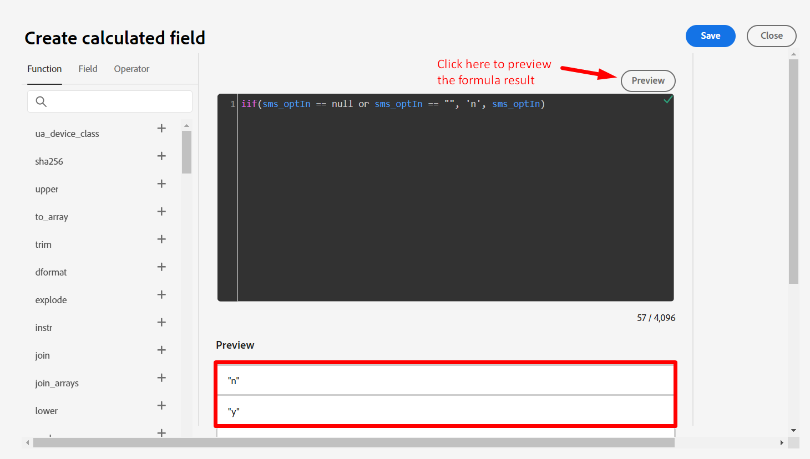
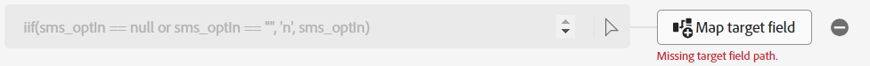
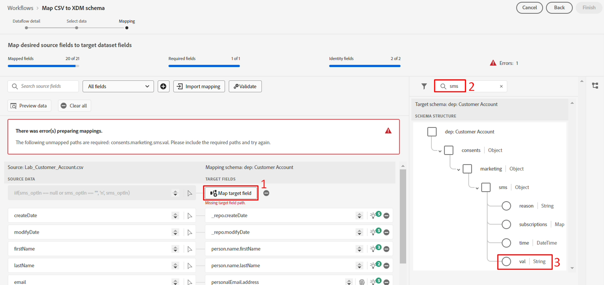
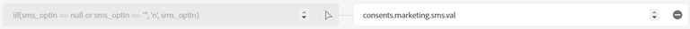
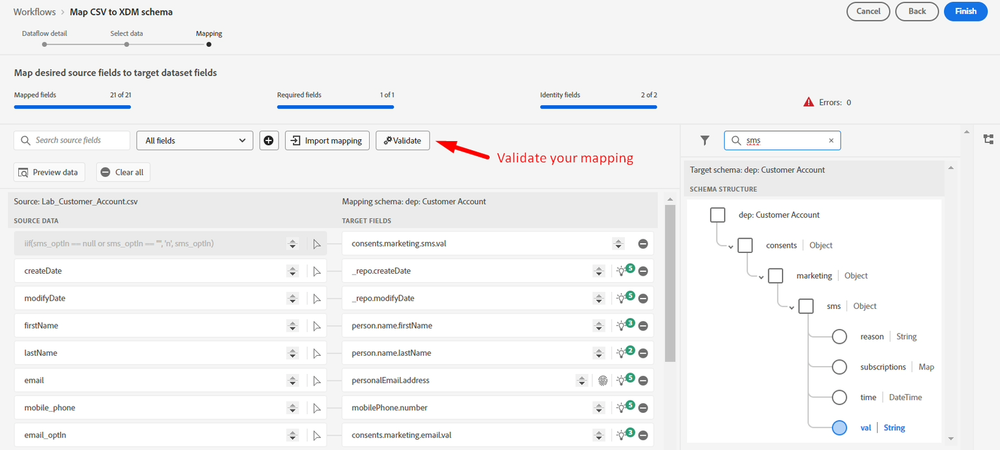
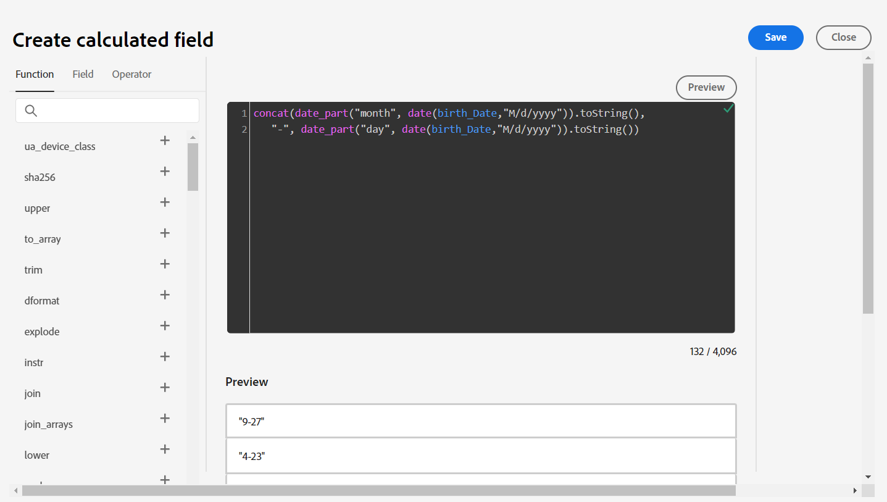

# 計算フィールド

## 概要

sms\_optIn フィールドは、顧客アカウントスキーマの必須フィールドです。 問題は、ストリーミングソースのsms\_optIn フィールドが&#x200B;*null*&#x200B;値を送信できるので、それに対処するために計算フィールドが必要になることです。そうしないと、これらのレコードは取り込みからスキップされ、損失が発生します。

に示すように、consents.marketing.sms.val フィールド


## 計算フィールドを作成

1. **新しいフィールドタイプ** アイコンをクリックして計算フィールドを作成し、**計算フィールドを追加**&#x200B;を選択します。 欠落しているすべての値について、同意は与えられないと見なされ、**&quot;n&quot;**&#x200B;としてマークされます。 計算フィールドを介した変換がこの新しいマッピングへの入力であるため、計算フィールドは左側の列に表示されます。

   


1. 計算フィールドを作成ダイアログボックスで、次の式を追加し、**プレビュー**&#x200B;をクリックします

   ```none
   iif(sms_optIn == null or sms_optIn == "", 'n', sms_optIn)
   ```

   


1. 黒いボックスの右上隅に緑色のチェックマークが表示され、式の有効性を示す必要があります。データプレビューには、**&quot;n&quot;**&#x200B;または&#x200B;**&quot;y&quot;**&#x200B;のみが値として表示されます。 問題ないようです。**保存**&#x200B;をクリックしてください。


## ターゲットにマップ

新しいフィールドがマッピング画面に追加されますが、マッピングされていないターゲットフィールドパスが表示されます。



1. 作成した新しい計算フィールドの&#x200B;**マップターゲットフィールド**&#x200B;をクリックします
1. 右側のペインで、ターゲットスキーマパネルが開きます。 検索ボックスに&#x200B;**sms**&#x200B;と入力します
1. **val** フィールドを選択します

   


   最終的なマッピングは次のようになります。

   


1. マッピングを検証して、正しく表示されるようにします



>[!NOTE]
>
>有効なSMS値を持たない行は、取り込み中に拒否されます。 部分取り込みが有効になっていない場合、この行を含む取り込み失敗は、バッチまたはファイル全体の取り込みを失敗します。 部分取り込みを有効にすると、値が欠落している必須フィールドを持つ行は拒否されますが、他の行は取り込まれます。


## 誕生日の処理

出生の日、月、年を別々のフィールドに分割して、その一部を下流の活動で使用できないようにすることが必要です。 これを解決するには、2つの計算フィールドを作成する必要があります。

### 生年月日のマッピングを作成

1. 新しい計算フィールドを追加して、プロファイルの生年月日を取得します
1. 計算フィールドには次のコードを使用します。

   >[!NOTE]
   >
   >上記のコードをコピーするのではなく、コード部分を個別に実行して、複数行が許可されないので、より複雑な計算フィールドを1行に作成するために、どのように構成されているかを確認して、何が起こっているのかを理解してみてください。 次のことをお試しください。
   >
   >1. `date(birth_Date,"M/d/yyyy")`
   >2. `date_part("day", date(birth_Date,"M/d/yyyy")).toString()`
   >3. `date_part("month", date(birth_Date,"M/d/yyyy")).toString()`
   >4. `concat(date_part("month", date(birth_Date,"M/d/yyyy")).toString(),`
   >   `"-", date_part("day", date(birth_Date,"M/d/yyyy")).toString())`


1. 「プレビュー」をクリックすると、次の結果が表示されます。 問題がなければ、**保存**&#x200B;をクリックします

   


1. 計算フィールドを&#x200B;**person.birthDayAndMonth**&#x200B;にマッピングします

1. マッピングの検証


### 誕生年のマッピングを作成

1. 以下のコードを使用して、プロファイルの誕生年をキャプチャする新しい計算フィールドを作成します

   ```none
   date_part("yyyy",date(birth_Date,"M/d/yyyy"))
   ```

1. 計算フィールドを&#x200B;**person.birthYear**&#x200B;のターゲット場所にマッピングします

1. マッピングの検証

>[!NOTE]
>
>日付は&#x200B;**MM/DD/YYYY**&#x200B;形式ですが、サンプル内の&#x200B;**birth\_Date**&#x200B;のデータが、その日と月の1桁または2桁で表示されることを確認してください。 **date**&#x200B;関数を機能させるには、**M/d/yyyy**&#x200B;などのデータの入力形式を指定して、月と日の1 ～ 2桁を考慮できるようにする必要があります。 この日付入力形式の指定がなければ、これらのマッピングの検証は失敗します。
