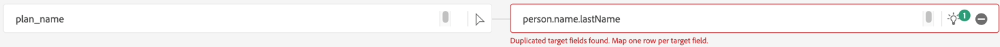
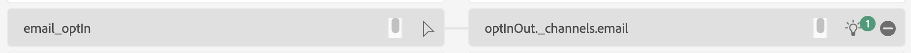
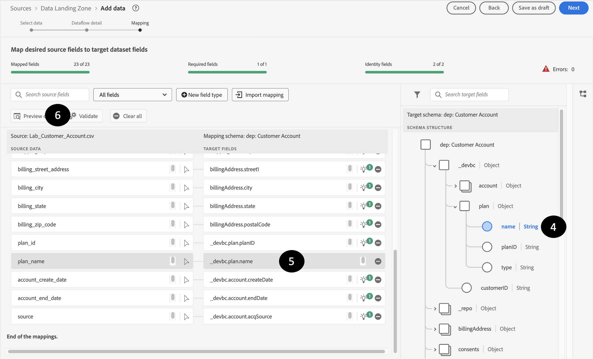

# パススルーマッピングの修正

## 特定のマッピングをドロップ

必要なソースデータの一部は、計算フィールドを使用して処理する必要があります。  これらの問題に対処するには、マッピングからこれらを削除し、マッピングを再検証します。

1. マッピングから次のソースデータをドロップします。
   - birth\_date
   - 倉庫
   - sms\_optIn
1. 「検証」ボタンをクリックして、マッピングを再検証します

>[!NOTE]
>
>「検証」をクリックした後も、エラーが表示される場合があります

## 誤ったマッピング例

AIやマシンラーニングによるレコメンデーションが有効であるものの、時には間違っていることがあります。  レコメンデーションを調べると、修正が必要なエラーが見つかる場合があります

>[!NOTE]
>
>以下は、独自のサンドボックスに表示される無効なマッピングの例です。 また、他のエラーが表示されることもあります。

## マッピングの重複

このシナリオでは、AI/MLの推薦者が2つの異なるソースフィールドを同じターゲットフィールド **person.name.lastName**&#x200B;にマッピングしたことがわかります

## 不正なマッピング

このマッピングは正しく見えますが、詳しく確認すると、**email**&#x200B;は&#x200B;**emailFormat**&#x200B;と同じではありません

これは、**email\_optIn**&#x200B;が間違った同意オブジェクトに誤ってマッピングされている場所です

間違った同意オブジェクトに誤ってマッピングされた

## パススルーマッピングの修正

間違ったターゲットフィールドを誤って指しているパススルーマッピングを修正するには、次の手順を実行します。

### 例

1. 無効なマッピングから開始し、ターゲットフィールドボックスをクリックします。 例えば、以下のマッピングでは、フィールド **person.name.lastName**&#x200B;が正しくマッピングされておらず、**planName**&#x200B;にマッピングされています
1. 右側に表示されるターゲットスキーマパネルで、適切なターゲットフィールドを選択し、**\_devbc.plan.name**&#x200B;を選択します
1. ターゲットフィールドは、ターゲットフィールドボックスで更新されます
1. このようなエラーを修正したら、**検証** ボタンを押して、これらの種類のエラーを減らし、新しいエラーを導入していないことを確認できるようにする必要があります。

>[!WARNING]
>
>すべてのマッピングエラーを解決するまで、次の手順に進まないでください
