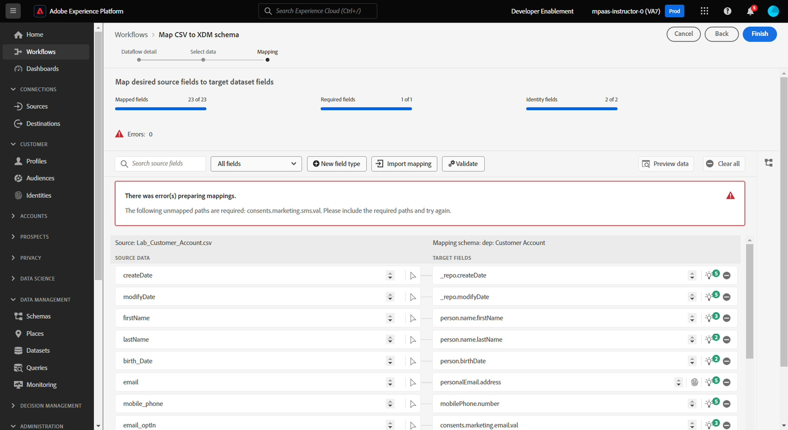

# マッピングデータ

## 概要

マッピング画面では、AI/マシンラーニングのレコメンデーションエンジンが、ソースデータセットのフィールドとスキーマフィールドの間で、複数の属性を自動的にマッピングします。 これらの自動マッピングはパススルーマッピングと呼ばれますが、エラーや誤ったマッピングが頻繁に発生するため、**慎重な検査**&#x200B;が必要です。

>[!NOTE]
>
>AI/マシンラーニングによるレコメンデーションはコンテキストベースであり、画面は上記のスクリーンショットとは異なる場合や、隣人と異なる場合があります

>[!NOTE]
>
>すべてのソース列は常に文字列として扱われることに注意してください
