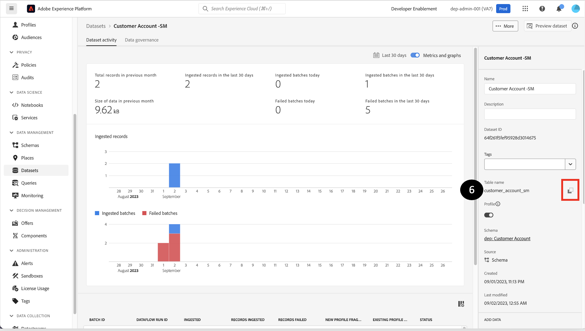
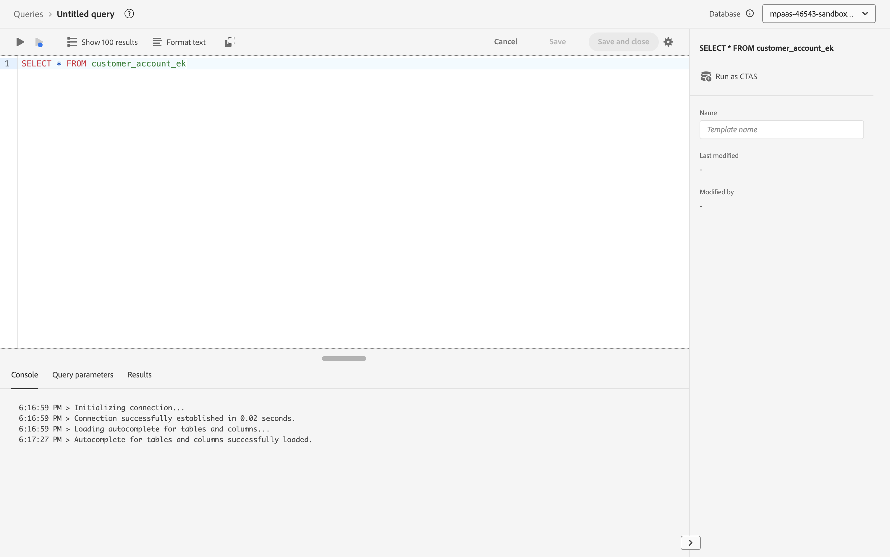

# 検証と検証

## データセットのプレビュー

1. **データセット**&#x200B;をクリック
1. **作成したデータセット名を**&#x200B;検索して&#x200B;**クリック**&#x200B;します。


1. 右上隅の「**データセットをプレビュー**」をクリックします


1. **スキーマ階層を示す左側のペインをクリックして、取り込んだレコードと同じレコードを**&#x200B;および&#x200B;**検証**&#x200B;します。


>[!NOTE]
>
>**データセットのプレビュー**&#x200B;には、このデータセットで成功した最新のバッチが表示されます。 以前のバッチは表示されません。 また、配列やマップなどの複雑なデータは現在表示できず、空の列として表示されます。 慌てないでください！ より包括的なビューを取得するには、SQLを使用して、以下で説明するようにデータセットを探索する必要があります。


## クエリデータセット

1. プレビューを&#x200B;**閉じる**
1. データセット画面で、**テーブル名**&#x200B;のコピーアイコンをクリックします。 下の例の画面では、テーブル名は`customer_account_sm`です




1. **クエリ** セクションに移動します

1. 「**クエリを作成**」をクリック


1. 次のSQL クエリを&#x200B;**Editor**&#x200B;にコピー&amp;ペーストします。 `<table_name>`を手順6で取得した値に置き換えることを忘れないでください。

```sql
SELECT * FROM <table_name>
```


1. 「**再生**」ボタンを押します。




1. **結果をプレビュー**

1. また、次のSQL クエリを実行して、データとともにXDM スキーマを取得します。

```sql
SELECT to_json(shippingAddress) FROM <table_name>
```

`postalCode` **ノード**&#x200B;のデータにアクセスするには、次のように入力します。

```sql
SELECT shippingAddress.postalCode FROM <table_name>
```

>[!TIP]
>
>おめでとうございます。  Real-Time Customer Profilesのサンプルセットの取り込みと作成が完了しました
