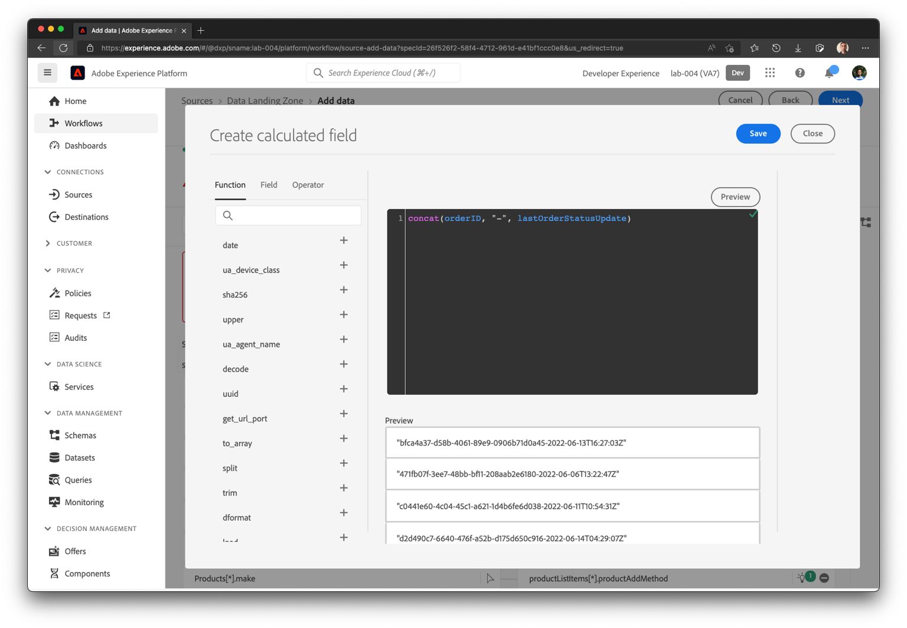
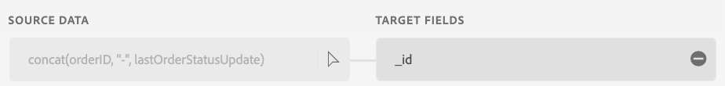
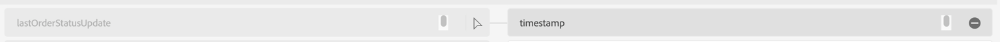
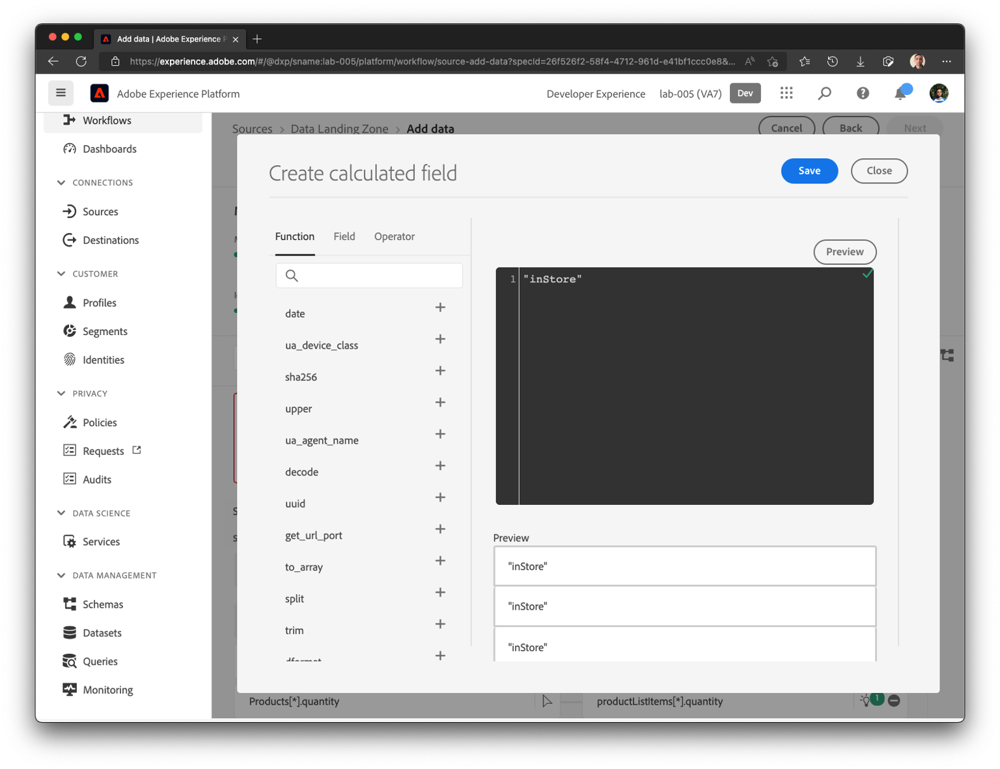

# 初期マッピング

前の演習と同様に、マッピングを検証し、場合によっては変更する必要があります。

## マシンラーニングのレコメンデーションの検証

1. マッピングステップでは、マシンラーニングレコメンデーションはほとんどの属性を自動的にマッピングします。 しかし、いくつかのエラーもあります。 最初の画面は以下のようになります。

のマッピングを生成しない2つのフィールドです

>[!NOTE]
>
>Experience Event データセットを初めてマッピングするので、**\_id**&#x200B;と&#x200B;**timestamp**&#x200B;はExperience Eventsにデフォルトで推奨またはマッピングされないことに注意してください。 手動でこれらを正しくマッピングする必要があります。

## Map \_id, timestamp and order.\_devbc.acqSource fields

1. **\_id、**&#x200B;をマッピングするには、次の計算フィールド式を記述し、「プレビュー」をクリックします

```none
concat(orderID, "-", lastOrderStatusUpdate)
```



にマッピング

1. ターゲットスキーマの&#x200B;**timestamp** フィールドが、次の計算フィールドにマッピングされていることを確認します。

```none
lastOrderStatusUpdate
```




1. 計算フィールド式&#x200B;**&quot;inStore&quot;**&#x200B;を&#x200B;**の順序にマッピングします。\_devbc.acqSource**



## 重複マッピングの処理

マッピング画面で問題が発生した場合は、**orderStatus**&#x200B;が&#x200B;**order.\_devbc.acqSource,**&#x200B;にマッピングされているなどの重複したマッピングがあります。「 – 」アイコンをクリックしてマッピングを削除します。

&#x200B;> [!NOTE]
>
>複数の入力フィールドを同じ出力フィールドにマッピングすることはできないので、マッピングが曖昧になります。 しかし、1つの入力フィールドをXDM スキーマの複数の出力フィールドにマッピングすることは可能です。


