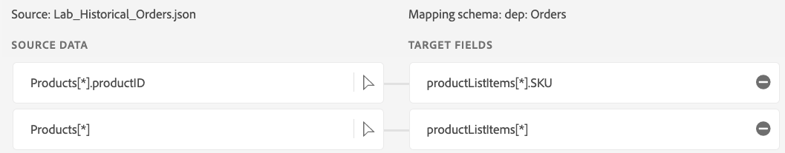
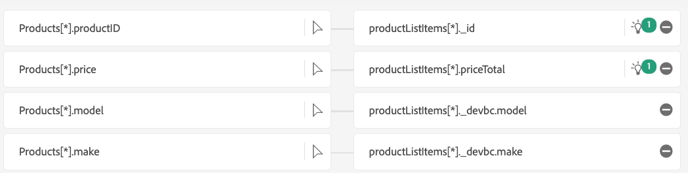

# オブジェクトコピーマッピング

この節では、オブジェクトのコピーマッピングを追加し、いくつかのオーバーライドを作成します。

## パススルーマッピング

「New field type」をクリックして、**products\[\*]**&#x200B;および&#x200B;**products\[\*].productID**&#x200B;で次のパススルーマッピングを追加し、ここに各行の新しいフィールドを追加します。 マシンラーニングのレコメンデーションにより、すでに存在する場合もあります。

| Sourceカラム | XDM列 |
| ----------------------- | ------------------------- |
| orderStatus | eventType |
| lastOrderStatusUpdate | タイムスタンプ |
| products\[\*] | productListItems\[\*] |
| products\[\*].productID | productListItems\[\*].SKU |

>[!NOTE]
>
>**products\[\*]**&#x200B;は、オブジェクトフィールドと&#x200B;**products\[\*].productID**&#x200B;の明示的フィールドマッピングとの間で1-1 フィールドマッピングを行っていることに注意してください。

>[!NOTE]
>
>**products\[\*].productID**&#x200B;は、**productListItems\[\*].\_id**&#x200B;に加えて&#x200B;**productListItems\[\*].SKU**&#x200B;にもマッピングされています。 これは、XDM スキーマの複数の出力フィールドにマッピングされる単一の入力フィールドの例です。 マッピングをそのままにしておきます。

1. マッピング **products\[\*].price**&#x200B;を&#x200B;**productListItems\[\*].priceTotal**&#x200B;に保ちます

## 特定のフィールドにオーバーライドを追加する

1. オブジェクトのコピーのマッピングを次の方法で上書き
   1. **products\[\*].make**&#x200B;を&#x200B;**productListItems\[\*].\_devbc.make**&#x200B;にマッピングしています
   2. **products\[\*].model**&#x200B;を&#x200B;**productListItems\[\*].\_devbc.model**&#x200B;にマッピングしています

## 特定のフィールドのオーバーライドの削除

1. **productListItems.currencyCode**&#x200B;と&#x200B;**productListItems.quantity**&#x200B;が自動入力されていることを確認します。
1. **productListItems\[\*].quantity**&#x200B;と&#x200B;**productListItems\[\*].currencyCode** マッピングを削除します。
1. オーバーライドは行われず、オブジェクトのコピーはパススルーフィールドに引き継がれます。

## オブジェクトのコピーマッピング、オーバーライドおよび削除の概要

| Sourceカラム | XDM列 | アクション |
| -------------------------- | ----------------------------------- | -------------------------------------- |
| products\[\*] | productListItems\[\*] | `Add` |
| products\[\*].productID | productListItems\[\*].SKU | `Add` |
| products\[\*].productID | productListItems\[\*].\_id | `No change` |
| products\[\*].make | productListItems\[\*].\_devbc.make | `Change` |
| products\[\*].model | productListItems\[\*].\_devbc.model | `Change` |
| products\[\*].price | productListItems\[\*].priceTotal | `No change` |
| products\[\*].quantity | productListItems\[\*].quantity | `Remove` |
| products\[\*].currencyCode | productListItems\[\*].currencyCode | `Remove` |

## マッピングの確認

確認する必要があるマッピングは2 セットあります。 合計では、2を削除した後に6つのマッピングが必要です。

オブジェクトのコピーのオーバーライドを追加した後のproductListItemsの

