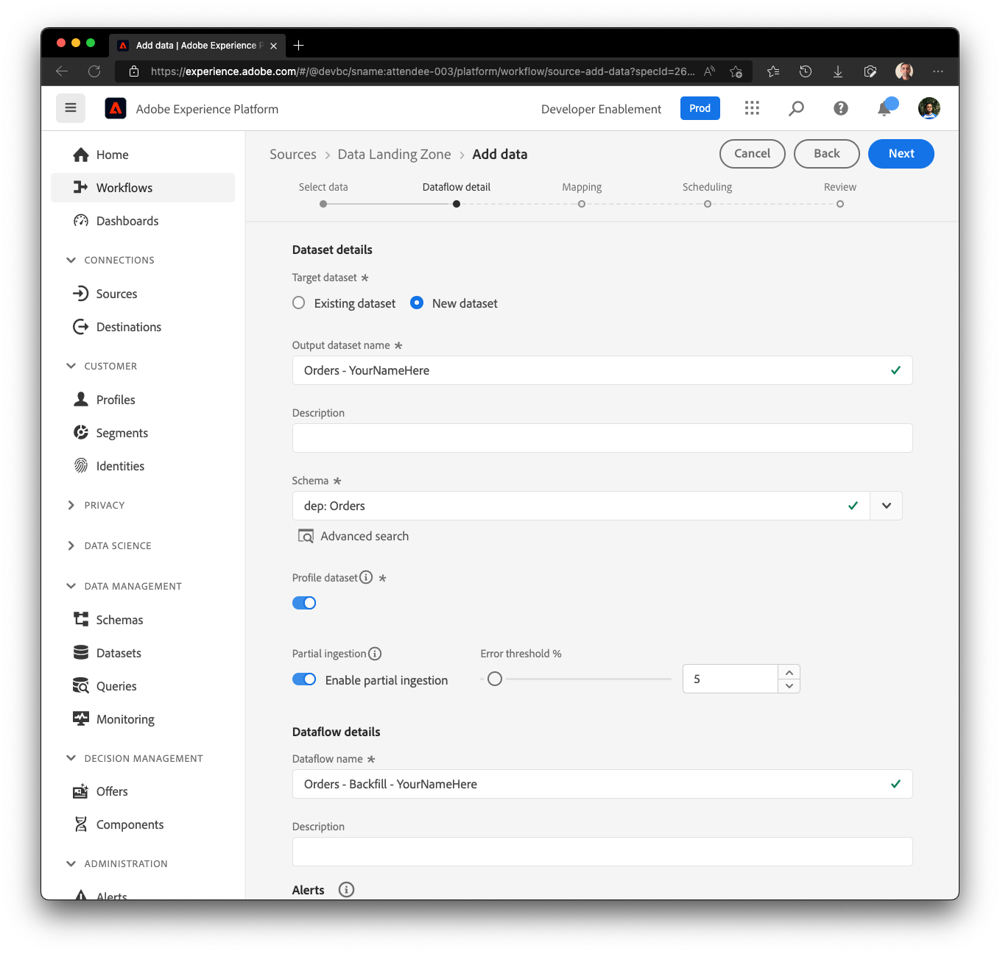

# ソースの設定

## サンプルファイルをアップロード

ラボで使用できるように、Azure Storage Explorerを介してサンプルデータファイルをデータランディングゾーンにアップロードする必要があります。  これを行うには、次の操作を行います。

1. [&#x200B; サンプルファイル &#x200B;](../../../sample-files.md)をダウンロード
1. **Lab\_Historical\_Orders.json** ファイルをドラッグ&amp;ドロップするか、上から保存したデータランディングゾーンにアップロードします。

アップロードすると、画面は以下のスクリーンショットのようになります。

データランディングゾーンにアップロードされたにアップロードされたLab_Historical_Orders.json

## ソースに移動

1. Adobe Experience Platformに移動し、**ソース** -> **カタログ** -> **クラウドストレージ**&#x200B;に移動します。
1. データランディングゾーンの&#x200B;**設定** / **データを追加**&#x200B;をクリックします

>[!NOTE]
>
>以前のバッチ取り込みラボからの接続を既に設定している場合は、**データを追加**&#x200B;がデフォルトのアクションとして表示されます

## ファイルをプレビュー

1. **Lab\_Historical\_Orders.json** ファイルを選択し、その内容をプレビューします
1. 画面の右上隅にある&#x200B;**次へ**&#x200B;をクリックして、次の手順に進みます

## データフローの設定

1. データフローの詳細画面で、**新規データセット**&#x200B;を選択します
1. 出力データセットに&#x200B;**Orders - YourNameHere**&#x200B;という名前を付けます
1. スキーマ名&#x200B;**dep: Orders**&#x200B;を選択します
1. 「**プロファイルデータセット**」トグルボックスをオンにします
（これをオンにしない場合、プロファイルストアはこのデータセットに入力される新しいデータを監視できず、したがって、このデータをプロファイルに取り込むことができません）
1. **部分取り込みを有効にする**
（これをオンにしないと、いずれかのレコードにエラーがある場合、取り込みが失敗する可能性があります）
1. データフロー名を&#x200B;**Orders - Backfill - YourNameHere**&#x200B;に設定します
1. すべてのアラートを有効にする&#x200B;**ソースデータフローの開始/成功/失敗**

>[!CAUTION]
>
>プロファイルと部分的な取り込みの両方でデータセットが&#x200B;**有効**&#x200B;であることを確認します。

画面の右上隅にある&#x200B;**次へ**&#x200B;をクリックして、次の手順に進みます
