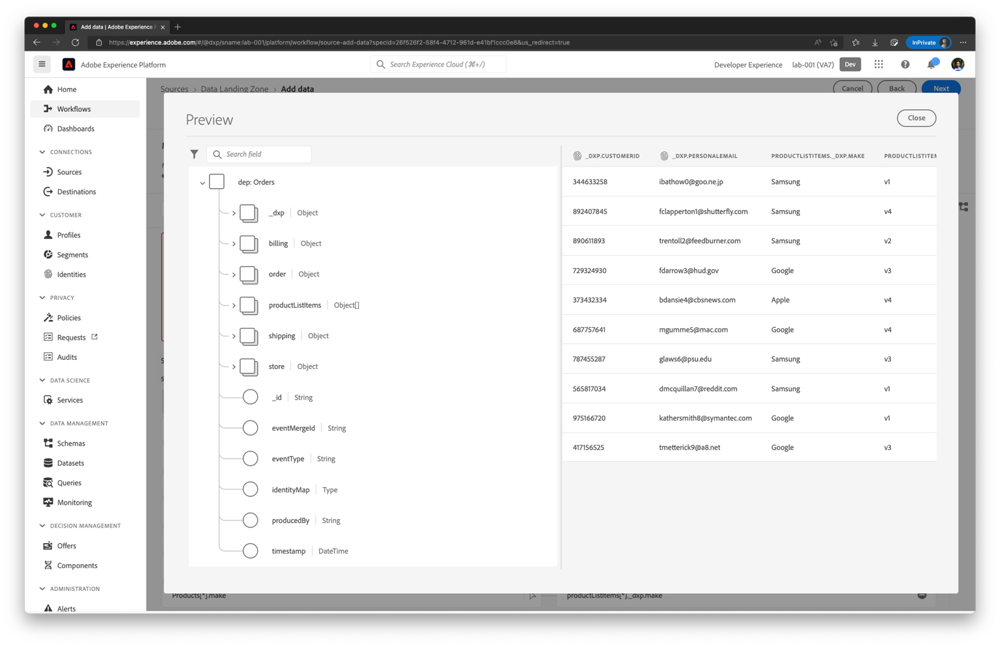
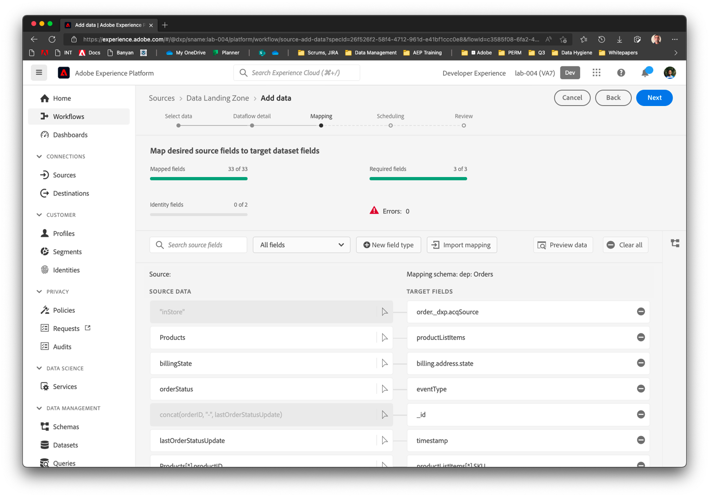

# データフローの検証とスケジュール

## マッピングセットを二重チェック

| # | Sourceカラム | XDM列 |
| -- | ------------------------------------------- | -------------------------------------------------------- |
| 1 | orderStatus | eventType |
| 2 | lastOrderStatusUpdate | タイムスタンプ |
| 3 | orderID | order.orderID |
| 4 | orderDate | order.orderDate |
| 5 | orderTotal | order.priceTotal |
| 6 | paymentType | order.payment.paymentType |
| 7 | paymentAmount | order.payment.paymentAmount |
| 8 | paymentCurrencyCode | order.payment.currencyCode |
| 9 | paymentTransactionID | order.payment.transactionID |
| 10 | plan.ID | order.\_devbc.plan.planID |
| 11 | customerID | \_devbc.customerID |
| 12 | personalEmail | \_devbc.personalEmail |
| 13 | storeID | store.storeID |
| 14 | shippingStreetAddress | shipping.address.street1 |
| 15 | shippingCity | shipping.address.city |
| 16 | shippingState | shipping.address.state |
| 17 | shippingZip | shipping.address.postalCode |
| 18 | shippingMethod | shipping.shippingMethod |
| 19 | shippingAmount | shipping.shippingAmount |
| 20 | shippingDestination | shipping.shippingDestination |
| 21 | billingStreetAddress | billing.address.street1 |
| 22 | billingCity | billing.address.city |
| 23 | billingState | billing.address.state |
| 24 | billingZip | billing.address.postalCode |
| 25 | products\[\*] | productListItems\[\*] |
| 26 | products\[\*].productID | - productListItems\[\*].\_id - productListItems\[\*].SKU |
| 27 | products\[\*].make | productListItems\[\*].\_devbc.make |
| 28 | products\[\*].model | productListItems\[\*].\_devbc.model |
| 29 | products\[\*].price | productListItems\[\*].priceTotal |
| 30 | concat （orderID, &quot;-&quot;, lastOrderStatusUpdate） | \_id |
| 31 | 「inStore」 | order.\_devbc.acqSource |

## マッピング出力のプレビュー

1. マッピング出力をプレビューします。 すべての属性をスクロールして、右側の属性の横に赤い感嘆符が表示されないようにします。

   

1. プレビューの左側のナビゲーションで、**productListItems** オブジェクト配列を選択します。 右側が更新され、そのオブジェクト配列内の属性のみが表示されます。

>[!NOTE]
>
>**productListItems.currencyCode**&#x200B;と&#x200B;**productListItems.quantity**&#x200B;は、（マッピングを削除した後でも）自動的に入力されます。 これは、親オブジェクトとして&#x200B;**productListItems**&#x200B;がマッピングされているためです。

重複したオーバーライドを削除した後のproductListItemsの

## 実行のスケジュール

1. 頻度を分、間隔を15に設定して、**を15分ごとに**&#x200B;実行するようにスケジュールを設定します。 フローを確認し、「終了」をクリックします。

   >[!CAUTION]
   >
   >スケジュールが15分に設定されていることを確認します。 実行を&#x200B;**1回実行**&#x200B;としてスケジュールすると、後でマッピングを変更しても実行を再開できません。

1. データフローの実行はすぐに開始されず、数分かかります。 そのため、最後のデータフロー実行ステータスは「*実行なし*」に設定されます。

1. 数分後、データフローが成功します。 **最後のデータフロー実行ステータス**&#x200B;と&#x200B;**最後のデータフロー実行日**&#x200B;に注意してください。

1. データフロー名をクリックして、データフロー実行のリストを取得します。 10 レコードを取り込む必要があります。

1. データフロー実行開始時間をクリックして、エラー診断の詳細を確認します。

1. 左側のナビゲーションバーで、Platformのデータセットに移動し、**Orders - YourNameHere**&#x200B;をクリックします

1. **データセットのプレビュー**&#x200B;をクリックします。
