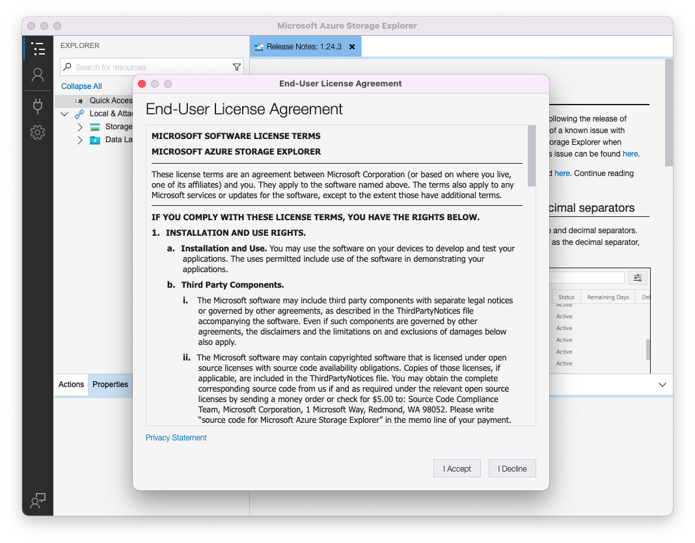
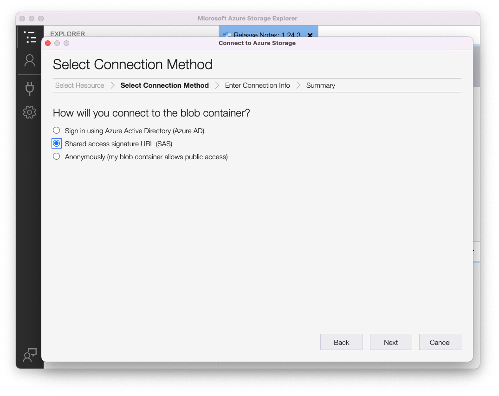
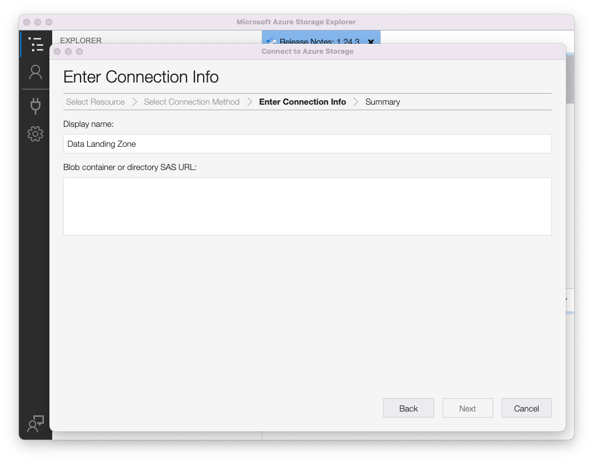
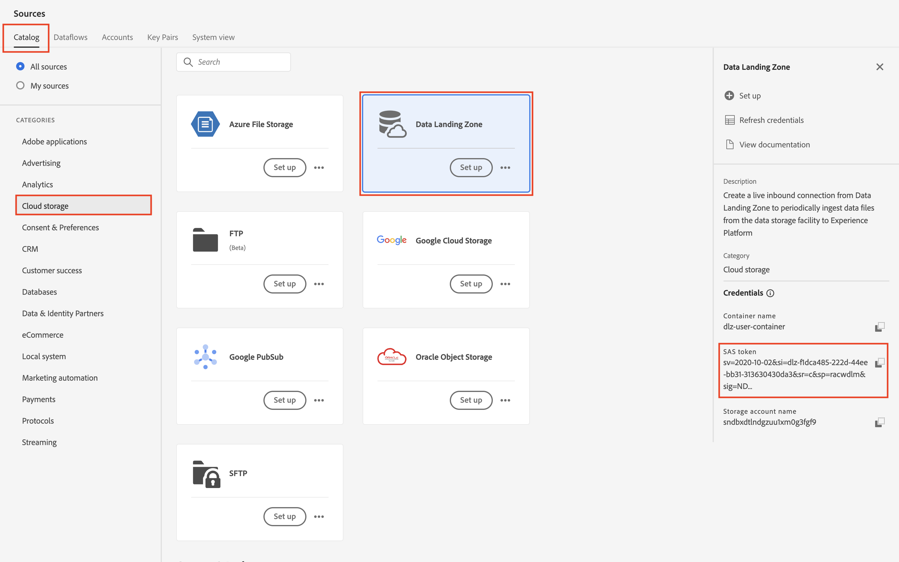

# データランディングゾーンの活用

## 前提条件

Azure Storage Explorerをまだダウンロードしていない場合は、このラボの要件であるため、今すぐダウンロードしてください。  ダウンロードは以下のリンクからダウンロードできます。

[Azure Storage Explorerのダウンロード](https://azure.microsoft.com/en-us/blog/microsoft-azure-data-lake-storage-adls-in-storage-explorer-public-preview/)

1. アプリケーションのインストール
1. アプリケーションを初めて開いたときに、エンドユーザー使用許諾契約に同意します

Azure Storage Explorerの

## Experience PlatformでのAzure Storage Explorerの設定

1. Azure Storage Explorerを開き、**リソースを選択アイコン**&#x200B;をクリックし、**ADLS Gen2 Containerまたはdirectory**&#x200B;を選択します

   

1. **共有アクセス署名URL （SAS）**&#x200B;を選択し、**次へ**&#x200B;をクリックします

   

1. 表示名を&#x200B;**データランディングゾーン**&#x200B;と入力します

   >[!NOTE]
   >
   >この手順を続行するには、SAS URLを指定する必要があります。  これは、次のステップで表示されるExperience Platformから取得できます。

   

1. Adobe Experience Platformに移動し、次の操作を行ってデータランディングゾーンに移動します。

   - **ソース/カタログ**&#x200B;に移動します
   - ソースの下の&#x200B;**クラウドストレージ**&#x200B;を選択します
   - 次に、**データランディングゾーン** カードを探します
   - データランディングゾーンカードをクリックし、右側のパネルで「**資格情報を表示**」をクリックします

   

1. 表示されるモーダルから&#x200B;**SASUri**&#x200B;をコピーします。

   Azure Storage Explorerに戻り、前の手順で空白のままにした&#x200B;**SASUri値**&#x200B;を&#x200B;**Blob コンテナまたはディレクトリ SAS URL**&#x200B;に貼り付けます

   

1. **次へ**&#x200B;をクリックして続行します

   

1. 概要画面で「**Connect**」をクリックします

次のような画面が表示されるはずです

>[!SUCCESS]
>
>おめでとうございます。  Azure Storage Explorerが正常に設定されました
