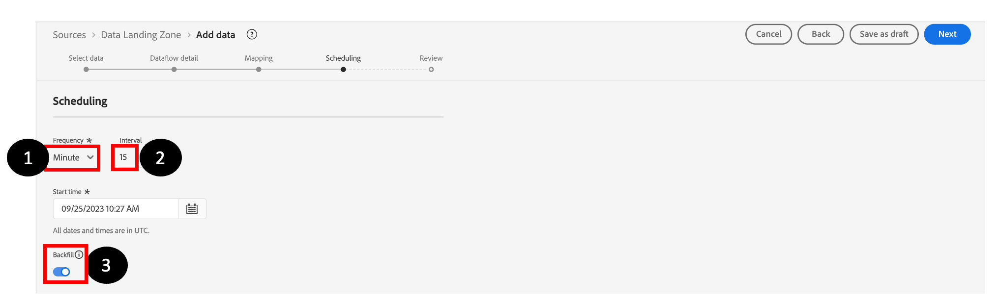

# データフローのスケジュール

**スケジュール設定** ステップで、次の手順を実行します。

1. **頻度**&#x200B;を分に設定します。
1. **間隔**&#x200B;を15分（15分）に設定します。
1. 「**バックフィル**」オプションをオンにします。

>[!NOTE]
>
>**開始時間**&#x200B;がUTCであることを確認してください。
>
>協定世界時（UTC）は、世界中のタイムキーピングの基準点として使用されるグローバルな時間標準です。 グローバルに分散したチームの場合、さまざまな地域や国に関する共通のリファレンスを提供するため、さまざまなタイムゾーンをまたいでアクティビティを調整したり、イベントをスケジュールしたりすることが容易になります。
>
>AEP UIの様々な部分では、タイムスケジュールのベースとしてUTC時間が表示されます。 UTC時間はロンドン時間より1時間遅れています。 UTC時間について不明な点がある場合は、「UTC時間を今すぐ」と入力してください。

>[!NOTE]
>
>実際には、**Backfill** オプションは、すべてのファイルの1回限りのバックフィルを行い、その後の実行は新しいファイルを取ります。

データフローを確認し、**完了をクリックします。**

>[!CAUTION]
>
>データフローに「**1回実行**」オプションを選択した場合、このスケジュールを編集したり、後でデータフローを更新したりすることはできません。 ただし、データフローをオンデマンドで実行できます。つまり、新しいデータを取り込む必要がある場合は再実行できます。

**終了**&#x200B;をクリックすると、**データフロー**&#x200B;画面に戻ります。 データフローの作成には数分かかります。 最後のデータフロー実行ステータスは&#x200B;**実行がないことを示します**。 最初のランは数分で開始されます。

>[!NOTE]
>
>バックエンドが更新をUIにプッシュしないため、ステータスの更新を確認するには、ページを継続的に更新する必要があります。

>[!NOTE]
>
>すべてのアラートをオンにすると、フローの実行が開始され、正常に完了または失敗したときに、ブラウザーの右上隅にあるブラウザーにアラートが表示されます
