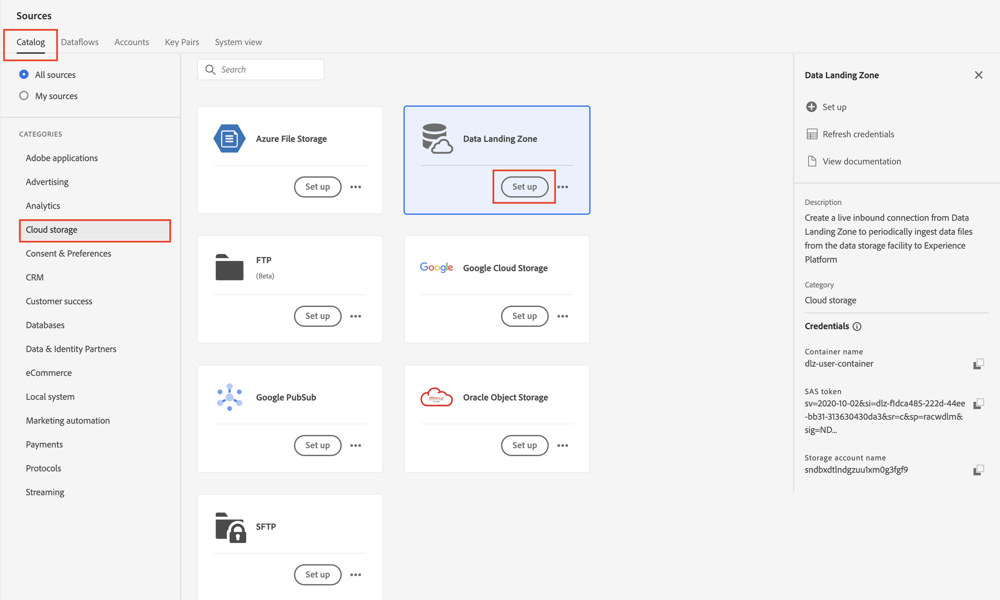
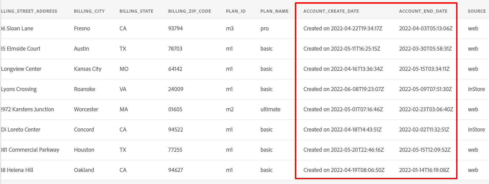
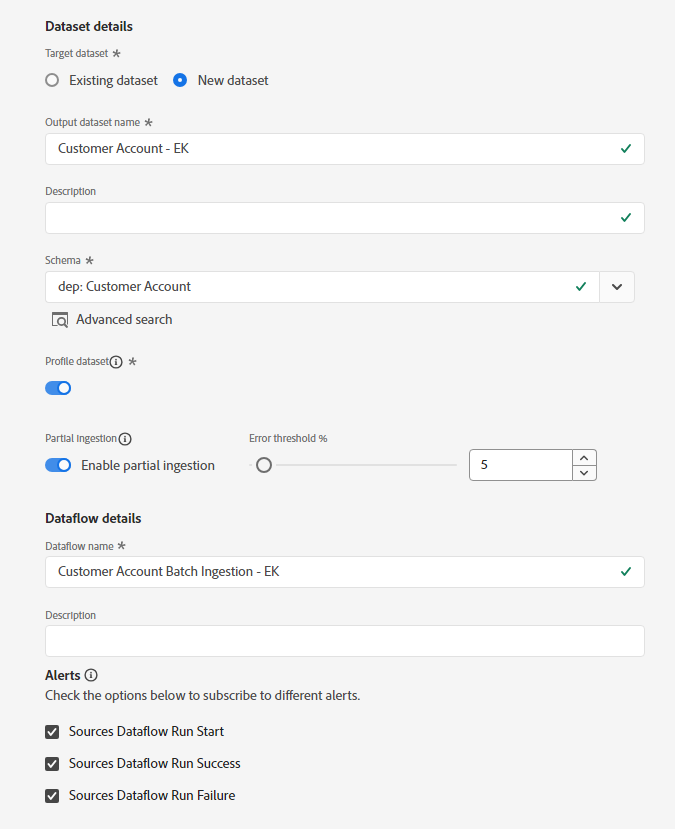

# ソースの設定

## サンプルファイルをアップロード

ラボで使用できるように、Azure Storage Explorerを介してサンプルデータファイルをデータランディングゾーンにアップロードする必要があります。  これを行うには、次の操作を行います。

1. [ サンプルファイル ](../../sample-files.md)をダウンロード
1. **Lab\_Customer\_Account.csv** ファイルをドラッグ&amp;ドロップするか、前の手順で保存したデータランディングゾーンにアップロードします。

アップロードされた画面は以下のスクリーンショットのようになります。

>[!WARNING]
>
>ファイルを&#x200B;*プロジェクト* フォルダーにアップロードしないでください。 ラボでは使用しないプリロード済みのデータが含まれています。

## ソースに移動

1. Adobe Experience Platformに移動し、**ソース** -> **カタログ** -> **クラウドストレージ**&#x200B;に移動します。
1. データランディングゾーンの&#x200B;**設定** / **データを追加**&#x200B;をクリックします

>[!NOTE]
>
>そのソースに少なくとも1つの接続が存在する場合は、**データを追加**&#x200B;がデフォルトアクションとして表示されます。 そのソースに接続が存在しない場合は、**セットアップ**&#x200B;がデフォルトのアクションとして表示されます

## ファイルをプレビュー

1. **Lab\_Customer\_Account.csv**&#x200B;を選択します

   

1. プレビューペインで、次の属性を確認し、次の点を確認します。

   - **sms\_optIn**&#x200B;は、複数の値が欠落している同意フィールドです（「 – 」としてプレビューに表示）。
   - **account\_create\_date**&#x200B;に適切な日付形式がありません。 1つの文字列に、日付と時刻の値と共に文字列値が含まれます。
   - **account\_end\_date**&#x200B;の日付形式が適切です。

   ファイルのプレビュー](assets/setup-source-sms-optin-missing-values.png "sms_optin")に複数の値が表示されている![sms_optIn フィールド

   ファイルのプレビューに表示される

   >[!NOTE]
   >
   >このラボの後のマッピングステップで、欠落している値、日付、不適切な形式のフィールドを処理する必要があります

1. 画面の右上隅にある&#x200B;**次へ**&#x200B;をクリックして、次の手順に進みます

## データフローの設定

1. データフローの詳細画面で、**新しいデータセット**&#x200B;を選択します。
1. 出力データセットに&#x200B;**顧客アカウント - \&lt; イニシャル >**&#x200B;という名前を付けます
1. ドロップダウンリストから「**dep：顧客アカウント**」スキーマを選択します。
1. 「**プロファイルデータセット**」トグルボックスをオンにします。
（これをオンにしない場合、プロファイルストアはこのデータセットに入力される新しいデータを監視できず、したがって、このデータをプロファイルに取り込むことができません）
1. **部分取り込みを有効にする**をオンにします。
（これをオンにしないと、いずれかのレコードにエラーがある場合、取り込みが失敗する可能性があります）
1. データフロー名を&#x200B;**Customer Account Batch Ingestion - \&lt;Your Initials>**&#x200B;に設定します
1. すべてのアラートを有効にする&#x200B;**ソースデータフローの開始/成功/失敗**

新しいデータセット、プロファイル切り替え、部分的な取り込み設定が設定された

>[!CAUTION]
>
> プロファイルと部分的な取り込みの両方で&#x200B;**が** データセットを有効にしていることを確認してください。

画面の右上隅にある「**次へ**」をクリックして、次の手順に進みます。

>[!NOTE]
>
>**部分取り込みを有効にする**&#x200B;は、データフロー全体が失敗と宣言されるまでに失敗する可能性のあるレコードの合計数（**INGEST**&#x200B;および&#x200B;**DCVS**）に対するエラー数の割合を指定します。
