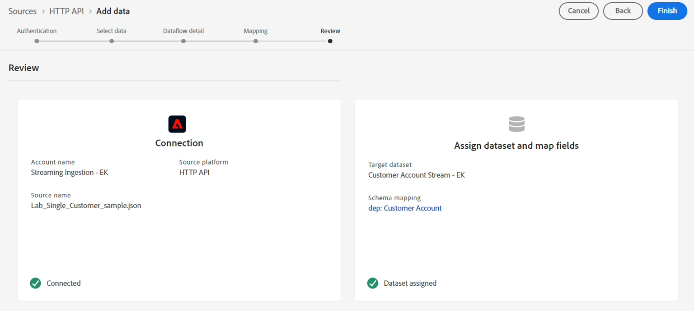

# 最終マッピングセットをチェック

## パススルーマッピング

>[!NOTE]
>
>続行する前に、最終的なマッピングが以下に示す内容と一致していることを確認してください。

>[!NOTE]
>
>\&lt;tenant-name>をサンドボックスの値に置き換えます

| Sourceフィールド | ターゲットフィールド |
| ------------------------- | --------------------------------- |
| account\_create\_date | \&lt;tenant-name>.account.createDate |
| account\_end\_date | \&lt;tenant-name>.account.endDate |
| customer\_id | \&lt;tenant-name>.customerID |
| plan\_name | \&lt;tenant-name>.plan.name |
| plan\_id | \&lt;tenant-name>.plan.planID |
| billing\_city | billingAddress.city |
| billing\_zip\_code | billingAddress.postalCode |
| billing\_state | billingAddress.state |
| billing\_street\_address | billingAddress.street1 |
| email\_optIn | consents.marketing.email.val |
| mobile\_phone | mobilePhone.number |
| firstName | person.name.firstName |
| lastName | person.name.lastName |
| メール | personalEmail.address |
| createDate | repo.createDate |
| modifyDate | repo.modifyDate |
| shipping\_city | shippingAddress.city |
| shipping\_zip\_code | shippingAddress.postalCode |
| shipping\_state | shippingAddress.state |
| shipping\_street\_address | shippingAddress.street1 |

## 計算マッピング

>[!NOTE]
>
>日付の書式設定方法により、`birth_Date`のマッピングがバッチ取り込みラボマッピングと異なることに注意してください。  バッチはスラッシュ `/`を使用していますが、ストリーミングはダッシュ `-`を使用しています

| 計算フィールド | XDM フィールド |
| ----------------------------------------------------------------------------------------------------------------------------------- | -------------------------- |
| iif （sms\_optIn == nullまたはsms\_optIn == &quot;&quot;, &#39;n&#39;, sms\_optIn） | consents.marketing.sms.val |
| concat （date\_part （&quot;mm&quot;, date （birth\_Date, &quot;yyyy-M-d&quot;））.toString （）, &quot;-&quot;, date\_part （&quot;dd&quot;, date （birth\_Date, &quot;yyyy-M-d&quot;））.toString （）） | person.birthDayAndMonth |
| date\_part （&quot;yyyy&quot;,date （birth\_Date,&quot;yyyy-M-d&quot;）） | person.birthYear |

>[!NOTE]
>
>続行する前に、最終的なマッピングが以下に示す内容と一致していることを確認してください

## データフローの最終版

完了したら、「**次へ**」ボタンをクリックし、「完了」ボタンをクリックして、新しいマッピングロジックでデータフローを更新します。

これで、作成したHTTP API アカウントとそのアカウントを使用するすべての関連データフローを表示する画面が表示されます。 作成したデータフローも表示されます。
