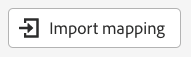
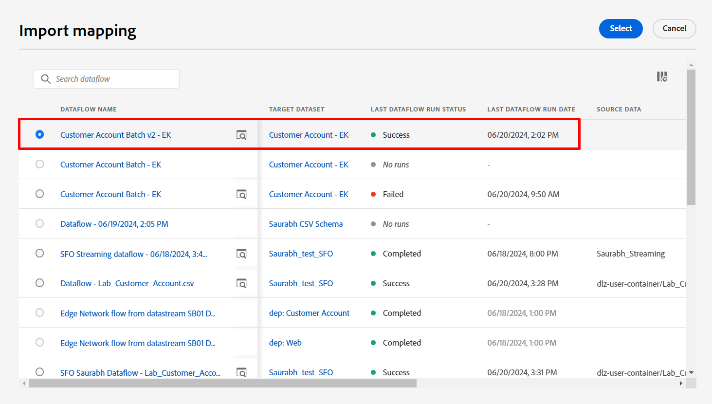

# マッピングの設定

>[!NOTE]
>
>この節に従って、バッチ取り込みラボを正常に完了した場合にのみ行います。  それ以外の場合は、バッチ取り込みラボにある[&#x200B; マッピングデータ &#x200B;](../batch-ingestion/mapping-data/overview.md)の手順に従います。

## マッピングセットの読み込み

バッチ取り込みラボを完了した場合は、そこで作成したマッピングセット 😄🎉を再利用できます

次の手順を実行します。

1. マッピング画面の「**マッピングをインポート**」ボタンをクリックします

   

1. 「バッチ取り込み」セクションで作成したデータフローを選択し、選択します。  **顧客アカウントバッチ v2 - \&lt; イニシャル >.**&#x200B;のような名前にする必要があります

からインポートするためのバッチ取り込みデータフローの選択

読み込み後、エラーが表示されます。  これは、サンプルファイルのbirth\_Date フィールドに使用される日付形式が変更されたためです。

- 使用するバッチサンプルファイル -> mm/dd/yyyy
- ストリームサンプルファイルが使用されました – > yyyy-mm-dd

**date**&#x200B;関数を使用する計算フィールドは、使用する日付形式の変更を考慮して更新する必要があります。

バッチ取り込みマッピングセットの読み込み後に表示される

## 計算フィールドの更新

各計算フィールドの横にある矢印アイコンをクリックして、各計算フィールドを更新し、マッピングを検証します

計算フィールドの数式を編集するためにクリックする

| ターゲットフィールド | 新しい計算フィールド |
| ----------------------- | ----------------------------------------------------------------------------------------------------------------------------------- |
| person.birthYear | date\_part （&quot;yyyy&quot;,date （birth\_Date,&quot;yyyy-M-d&quot;）） |
| person.birthDayAndMonth | concat （date\_part （&quot;mm&quot;, date （birth\_Date, &quot;yyyy-M-d&quot;））.toString （）, &quot;-&quot;, date\_part （&quot;dd&quot;, date （birth\_Date, &quot;yyyy-M-d&quot;））.toString （）） |
