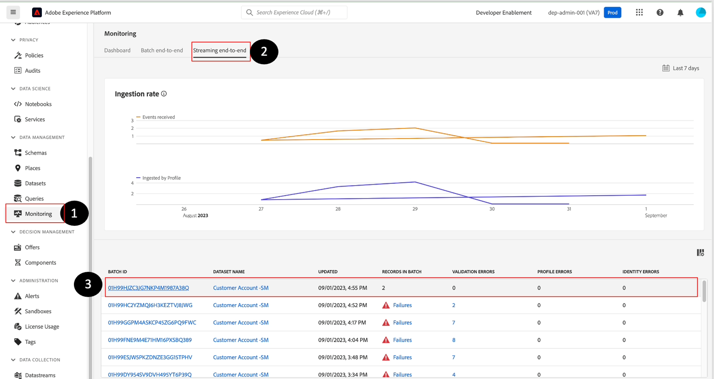
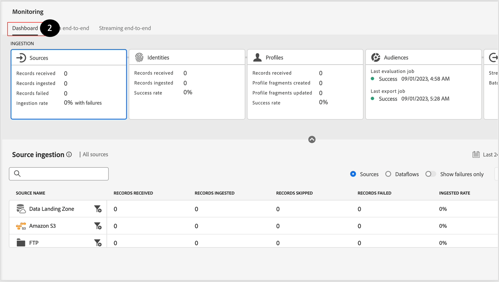
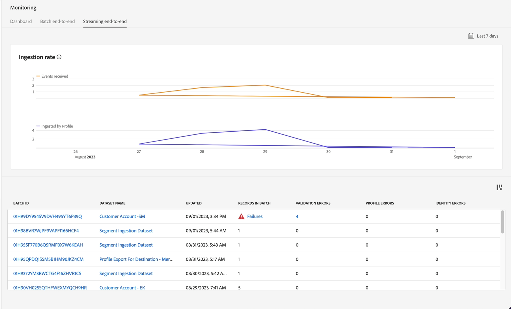

# エラーの監視とデバッグ

>[!NOTE]
>
>ストリーミング取り込みの監視はデータフローレベルで行われます。つまり、UI内でデータレイクを表示しているときにデータフローレベルで行われます。  つまり、バッチ（ストリーミングパイプラインのマイクロバッチ処理）が約60分ごとに表示されます。  そのため、リアルタイム顧客プロファイルにデータが表示されない場合、問題の診断を最大60分待つ必要があります。

## 監視ダッシュボードの表示

1. **監視 – > エンドツーエンドのストリーミング**&#x200B;に移動し、**データフロー**&#x200B;を見つけます。

   でデータフローを探す

1. 「**ダッシュボード**」タブをプレビューして、バッチ取り込みワークフローに関連するパイプライン指標を表示することができます。

すべてのバッチ取り込みワークフローの指標を表示する

>[!NOTE]
>
>この監視画面では、さまざまなデータフロー実行のステータスを確認できます。  上部パネルで使用可能な様々な指標を確認します。  これらの指標は、Experience Platform内のデータパイプラインの健全性を把握するのに役立ちます

## エラーのデバッグ

1. 手順に従っていなかったためにデータフローにエラーが発生した場合は、次のようになります。

   マッピングエラーを含むストリーミングデータフローの

1. 「失敗」をクリックすると、次の画面が表示されます。

   

   >[!NOTE]
   >
   >マイクロバッチが成功すると、レコードをデータレイクに書き込むのに時間が必要になるため、15分以上かかる場合があります。

1. エラーメッセージを分析し、**ソース/ターゲットフィールド、**&#x200B;を特定し、コードを探します。

   - **INGEST XXXX** - データの破損または形式の問題、つまり正規表現の形式に従っていないことが原因で、これは重大なエラーです。
   - **DCVS XXXX** – このエラーは`required` フィールドで発生します。 値が存在しない場合、または（列挙リスト内ではなく）正しくマッピングされていない場合、これらの行はスキップされます。
   - **MAPPER XXXX** – これらは警告であり、行はスキップされません。 しかし、値は「無効化」されている可能性があります。そのため、下流のアクティビティに影響を与えないことを確認する必要があります。

1. エラーから回復するには、**ソース/データフロー/データフロー名/データフローを更新**&#x200B;に移動して、マッピングを修正する必要があります。

>[!NOTE]
>
>JSON サンプルファイルを再アップロードするには、まずJSON サンプルファイルを削除し、もう一度追加して、検証のために新しいコピーでマッパーが更新されるようにします。

をクリック
