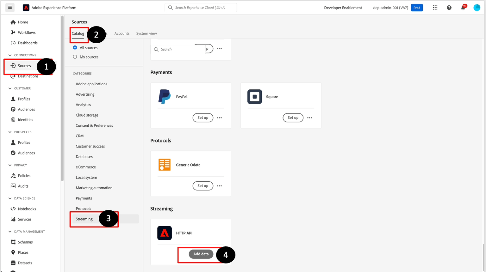
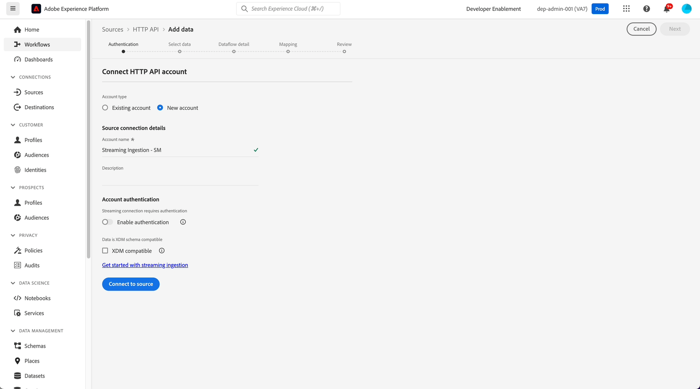
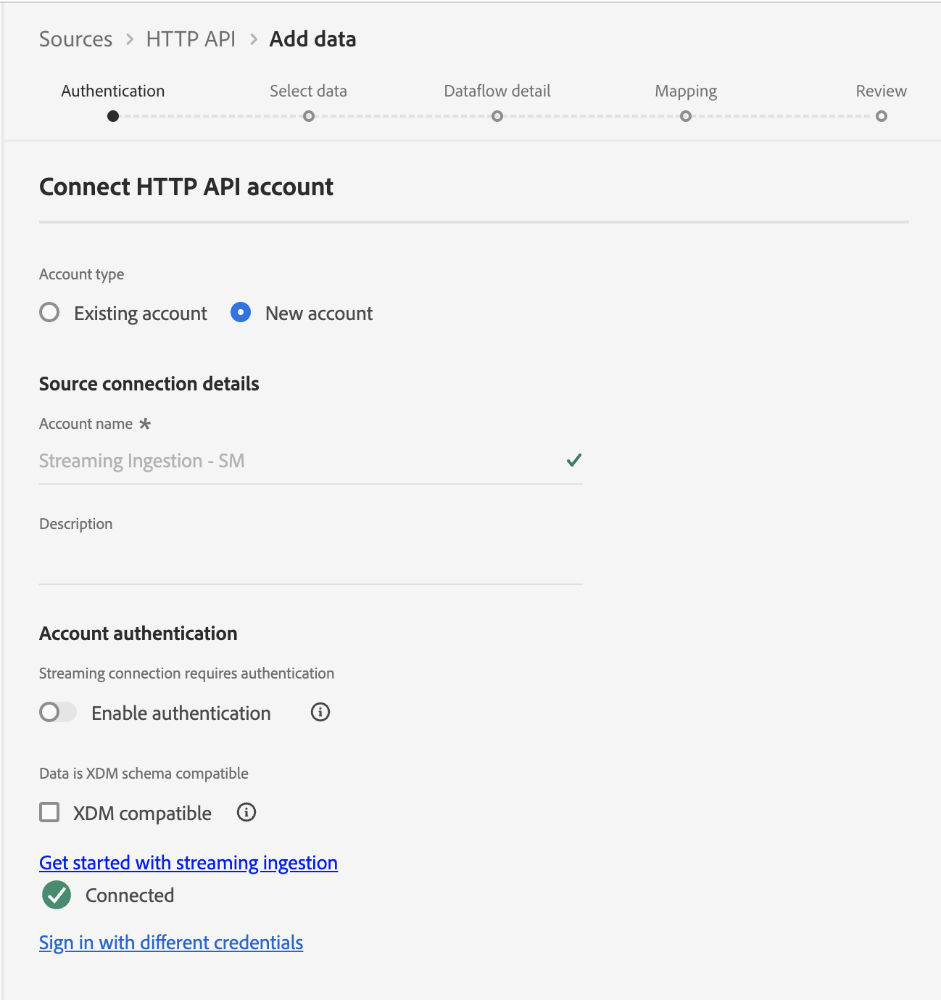
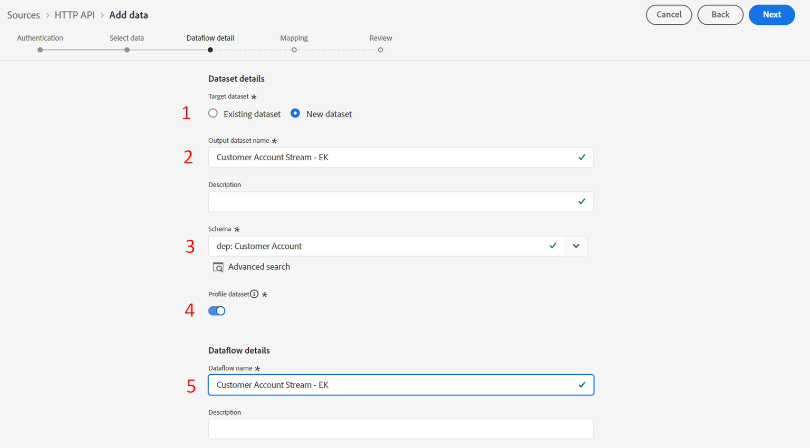

# ソースの設定

## ストリーミングソースに移動します

1. Adobe Experience Platform UIに移動し、**ソース**&#x200B;に移動します
1. 上部ナビゲーションの&#x200B;**カタログ**&#x200B;をクリックします
1. ソースのリストから「**ストリーミング**」を選択します（「すべてのソース」ラジオボタンが選択されていることを確認します）
1. HTTP APIの&#x200B;**設定** / **データを追加**&#x200B;をクリックします

## HTTP API アカウントの作成

最初に行う必要があるのは、新しいアカウントを作成することです。 このアカウントには、認証の処理方法と、ストリーミングされるデータがXDM互換かどうか（つまり、基盤となるXDM スキーマの構造にすでに一致している）に関する詳細が保持されます

次のタスクを実行します。

1. **新しいアカウント**&#x200B;を選択し、次の詳細を追加します。
   - アカウント名 – > `Streaming Ingestion - <Your Initials>`
1. **認証を有効にする**&#x200B;のトグルを無効のままにする
1. 「**XDM compatible**」のチェックボックスをオフのままにします
1. 「**ソースに接続**」ボタンをクリックして続行します

>[!CAUTION]
>
>**認証を有効にする**&#x200B;を切り替えたり、**XDM互換**&#x200B;のチェックボックスをオンにしたりしないでください。 これは研究室を壊す

画面は次のようになります。

「Connected」というメッセージが表示された緑色のチェックボックスが表示されます。 右上の「**次へ**」ボタンをクリックして、引き続きデータフローの設定を行います。

が表示されます

## サンプルデータのアップロード

>[!NOTE]
>
>まだダウンロードしていない場合は、必ず[ サンプルファイル ](../sample-files.md)をダウンロードしてください

1. 画面の「Source データスキーマ」セクションで、以前のラボからダウンロードしたローカルファイルシステムからJSON ファイル **Lab\_Single\_Customer\_sample.json**&#x200B;をアップロードします。
1. ファイルをアップロードすると、プレビューが次のように表示されます。 右上の「**次へ**」ボタンをクリックして続行します。 birth_Date フィールドが、以前のバッチ取り込みラボで見たMM/DD/YYYY形式と異なる形式のYYYY-MM-DDでどのように表示されるかを確認します。

>[!NOTE]
>
>JSON サンプルファイルには、パイプラインを設計および検証するための1つのレコードが含まれています。 スクロールする場合は、XDM ノードをクリックしてノードをスクロールさせる必要があります。

## データフローの詳細の設定

この画面では、設定したHTTP API アカウントを活用する特定のデータフローを作成します。  アカウントごとに多くのデータフローを設定できます。  このシナリオでは、顧客アカウントデータをストリーミングするためのデータフローを作成する必要があります。 データフローでは、ソースアカウント、関連するスキーマを持つデータセット、設定の詳細の関連付けが必要です。

次の手順を実行します。

1. 新しいデータセットを作成し、名前を – > `Customer Account Stream - <Your Initials>`とします
1. **スキーマ**&#x200B;を – >`dep: Customer Account`として選択します
1. **プロファイルデータセット** トグルが&#x200B;**有効**&#x200B;であることを確認します。  **有効**&#x200B;でない場合は、有効にします。
1. このように&#x200B;**データフロー名**&#x200B;を更新します。
   - `Customer Account Stream - <Your Initials>`
1. 「**次へ**」ボタンをクリックして続行します

>[!NOTE]
>
>プロファイルのデータセットを有効にしない場合は、データレイクにのみデータストリームが送信されます。 プロファイルまたはID グラフにストリーミングイベントが表示されません。
