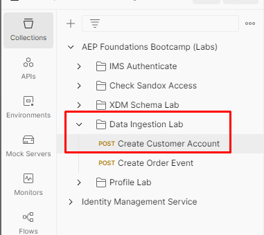
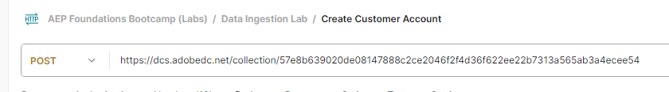

# プロファイルのストリーミング

## APIの概要

データをAdobe Experience Platformに生の形式でストリーミングする際には、作成したデータフローに関係なく、APIの構造を簡単に再作成できるように、APIの構造を理解することが重要です。  以下は、cURLを使用した呼び出しの基本構造の例です

**リクエストのサンプル （生データ）**

```curl
curl --location '' \
--header 'Content-Type: application/json' \
--header 'x-adobe-flow-id:  <dataflow-id>;' \
--header 'Authorization: Bearer XXX;' \
--data '{
    "customer_id": "202208240125",
    "firstName": "",
    "lastName": "",
    "email": "",
    "createDate": "1660096899",
    "modifyDate": "2022-08-09T22:01:40Z",
    "birth_Date": "1991-06-12",
    "mobile_phone": "888-888-8888",
    "email_optIn": "y",
    "sms_optIn": "n",
    "shipping_street_address": "1901 W Madison St",
    "shipping_city": "Chicago",
    "shipping_state": "IL",
    "shipping_zip_code": "60612",
    "billing_street_address": "1901 W Madison St",
    "billing_city": "Chicago",
    "billing_state": "IL",
    "billing_zip_code": "60612",
    "plan_id": "m1",
    "plan_name": "basic",
    "account_create_date": "Created on 2022-04-20T22:19:03Z",
    "account_end_date": "2022-01-20T13:15:32Z",
    "source": "inStore"
}'
```


上記のリクエストで注意すべき重要な要素がいくつかあります。

| 主要な要素 | 必須 | 説明 |
| --------------------------- | -------- | ------------------------------------------------------------------------------------------------------------------------------------------------------------------------------------------- |
| リクエスト URL （場所） | - | これは、ストリーミングデータが指すHTTP API ソースアカウントのURLです。 **常にPOST**&#x200B;型です |
| ヘッダー「Content-Type」 | * | 送信するデータがJSON形式であるため、常に`application/json`に設定してください |
| ヘッダー「x-adobe-flow-id」 | - | ソースコネクタから作成されたデータフローIDに設定 |
| ヘッダー「認証」 | * | オプションの値ですが、セキュリティ上の理由から強く推奨されます。 これは、[Postman Setup](../../postman-setup/environment-file.md) ラボで生成した`access_token`と同じです |
| 本文 | - | Adobe Experience Platformに送信する実際のデータが含まれます |

>[!NOTE]
>
>Body Contentは常にJSON形式で、データフローのデザイン時に提供されるサンプルペイロードと一致する必要があります


## 必要な値の収集

データをストリーミングする前に、上記の必須の値（ストリーミングエンドポイントのURLと本文コンテンツの「ヘッダー」の値など）をいくつか収集する必要があります。

次の手順を実行します。

1. **ストリーミングエンドポイント**&#x200B;値をコピーし、ローカルマシンに保存します（前のセクションの手順から移動していない場合）。 離れた場所に移動した場合は、ソース/アカウントで見つけることができます。

   >[!NOTE]
   >
   >離れた場所に移動した場合は、次の操作を行うことで、このページにアクセスできます。
   >
   >- 左側のパネルの&#x200B;**ソース**&#x200B;をクリックします
   >- 「**アカウント**」タブにアクセスしていることを確認し、「**ストリーミング取り込み – \&lt; イニシャル >**」というタイトルのアカウントを作成しました

   >[!NOTE]
   >
   >この値が表示されない場合は、行をクリックしてデータフロー行を選択していないことを確認してください。  青いリンクをクリックしないでください

   アカウントの詳細の右側に表示される


1. 青いリンクを避けて、データフローの任意の場所をクリックして、データフロー行を選択します。 **データフローID**&#x200B;をコピーし、安全な場所に保存します

を表示するデータフローの詳細（右側）パネル


## API リクエストの更新

Postman アプリケーションに切り替え、収集した情報でCreate Customer Account リクエストを更新します。

1. Postmanを開き、**Data Ingestion Lab -> Create Customer Account** API リクエストに移動して開きます

   


1. 以前に保存した&#x200B;**ストリーミングエンドポイント**&#x200B;値をリクエストのURLにコピーして貼り付けます

   に貼り付けられました


1. 以前に保存したデータフローID値を&#x200B;**x-adobe-flow-id** ヘッダー値にコピーして貼り付けます

   x-adobe-flow-id ヘッダー値](assets/stream-a-profile-copy-paste-x-adobe-flow-id.png)に貼り付けられた


1. Adobe Experience Platformが正常に受信したことを示す`200 OK`件の応答が返されます

サンプル 200 OK応答

```none
{
    "inletId": "57e8b639020de08147888c2ce2046f2f4d36f622ee22b7313a565ab3a4ecee54",
    "xactionId": "1688068236344:7186:152",
    "flowId": "7d1d1a20-3df2-43fb-8bd8-2856bb3ea6a4",
    "receivedTimeMs": 1688068236344
}
```

>[!NOTE]
>
>応答に&#x200B;**xactionId**&#x200B;を書き留めます。  取り込まれたレコードが表示されない場合にエラーが発生した場合は、環境の問題をデバッグするためにサポートチームが使用するトレーサー弾丸であるため、常にカスタマーサポートチケットの一部として提供する必要があります

>[!TIP]
>
>おめでとうございます。  プロファイルレコードのAdobe Experience Platformへのストリーミングが完了しました
