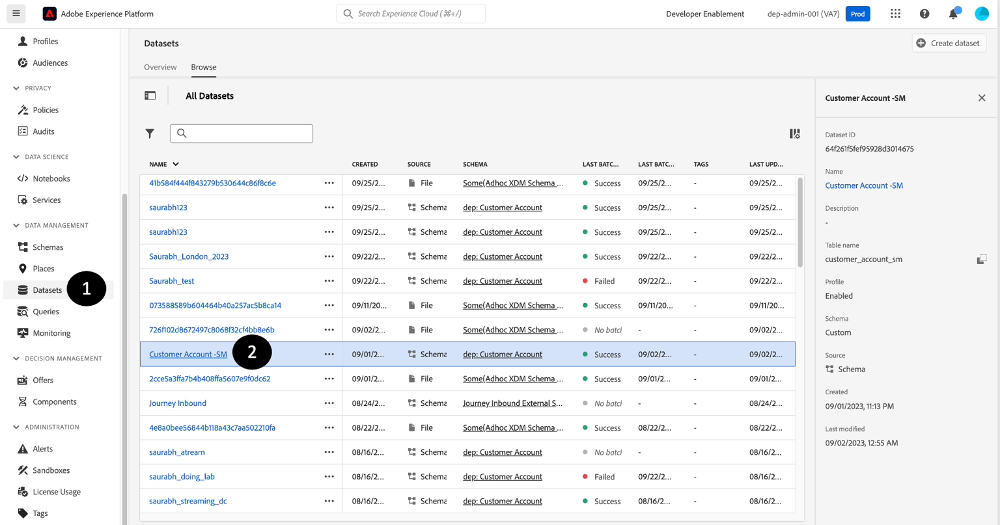
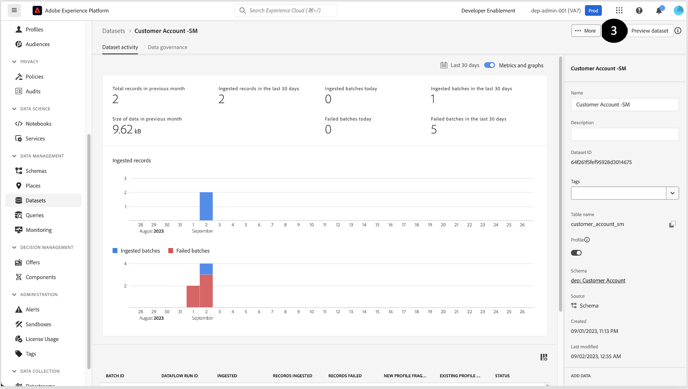
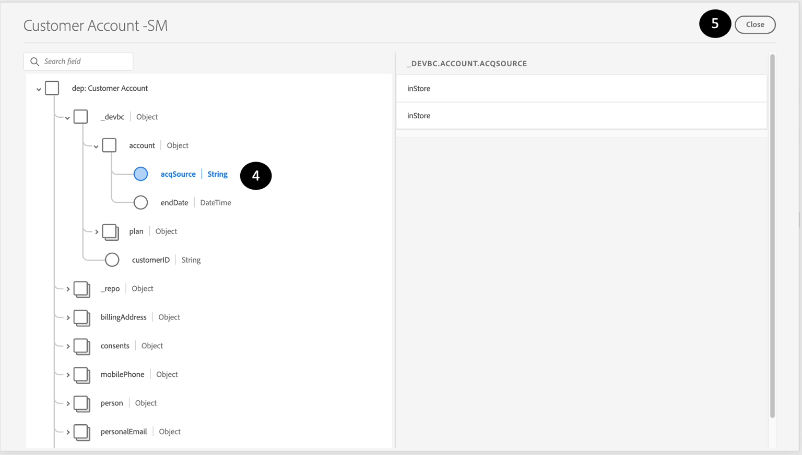

# 検証と検証

## データセットのプレビュー

1. **データセット**&#x200B;をクリック
1. **作成したデータセット名を**&#x200B;検索して&#x200B;**クリック**&#x200B;します。

   


1. 右上隅の「**データセットをプレビュー**」をクリックします

   


1. **スキーマ階層を示す左側のペインをクリックして、取り込んだレコードと同じレコードを**&#x200B;および&#x200B;**検証**&#x200B;します。



>[!NOTE]
>
>**データセットのプレビュー**&#x200B;には、データセットの最初の数行のみが表示されます。 配列オブジェクトは表示できません。


## クエリデータセット

1. プレビューを&#x200B;**閉じる**
1. データセット画面で、**テーブル名**&#x200B;のコピーアイコンをクリックします。 下の例の画面では、テーブル名は`customer_account_sm`です

   


1. **クエリ** セクションに移動します

1. 「**クエリを作成**」をクリック

   


1. **拡張クエリエディター**&#x200B;を有効にする切替スイッチ

   拡張クエリエディター切り替えが有効になっている


1. 次のSQL クエリをコピーして、**Editor**&#x200B;に貼り付けます。 `<table_name>`を手順2で取得した値に置き換えることを忘れないでください。

   ```sql
   SELECT * FROM <table_name>
   ```


1. 「**再生**」ボタンを押します。

1. **結果をプレビュー**&#x200B;します。

1. また、次のSQL クエリを実行して、データとともにXDM スキーマを取得します。

   ```sql
   SELECT to_json(shippingAddress) FROM <table_name>
   ```


1. `postalCode` **ノード**&#x200B;のデータにアクセスするには、次のように入力します。

```sql
SELECT shippingAddress.postalCode FROM <table_name>
```

>[!SUCCESS]
>
>おめでとうございます。  Real-Time Customer Profilesのサンプルセットの取り込みと作成が完了しました
