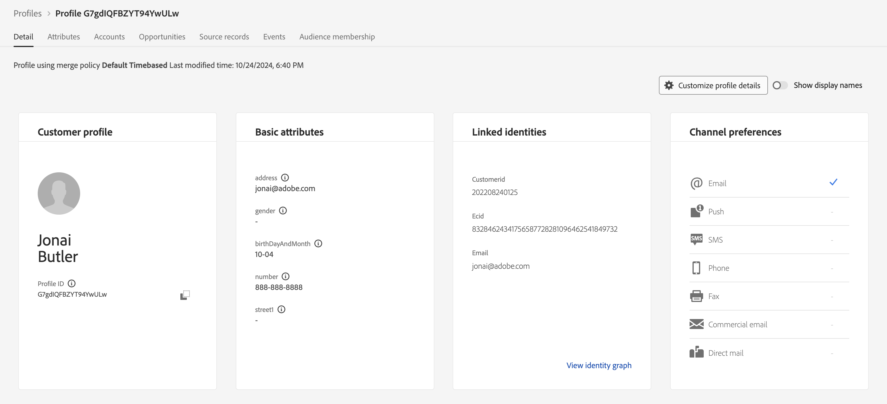

# 取り込んだプロファイルを確認

## ストリーミングの検証

Adobe Experience Platform内でストリーミングデータを検証するには、いくつかの異なる手順が必要です。  ストリーミングデータは、データセットの設定に応じて複数のデータベースに書き込むことができます。

| ストレージ | 遅い | 説明 |
| -------------- | -------------------------------------------------------------------------- | ---------------------------------------------------------------------- |
| データレイク | \～最大60分 | ストリーミングデータを一元管理する |
| プロファイルストア | 平均で\～1分。 最大15分 | 基礎となるデータセットがプロファイルに対して有効になっている場合にのみデータを処理します |
| ID ストア | \～1分平均。 \～10分のマイクロバッチで新しいID関係を作成 | 基礎となるデータセットがプロファイルに対して有効になっている場合にのみデータを処理します |

検証しようとしているものによっては、上から見ることができるように、いくつかの異なる場所に行く必要がある場合があります。  このシナリオでは、プロファイルにデータを書き込んだので（プロファイルのデータセットを有効にしたように）、プロファイルストアでプロファイルが存在するかどうかを確認します。

## プロフィールを検索

1. UIで、**プロファイル/参照**&#x200B;に移動します
1. 「ID名前空間」および「ID値」入力ボックスに次の値を入力します。
   - **ID名前空間** -> `customerID`
   - **ID値** -> `202208240125`
1. 「**表示**」ボタンをクリックして、プロファイルを検索します
1. 返された行の&#x200B;**プロファイル ID** リンクをクリックして、プロファイルを表示します

あなたのプロファイルを見て、あなたがストリーミングしたものと一致することを検証してください。 すごいですね！

>[!NOTE]
>
>ネットの新しいID関係のステッチで\～10分の待ち時間を考慮すると、メール名前空間を使用してプロファイルを検索しようとすると、応答が見られなかったでしょう。
>
>代わりにcustomerID名前空間（プライマリ ID）を使用すると、プロファイルをすぐに検索できます。
>
>プロファイルはプライマリ ID 😄についてのみ知っていることを忘れないでください
