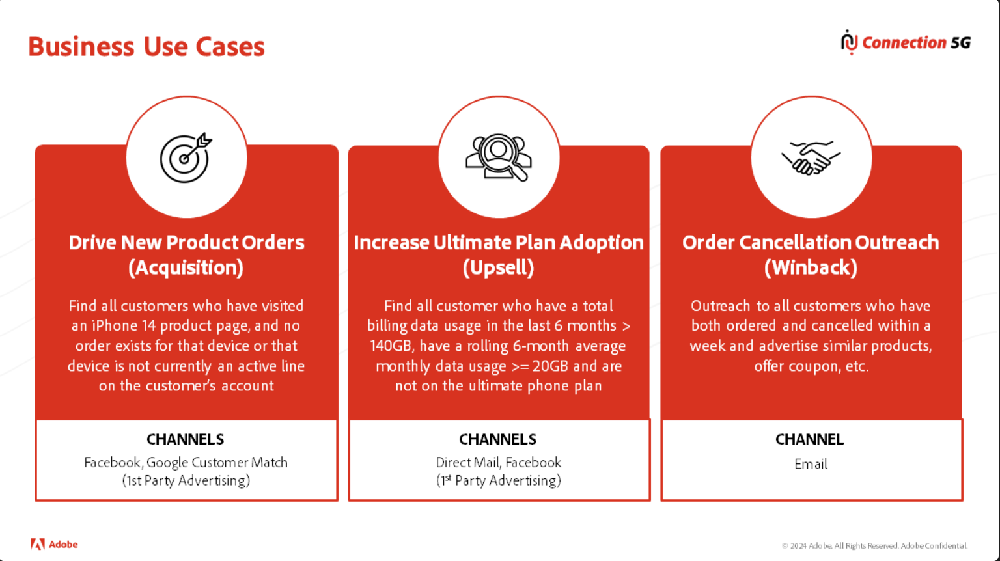

# 非正規化

## 講義

このビデオでは、ルックアップを折りたたみ、テーブルを親テーブルに戻すための3つの非正規化ルールと、パーソナライゼーションとストリーミングセグメント化の要件がそれらの決定にどのように影響するかについて説明します。

>[!VIDEO](https://video.tv.adobe.com/v/3459083/?quality=12&learn=on)

## ラボの詳細

>[!NOTE]
>
>このラボでは、Connection 5G warehouse ERDのみに焦点を当てています

## 非正規化ルール：

1. 1\:M基数を持つ&quot;**D**&quot;または&quot;**B**&quot;としてラベル付けされた関係モデル内のテーブルは、親テーブル上のオブジェクト配列またはマップとして定義されます
1. ルール #1によってトリガーされます。配列またはマップとして機能する「**D**」または「**B**」テーブルを非正規化する前に、それらを照会して、親テーブルに非正規化する最善の方法を決定します
1. M:1の基数を持つ&quot;**D**&quot;としてラベル付けされた関係モデルのテーブルは、親テーブルのオブジェクトまたはフィールドのリストとして機能します

## パーソナライゼーションルールの非正規化：

データモデルを構築する際には、顧客のユースケースを見直すことを忘れないでください。  次の点に留意してください。

- ストリーミングセグメンテーションでは、評価時にルックアップテーブルにアクセスできません
- コンテンツをパーソナライズするためにアクセスできるのは、プロファイルの特性とセグメントメンバーシップのみです

パーソナライゼーションに非正規化を適用する際に

>[!NOTE]
>
>このラボでは、Connection 5G Training Scenario.pdfを参照することを忘れないでください。

## 手順1 – 個人プロファイルテーブルの入力

1. 関連するスキーマ「**B**」または「**D**」から、顧客アカウントテーブルで非正規化する必要があるフィールドに書き込みます
1. 上記のユースケースについて、ストリーミングセグメンテーションやパーソナライゼーションをサポートするために必要な追加フィールドを確認する これらのフィールドをテーブルに追加します

## 手順2 - エクスペリエンスイベント テーブルの入力

1. 関連する「**B**」または「**D**」テーブルの請求テーブルと注文テーブルに非正規化する必要があるフィールドを書き込みます
1. 上記のユースケースについて、ストリーミングセグメンテーションやパーソナライゼーションをサポートするために必要な追加フィールドを確認する これらのフィールドをテーブルに追加します

## 手順3 - ルックアップテーブルの入力

1. 関連するテーブル「**B**」または「**D**」から、製品ルックアップテーブルに非正規化する必要があるフィールドに書き込みます
1. 上記のユースケースについて、ストリーミングセグメンテーションやパーソナライゼーションをサポートするために必要な追加フィールドを確認する これらのフィールドをテーブルに追加します

## レビュー

次のビデオでは、Connection 5G テーブルが配列とオブジェクトに非正規化された方法と、取得とアップセルのユースケースでプライマリプロファイルとイベントテーブルに追加フィールドを戻す必要があった方法を確認します。

>[!VIDEO](https://video.tv.adobe.com/v/3459086/?quality=12&learn=on)
