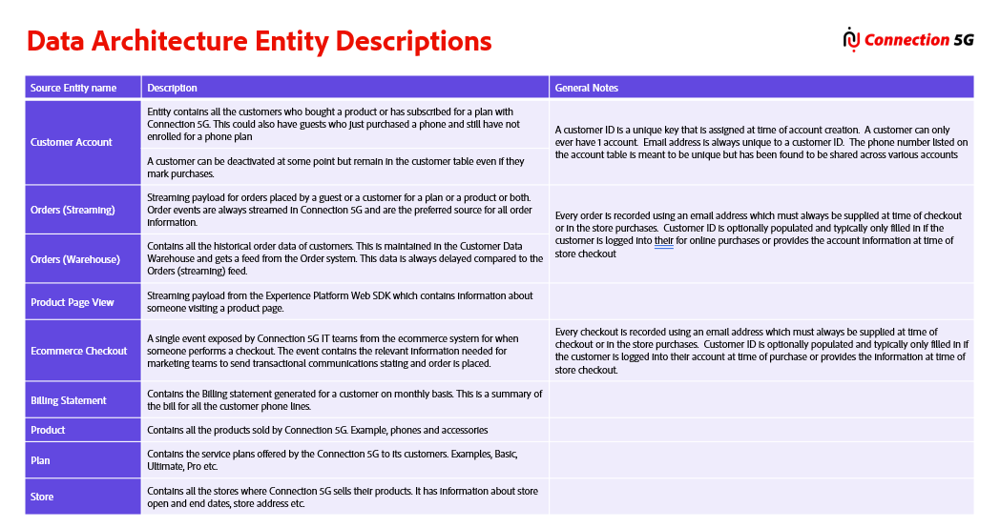

# パート 2 - キーフィールド

## 講義

このビデオでは、各テーブルのプライマリ ID、人物ID、関係IDを識別する方法と、エクスペリエンスイベントに必要な_id、タイムスタンプ、イベントタイプフィールドを確認する方法について説明します。

>[!VIDEO](https://video.tv.adobe.com/v/3459085/?quality=12&learn=on)

## ラボの詳細

### ID フィールド

- **人物ID** – 人物を一意に識別するために使用されます。 これらは、プライマリエンティティ表でのみ使用されます。 これらは少なくとも1つ必要ですが、複数存在する可能性があります。
- **関係ID （例：個人ではない）** - Real-Time Customer Profileのプライマリエンティティ テーブルから、関連する関連エンティティ クラス （例：参照）への関係を示すために使用されます。
- **プライマリ ID** - ストレージキーとして使用され、Real-Time Customer Profileで使用されているスキーマに必要な個人IDまたは関係（個人ではない） IDのいずれかです。 プライマリエンティティテーブルの場合、IDは人物も一意に識別します。 XDM プロファイルスキーマとルックアップスキーマに指定した場合、このフィールドは、新しいレコードが作成されるか、既存のレコードが更新されるかを判断します。 そのうちの1つがきっと存在するはずです。

### 必須フィールド（XDM Experience Eventのみ）

- **\_id** - リアルタイム顧客プロファイルがイベント IDと組み合わせてプライマリの一意のストレージキーを作成するために使用します。 プロファイルサービス内でのイベントデータの誤った重複を防ぐために必要
- **タイムスタンプ** – すべてのイベントが特定の時間に発生するため、すべてのイベントにはタイムスタンプが必要です

必須ではありませんが、強く推奨：

- **イベントタイプ** - イベントデータの上位レベルの動作（購入、予約など）を説明します。

### 一般ルール

1. Bridge Table Rule #2 - 「**P**」または「**E**」の親（つまり親テーブル）と「**L**」テーブルの間にブリッジテーブルが存在する場合、ブリッジテーブルは親テーブルの一部として扱われます
1. データ取り込み中の再作業を避けるために、この段階でIDが&#x200B;**シングル**&#x200B;のユーザーに固有であることを常に検証します
1. Experience Event スキーマの場合、プライマリ IDは、そのビヘイビアーを1人のユーザーに対して一意に識別するものです。
1. ルックアップテーブルの場合、リレーショナルモデルのプライマリキー（PK）は常に非人プライマリ IDになります

Connection 5G Warehouse ERDおよびストリーミング ERDの各テーブルに対して、**&quot;P&quot;、&quot;E&quot;、&quot;L&quot;、**&#x200B;のいずれかのラベルを付けて、次の手順を実行して、プライマリ ID、人物ID、関係ID、および特定のスキーマクラスの必須フィールドを識別します。

>[!NOTE]
>
>スキーマにIDをラベル付けする際は、ラボ中に以下の図を参照してください
>
>ERD テーブルに適用されたプライマリ ID、人物ID、関係ID ラベルの例を示す

## 手順1 - XDM個人プロファイルテーブルのキーフィールドにラベルを付ける

顧客アカウントテーブル内のキーフィールドを特定するには、次の手順を実行します。

- プライマリ IDとして使用されるフィールドを特定し、`PI`というラベルを付けます
- 他のすべてのユーザーIDを特定し、`I`を付けてラベル付けします
- 関係IDを特定し、`R`を使用してラベル付けします

## 手順2 - XDM エクスペリエンスイベントテーブルのキーフィールドにラベルを付ける

手順1で実行したのと同じ一連のタスクを、XDM エクスペリエンスイベントテーブルに対して実行します。

- プライマリ IDとなる各テーブルのフィールドを特定し、`PI`というラベルを付けます
- 各テーブル内の他のすべてのユーザーIDを特定し、`I`でラベル付けします
- すべての関係IDを特定し、`R`でラベル付けします

上記のラベルに加えて、次のラベルも付けます。

- XDM エクスペリエンスイベントテーブルごとに一意のイベント IDを識別または作成し、`_id`を付けてラベル付けします
- 各テーブルのイベントのタイムスタンプを特定し、`T`というラベルを付けます
- 各テーブルのイベントタイプを特定または作成し、`ET`というラベルを付けます

## 手順3 - ルックアップテーブルのキーフィールドにラベルを付ける

各ルックアップテーブルで、プライマリ IDとなるフィールドを特定し、`PI`というラベルを付けます

## レビュー

次のビデオでは、Connection 5G テーブル全体で識別される主要なフィールドを確認します。これには、可変オーダーレコードの一意のイベント IDとして連結フィールドが必要な理由が含まれます。

>[!VIDEO](https://video.tv.adobe.com/v/3459088/?quality=12&learn=on)
