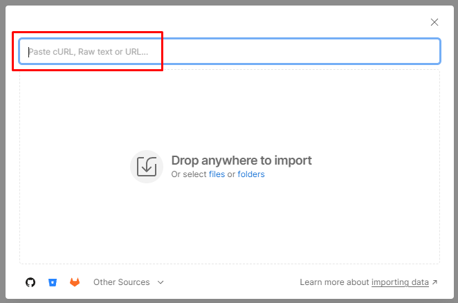

# 環境ファイル

## Postman環境ファイル

ファイルをダウンロード — [AEP Bootcamp.postman_environment.json](assets/aep-bootcamp.postman_environment.json)

## 環境ファイルを読み込む

1. ファイルをクリックして、ブラウザーの上から`Environment File`を開きます
1. ファイルのURLをクリップボードにコピーします
1. ローカルマシンでPostmanを起動し、ワークスペース内の「`Import`」ボタンをクリックします
1. `Environment File`のURLをオーバーレイの読み込みモーダルテキストボックスに貼り付けます。  これにより、自動インポートがトリガーされます

読み込みが完了したら、左側のサイドバーの「`Environments`」タブをクリックして、環境ファイルの存在を検証できます。  以下のような表示になります。

## 環境変数

API呼び出しを行う前に、インポートした環境ファイルのいくつかの変数を更新する必要があります。  これらの変数はAPI呼び出しで参照されるため、正しく入力されていることを確認してください。  変数は2つのグループに分けられます。

- **開発者プロジェクト値** ->これらは、Adobe Developer Consoleで作成された開発者プロジェクトから生成されたデフォルトの変数です
- **その他の値** ->これらは、ユーザーが様々なExperience Platform APIを操作するために通常作成する、カスタム作成された変数です

>[!NOTE]
>
>これらの値は、[Developer Console Setup](../sandbox-setup/developer-console-setup.md#collect-your-values)で作成したOAuth Server-to-Server資格情報から取得されます

### 開発者プロジェクトの値を更新

1. Postmanの左側のサイドバーにある`Environments` タブをクリックします
1. 次に、`AEP Bootcamp`環境ファイルをクリックします
1. 次のリストにある変数の`current values`を更新します。
   - CLIENT\_SECRET
   - CLIENT\_ID （API キーとも呼ばれます）
   - TECHNICAL\_ACCOUNT\_ID
   - IMS\_ORG

完了すると、環境ファイルは次のようになります。

### 他の値を更新

更新が必要な他の値は、`SANDBOX_NAME`変数と`TENANT_NAME`変数のみです。

- `SANDBOX_NAME` – 実行するサンドボックスをAdobe Experience Platformに伝えます
- `TENANT_NAME` – 特定のXDM呼び出しでテナント名を事前入力するために使用されます

>[!NOTE]
>
>これらのラボを自分のペースで進めている場合（sandbox-assignment.pdfを使用したライブトレーニングイベントではなく）、Adobe Experience Platform UI URLからサンドボックスにログインしている間に両方の値を検索できます。例えば、次のようになります。
>
>`https://experience.adobe.com/#/@dep/sname:prod/platform/home`
>
>- `SANDBOX_NAME`は`sname:`の後の値です。この例では、`prod`
>- `TENANT_NAME`は`@`記号の後の値で、先頭にアンダースコアが付きます（この例では`_dep`）

1. 次のリストにある変数の`current values`を更新します。
   - SANDBOX\_NAME
   - TENANT\_NAME
1. 環境ワークスペースの右上にある「`Save`」ボタンをクリックして、更新を保存します

完了したら、環境ファイルは次のようになります。

の環境ファイル

>[!TIP]
>
>おめでとうございます。 Postman環境設定が完了しました
