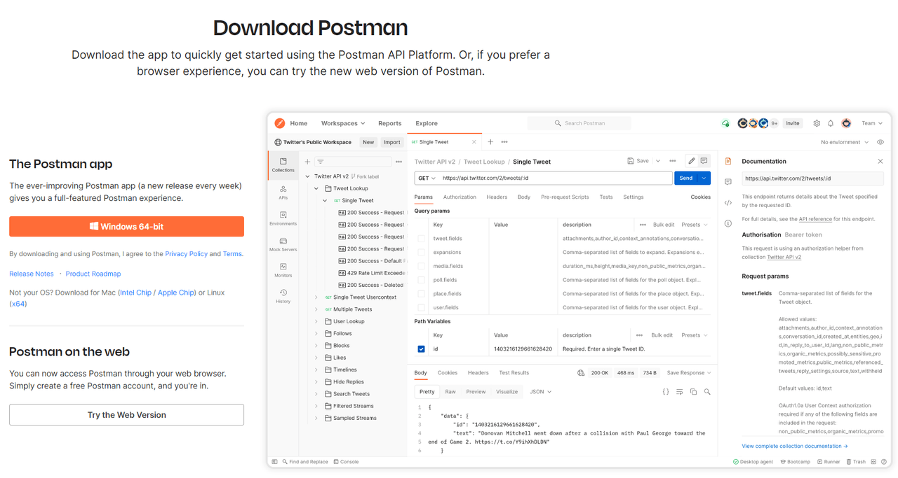

# Postman インストール

>[!NOTE]
>
>このコースでは、さまざまなラボにPostmanが必要です。  Postmanが既にインストールされている場合でも、Environment Files and API Collectionがインストールされ、適切に設定されていることを確認するには、このラボを参照する必要があります。

## Postmanのインストール

Postman web サイトに移動し、Postman アプリをダウンロードするか、Web バージョンを利用します – > [https://www.postman.com/download/](https://www.postman.com/download/)

## Postmanインターフェイス

Postmanを開き、アプリケーションのいくつかの領域をすばやく確認します。 Experience Platformを使用する上で本当に必要なのは、アプリケーションのいくつかの重要な領域に集中することだけです。

## サイドバー

サイドバーを利用すれば、さまざまなPostman要素をすばやく移動できます。 ラボでは、以下の2つの項目のみを使用します。

**コレクション** – 保存されたリクエストのグループ。外部の場所から読み込むことも、自分で作成することもできます。

**Environments** - Postman リクエストで参照できる一連の変数。 Experience Platformでは、Postman環境はAdobe IMS組織と同義と考えることができます。 Postmanの環境機能を使用して

## ヘッダー

ワークスペース：作業をさまざまなグループ（プロジェクト、チームなど）に整理できます

## 主な作業空間

主なワークエリアは、Postmanで作業する際に作業の大部分を行う場所です。 すべてのAPI リクエストは、メインワークエリア内の特定のタブに公開されます。

**右側のサイドバー** – 選択した現在のタブに基づいて、ツールへの追加アクセスを提供します。 例として、いくつかの機能を挙げるために、リクエスト、コメント、コードスニペットに関するドキュメントが挙げられます。

**環境セレクター** - APIを操作する際に、事前設定済みの変数にアクセスするために、異なる環境をすばやく切り替えることができます。 Experience Platformを使用する場合は、特定のAdobe IMS組織で作業する場合に、これを活用します。

## フッター

Postmanアプリケーションの最下部には、作成した呼び出しのログをすばやく確認できる一連の関数、検索と置換、およびその他のさまざまな関数をすばやく見つけることができます。
