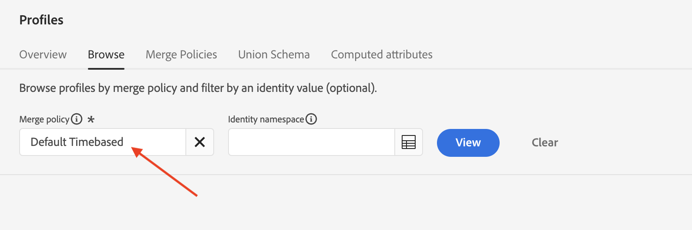
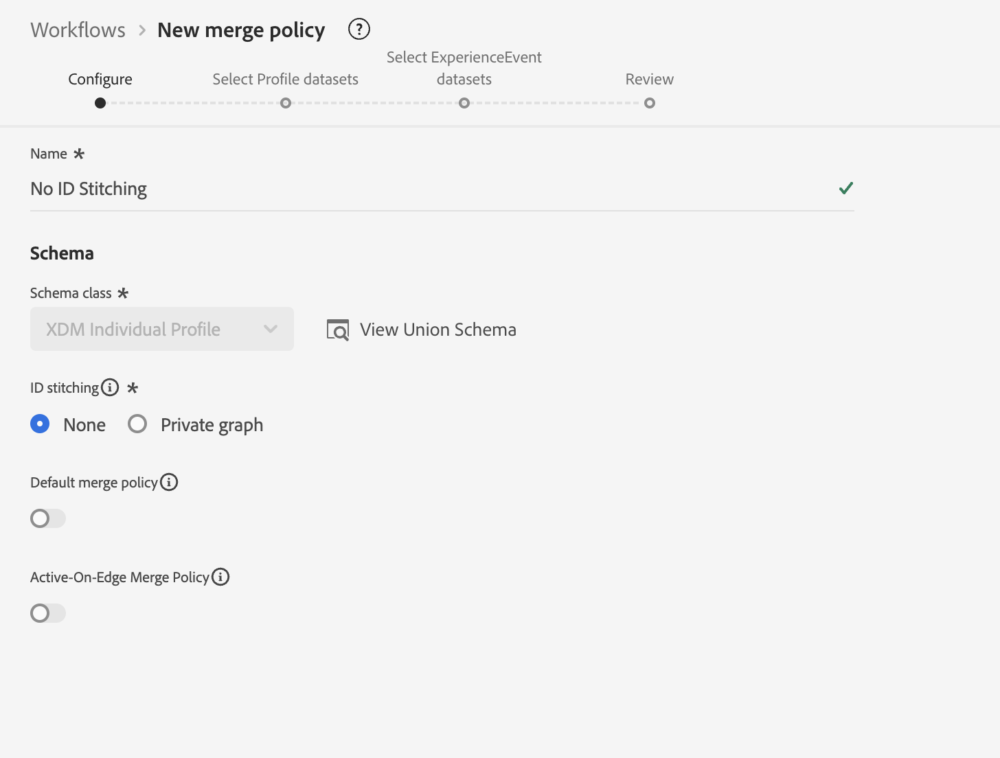
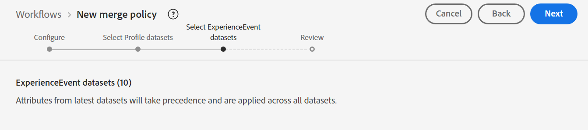
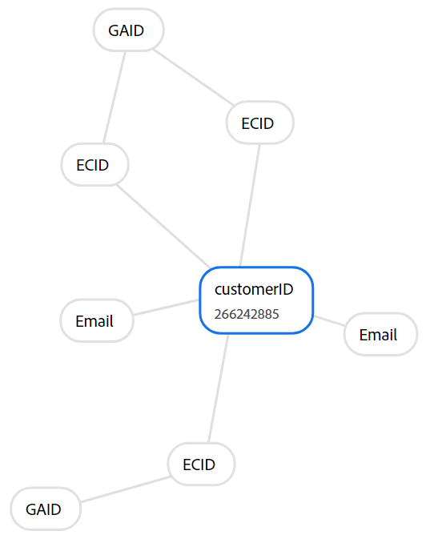
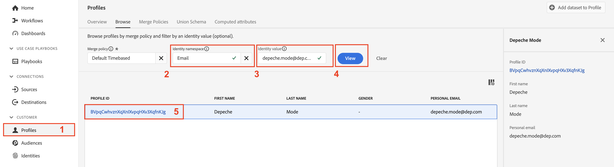
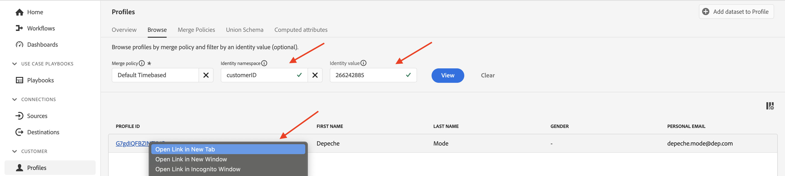

# 結合ポリシー

## もう一度お願いします？

プロファイルを検索するたびに、プロファイルビューアに結合ポリシーが表示されます（おそらく、何かをしたことに気づいていなかったでしょう）

プロファイル参照ビューに表示されるの結合ポリシー

結合ポリシーは、次の2つのことを行います。

1. プロファイルストア内でフラグメントを組み立てる方法（ID ステッチなど）について説明します。 選択肢は次の2つです。
   - ID グラフ（ID サービス）の使用
   - ID グラフを使用しない（つまり、提供されたIDのみに依存して、同様に保存されたプロファイルフラグメントを検索する）
1. フィールドが複数のデータセットから来る可能性がある場合（つまり、結合メソッド）に、XDM Individual Profile クラスベースのデータセット内でフィールドの競合を解決する方法をプロファイルサービスに伝えます。 選択肢は次の2つです。
   - タイムスタンプの優先度 – すべてのデータセットの最新のレコードを真実のセットとして使用し、他のすべてのレコードが最近から最も古い順にギャップを埋めるようにします
   - データセットの優先度 – プロファイルの形成に使用できるXDM個人プロファイルデータセットと、それらを組み立てる順序を選択します

> [!NOTE]
>
>データセットの優先順位の結合方法を選択すると、プロファイルの形成で使用できるXDM個人プロファイルとXDM エクスペリエンスイベントのデータセットを選択できます。
>
>タイムスタンプの優先度の結合メソッドは、常にすべてのデータセットを使用します

>[!WARNING]
>
>セグメント化とプロファイルを機能させるためには、サンドボックスごとに、**default**&#x200B;結合ポリシーとしてマークされた結合ポリシーが少なくとも1つ必要です

>[!NOTE]
>
>多くの場合、データセットの優先順位を使用するカスタム結合ポリシーを使用する必要がないように設計しています。
>
>- 複数のデータセットに同じフィールドを記録するのではなく、一意の名前を付けます。例：
>  - 名 – CRM
>  - 名 – ロイヤルティ
>  - 名 – Web フォーム
>- これにより、マーケターは、システムが理解できないルールセットに基づいて自動的に選択するのではなく、どのデータソースとフィールドを使用するかを選択できます。また、発生していることを理解することなく、あるソースからプロファイルのフィールドと別のソースからプロファイルのフィールドを選択する可能性があります。
>- データモデルの場合、フィールドの競合を解決する必要はないため、カスタムの結合ポリシーは必要ありません

結合ポリシーとID グラフの連携の仕組みを詳しく理解するには、ID ステッチにID グラフを使用しないID グラフを作成します。

## 結合ポリシーの作成

ID グラフを使用しない結合ポリシーを作成して、プロファイル形成でその動作を確認できるようにします。

## 作成

1. 左側のパネルの&#x200B;**プロファイル**&#x200B;をクリックします
1. 上部のナビゲーションで「**ポリシーを結合**」をクリックします
1. 画面の右端にある&#x200B;**結合ポリシーの作成**&#x200B;をクリックします

## 設定

次に、結合ポリシー設定を設定する必要があります。  次の情報を入力します。

| 設定 | 値 |
| --------------------------- | --------------- |
| 名前 | ID照合なし |
| IDの接続 | なし |
| デフォルトの結合ポリシー | 無効 |
| Active-On-Edge結合ポリシー | 無効 |

完了したら、**次へ**&#x200B;をクリックします

## プロファイルデータセットの選択

1. 結合メソッドで、**順序のタイムスタンプ**&#x200B;を選択します
1. 「**次へ**」をクリック

## エクスペリエンスイベントデータセットの選択

結合メソッドに対して順序付けされたタイムスタンプを選択した場合、すべてのXDM Individual ProfileおよびExperience Event クラスベースのデータセットがプロファイルの形成に参加することをプロファイルサービスに伝えていることに注意してください。

したがって、この手順では何もする必要がないので、**次へ**&#x200B;をクリックするだけです。

## レビュー

最後の手順では、選択した設定のプレビューと、結合ポリシーの動作を示すサンプルプロファイルが表示されます。

「**完了**」ボタンをクリックして、結合ポリシーを作成します

## 結合メソッドの動作

プロファイルのID グラフであるDepeche Modeは、以下のスクリーンショットのようです。 プロファイルサービスの仕組みを理解するには、組み立てプロセスでこのID グラフを使用することを無視するのが最善の方法です。

リンクされたIDを表示するDepeche Mode プロファイルの

## メールを使用した比較

次の手順に従ってプロファイルビューアを開きます。

1. 左側のパネルの&#x200B;**プロファイル**&#x200B;をクリックし、上部のナビゲーションで&#x200B;**参照**&#x200B;を選択します
1. **電子メール**&#x200B;のID名前空間を選択
1. ID値として&#x200B;**depeche.mode\@dep.com**&#x200B;を入力します
1. 「**表示**」ボタンをクリックして、プロファイルを検索します
1. プロファイルへの&#x200B;**リンク**&#x200B;をクリックすると、プロファイルの詳細が表示されます

Depeche Mode プロファイルを別に検索しますが、今回は&#x200B;**ID ステッチなし**&#x200B;結合ポリシーを使用します。

1. 左パネルの&#x200B;**プロファイル**&#x200B;を右クリックし、**新しいタブで開く**&#x200B;を選択します
1. 上部のナビゲーションで「**参照**」を選択します
1. **ID ステッチなし**&#x200B;の結合ポリシーを選択します
1. **電子メール**&#x200B;のID名前空間を選択
1. ID値として&#x200B;**depeche.mode\@dep.com**&#x200B;を入力します
1. 「**表示**」ボタンをクリックして、プロファイルを検索します
1. プロファイルへの&#x200B;**リンク**&#x200B;をクリックすると、プロファイルの詳細が表示されます

プロファイルの両方のビューを比較すると、それらが非常に異なることに気づくはずです。 一部の属性とIDが、**ID ステッチなし**&#x200B;結合ポリシーを使用するバージョンにありません。

各プロファイルのイベントを見ると、**ID ステッチなし**&#x200B;結合ポリシーを使用するプロファイルには1つのイベントのみが含まれているのに対し、他のバージョンにはすべてのイベントが含まれていることがわかります。

プロファイルのNo ID ステッチ バージョンの1つのイベントは、そのイベントが「personalEmail.address」のプライマリ IDを使用して保存されるためです。

>[!NOTE]
>
>ID グラフプロファイルを使用しない結合メソッドを使用する場合、提供されたIDのみに依存して、同様に保存されたプロファイルフラグメントを検索します。

## customerIDを使用した比較

デペッシュモードプロファイルの様々なフラグメントを、グラフの他のIDを使用して確認できます。  「No ID Stitching merge」ポリシーで同じプロファイルをもう一度検索してみますが、今回はcustomerID名前空間と以下の値を使用します。

| ID名前空間 | 値 |
| ------------------ | --------- |
| customerID | 266242885 |

ID ステッチなし結合ポリシーを使用してcustomerIDでDepeche モードを検索する場合、

customerID](assets/merge-policies-customerid-lookup-events-tab.png)でDepeche Modeを検索する際に、customerIDをプライマリ IDとするイベントのみを表示する![ イベントタブ

**自分に質問する**

質問：属性について何かお気づきですか？ 誰もいない、なぜですか？

回答：プライマリ IDとしてメールを使用して属性を読み込みました

質問：イベントについて何かお知らせはありますか？

回答：表示されるイベントは、customerIDをプライマリ IDとして持つイベントのみです

## GAIDを使用した比較

No ID Stitching merge ポリシーを使用して同じプロファイルを再度検索しますが、今回はGAID名前空間と以下の値を使用します。

| 名前空間 | 値 |
| --------- | ----------- |
| GAID | 266242-9013 |

**自分に質問する**

質問：プロファイルが見つかりませんでした。 何が起こっていますか？ なぜプロファイルが見つからないのか？ 回答：そのGAID値をプライマリ IDとして使用して保存されるプロファイルフラグメントはありません

## プロファイル + ID

主な内容：

- プロファイルストアには、プライマリ IDを使用して保存されたプロファイルフラグメントが含まれます
- ID グラフには、2つ（2）以上の個人ベース ID間の関係が含まれます

ID グラフをプロファイルストアと共に使用する場合、ID グラフ内の各ID値をプライマリ IDとして扱う、適切なプロファイルフラグメントを見つける方法の説明として考えることができます。

ID グラフを使用しない場合、プロファイルストアは単一の識別子（プライマリ ID）を使用してプロファイルフラグメントのみを取得できます

> [!TIP]
>
>**時間が空いているため、実験を行います…:**
>
>- UIで、2つのIDを持つ他のプロファイルを検索します
>- 一部のイベントが一方のフラグメントに対して保存されますが、もう一方のフラグメントに対しては保存されない方法を確認してください
>- 一部のプロファイル属性が一方のフラグメントに対してどのように保存され、もう一方のフラグメントに対してどのように保存されないかを確認します
>- 既に検索したプロファイルに移動し、**ID ステッチなし**&#x200B;結合ポリシーを使用して検索し直します。  違いに注意する
