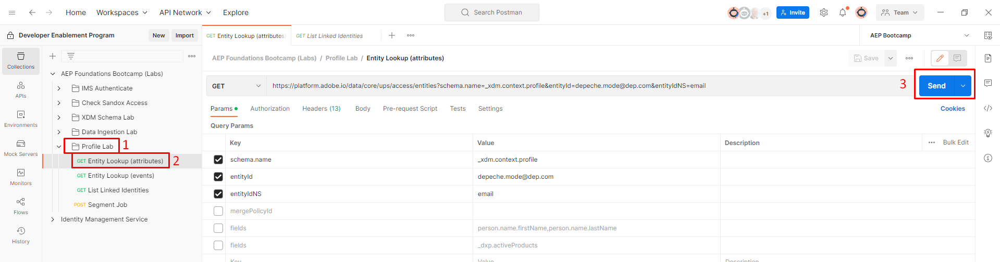
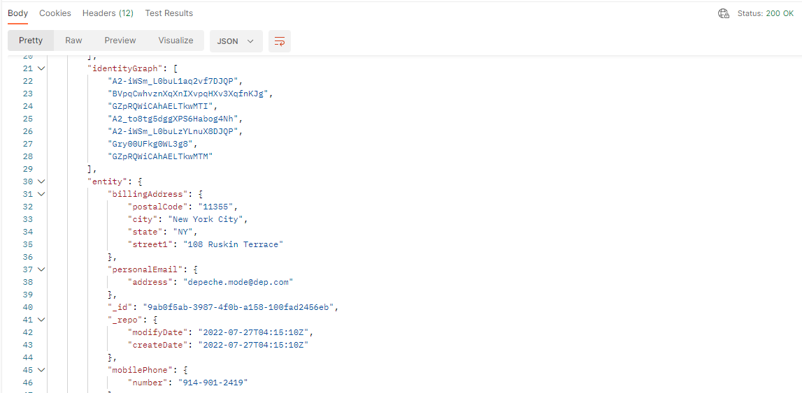
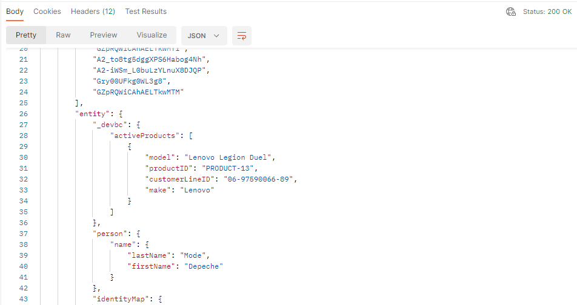
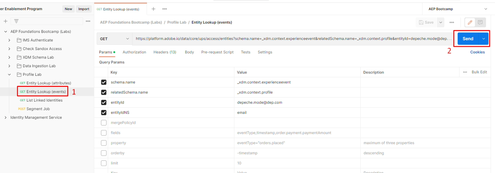
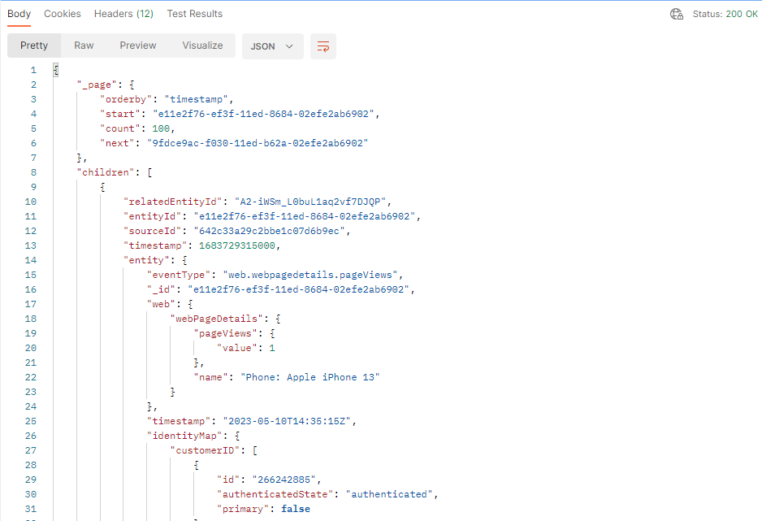
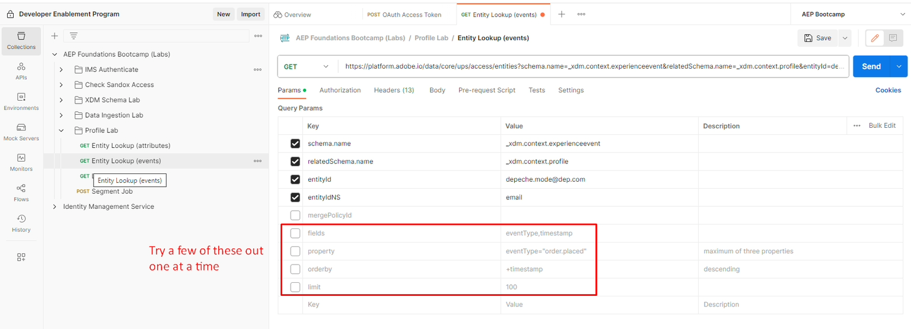
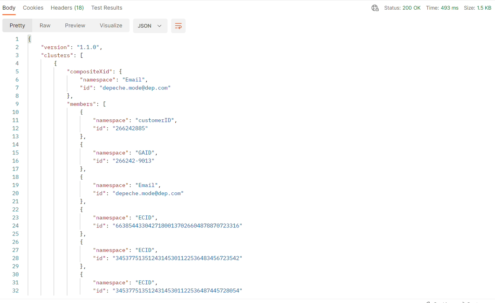

# プロファイルとID API

## プロファイルエンティティ API

リアルタイム顧客プロファイルを使用する場合、プロファイル APIの使用方法を理解することは非常に重要です。 これにより、迅速なトリアージやデバッグが可能になるだけでなく、コールセンターからキオスクに至るまで、様々なシステム統合が可能になります。

最も重要なAPIのひとつは、Profile Entity APIです。 このAPIを使用すると、UIで見たように、個々のプロファイルを検索できます。 パラメーターを使用して、プロファイルの属性またはイベントを表示するかどうかを指定します。

以下は、プロファイルエンティティ APIのGET メソッドの仕様の全体です

## APIの概要

以下は、プロファイルエンティティ APIの呼び出しに必要な最小情報です。

`GET https://platform.adobe.io/data/core/ups/access/entities`

### 必須クエリパラメーター

このパラメーターをリクエストごとに送信します。 この値は、プロファイルの属性とイベントのどちらを検索しているかによって異なります。

| パラメーター | タイプ | 説明 | 例 |
| ------------- | ------ | ---------------------------------------------------------------------------------------------------------------------------------------------- | ------------------------------ |
| `schema.name` | 文字列 | 検索するエンティティのXDM スキーマクラス名。 | `_xdm.context.profile` |
| `schema.name` | 文字列 | この値を使用して、プロファイルのイベントを検索します。 `relatedSchema.name=_xdm.context.profile`と組み合わせて、イベントをプロファイルにスコープします。 | `_xdm.context.experienceevent` |

### 検索するエンティティの識別

ほとんどのリクエストでは、`entityId`と`entityIdNS`を使用して、電子メールアドレス、CRM ID、ロイヤルティ IDなどの既知のID値でエンティティを識別します。このIDを既に知っておく必要はありません。 XIDは、IDを表すためにID サービスが生成および内部的に割り当てるbase64 エンコードされた識別子で、その名前空間とID値を単一のコンパクトトークンに統合します（詳細は[&#x200B; ネイティブ XID](https://experienceleague.adobe.com/docs/experience-platform/identity/api/list-native-id.html?lang=ja)を参照）。

| パラメーター | タイプ | 説明 | 例 |
| ------------ | ------ | ---------------------------------------------------------------------------------------------------------------------------------------------- | ---------------------- |
| `entityId` | 文字列 | 検索する識別子の値。 エンティティのXIDを既に知っている場合は、ここで単独で使用し、`entityIdNS`を省略します。 | `depeche.mode@dep.com` |
| `entityIdNS` | 文字列 | `entityId`が属するID名前空間コード （例：`email`、`crmid`、`ECID`）。 `entityId`が既にXIDでない場合は、必ず必須です。 | `email` |

>[!NOTE]
>
>このラボのPostman リクエストでは、Depeche Mode プロファイルをXIDではなくメールアドレス （`entityIdNS=email`, `entityId=depeche.mode@dep.com`）で検索します。

### 必須ヘッダー

すべてのリクエストには、次のヘッダーも必要です。

| ヘッダー | タイプ | 説明 | 例 |
| ----------------- | ------ | ---------------------------------------------- | --------------------- |
| `x-gw-ims-org-id` | 文字列 | IMS組織ID。 | `<your IMS org>` |
| `x-api-key` | 文字列 | 登録したプロジェクト/資格情報のAPI キー。 | `<your API key>` |
| `Authorization` | 文字列 | リクエストのベアラートークン。 | `Bearer <your token>` |

>[!NOTE]
>
>追加のID ルックアップオプション、イベントフィルタリング （`startTime`、`endTime`、`property`、`orderby`、`limit`）、フィールド選択、結合ポリシーの上書きなど、クエリパラメーターの完全なリストについては、[&#x200B; プロファイルエンティティ API リファレンス &#x200B;](https://developer.adobe.com/experience-platform-apis/references/profile#tag/Entities)を参照してください。

>[!WARNING]
>
>すべてのAPI リクエストはサンドボックス固有であるため、APIを操作する際は、`x-sandbox-name`という各リクエストのヘッダーパラメーターが適切なサンドボックスに正しく設定されていることを確認することが重要です。
>
>このラボでは、環境ファイルに`x-sandbox-name`が既に設定されています

## エンティティ検索（属性）

Entity Lookup APIについて詳しくは、前のラボのDepeche Mode プロファイルを使用してください。

1. **Postman**&#x200B;を開き、**Profile Lab** フォルダーに移動します
1. **エンティティ検索（属性）** リクエストをクリックして開きます
1. **送信** ボタンをクリックして呼び出しを実行します

   を送信する前のEntity Lookup （attributes）呼び出し用のPostman リクエストペイン

   正常なリクエストには`200 OK`を返す必要があり、Depeche Mode プロファイルのすべての属性を含む結果が表示されます。

   Depeche Mode プロファイルのすべての属性を含む

   >[!NOTE]
   >
   >デフォルトでは、プロファイルエンティティリクエストで結合ポリシーが指定されていない場合、サンドボックスのデフォルトの結合ポリシーが使用されます

   Entity APIでは、クエリパラメーターを使用して、応答で返される内容を変更します。

1. エンティティ検索（属性）リクエストで、リクエストの&#x200B;**パラメーター** オプションをクリックします
1. **フィールド**&#x200B;という名前の&#x200B;**キー**&#x200B;の横にあるチェックボックスをオンにします
1. **送信** ボタンをクリックしてリクエストを実行します

>[!NOTE]
>
>`mergePolicyId`を指定するパラメーターもあります。 この値を検索するには、他のAPIを使用するか、UIを使用してIDを検索します。

リクエストが成功した場合は`200 OK`で応答する必要があります。有効にしたパラムフィルターで指定されたフィールド（名、姓、アクティブな製品の配列）のみが表示されます。

>[!SUCCESS]
>
>おめでとうございます。  Profile Entity APIを使用してプロファイルの属性を検索しました

## エンティティ検索（イベント）

プロファイルのイベントを検索するには、同じProfile Entity APIを使用します。  唯一の違いは、応答で使用するクラスタイプを変更する必要があることをプロファイルサービスに伝える必要があることです。

1. **エンティティ検索（イベント）** リクエストをクリックして開きます
1. **送信** ボタンをクリックして呼び出しを実行します

正常なリクエストには`200 OK`を返す必要があり、Depeche Mode プロファイルのすべてのイベントを含む結果が表示されます。

デペッシュ モード プロファイルのすべてのイベントを含む

プロファイル属性を検索する場合、Entity APIには、応答で返される内容を変更するクエリパラメーターがさらに多くあります。

Params セクションでそれらを有効にし、リクエストを実行して、それらのいくつかを試してください。 詳細をご確認ください。

パラメーターのセクション で追加のクエリパラメーターを有効にした エンティティ検索（イベント）リクエスト

**クエリパラメーター定義の例**

| キー | 値 | 説明 |
| ------------- | ------------------------------- | ------------------------------------------------------------------------------------------------------- |
| mergePolicyId | \&lt;blank> | 参照に使用する結合ポリシーを切り替えます。 空白のままにすると、サンドボックスのデフォルトの結合ポリシーが使用されます |
| フィールド | eventType,timestamp,identityMap | 各イベントのこれらのフィールドのみが表示されます（値があるかどうかに関係なく） |
| プロパティ | eventType=&quot;order.placed&quot; | 指定したタイプのイベントのみをフィルタリングします |
| orderby | +timestamp | イベントを昇順に並べ替えます |
| 制限 | 5 | 応答に5つのイベントのみを表示 |

>[!NOTE]
>
>すべてのクエリパラメーターオプションについて詳しくは、こちらを参照してください – > [https://developer.adobe.com/experience-platform-apis/references/profile/#tag/Entities/operation/retrieveEntity](https://developer.adobe.com/experience-platform-apis/references/profile/#tag/Entities/operation/retrieveEntity)

## ID サービスクラスターAPI

ある時点で、ID グラフ内の特定のプロファイルのID クラスターの一部であるIDについて質問がある場合があります。  このAPIを使用すると、単一のID名前空間/値を渡すことができ、それに応じて、そのプロファイルの完全なID クラスターを受け取ることができます。

自分で試す：

1. 「**リンクされたIDのリスト**」リクエストをクリックして開きます
1. **送信** ボタンをクリックして呼び出しを実行します

>[!NOTE]
>
>リクエストのパラメーターは、ID名前空間とID （値）です

を送信する前にリンクされたIDのリスト呼び出しを行うためのPostmanのリクエストペイン

応答が成功すると、次のスクリーンショットのようになります

>[!NOTE]
>
>応答には、プロファイル Depeche ModeのすべてのIDが含まれていることがわかります
