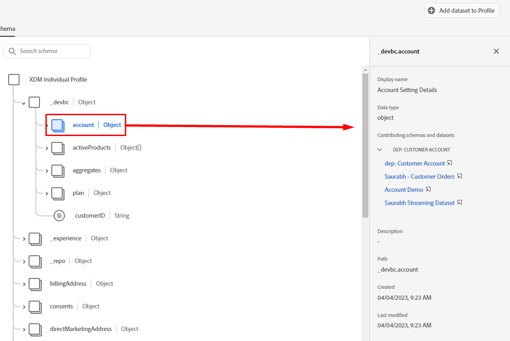
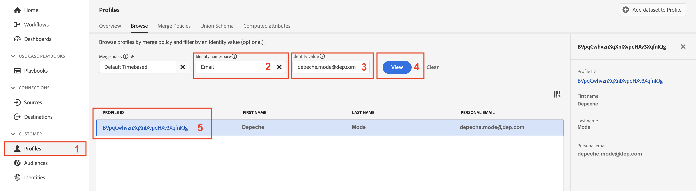
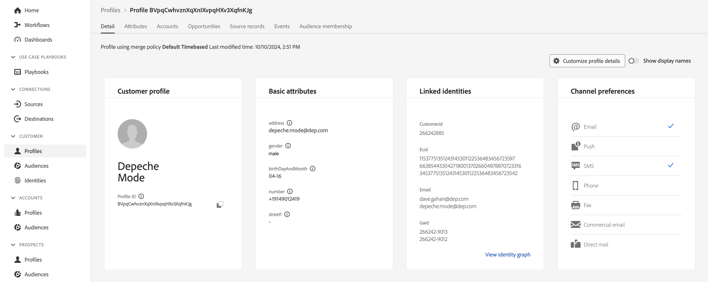
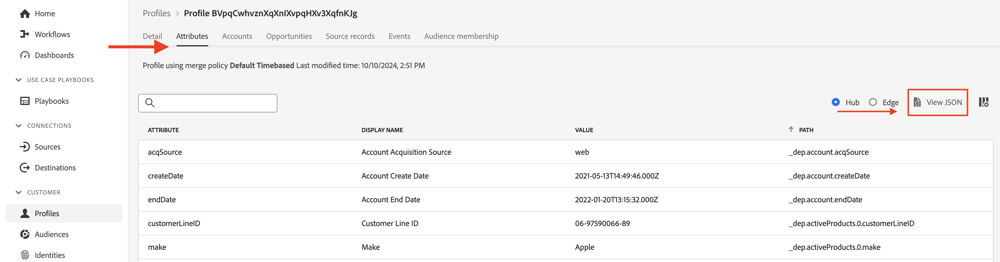
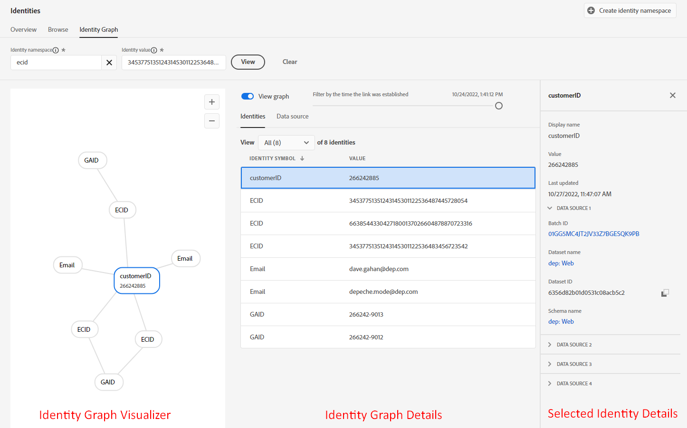
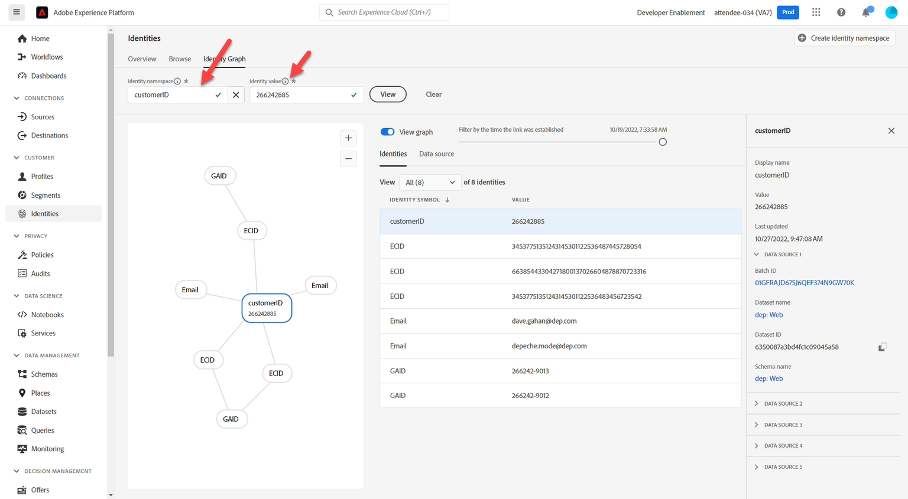

# プロファイルの基本

## プロファイル結合スキーマ

リアルタイム顧客プロファイルのビューは、プロファイルに対して定義して有効にしたスキーマを使用して構築されます。 これは、Adobeがプロファイルの結合スキーマと呼ぶものです。

次の操作を行うと、プロファイルの結合スキーマを確認できます。

1. 左側のパネルの&#x200B;**プロファイル**&#x200B;をクリックします
1. 上部ナビゲーションの&#x200B;**結合スキーマ**&#x200B;をクリックします


>[!NOTE]
>
>プロファイルは、XDM クラスごとに結合ビューを作成します。 このビューを使用して、どのクラスにどのようなスキーマが貢献したのか、各クラス内のIDおよび関係を確認します。

XDM Individual Profile クラスの結合スキーマを確認し、テナント名前空間を展開します。 **LID手法**&#x200B;および&#x200B;**XDM モデリング ラボ**&#x200B;で定義した様々なスキーマに由来するいくつかの項目が、ここに表示されます。


**アカウント** オブジェクトをクリックし、画面の右側のパネルに表示される内容を確認します。 オブジェクトの詳細、その形成に貢献したスキーマとデータセット、およびその他の関連情報を確認できるようになりました。



>[!NOTE]
>
>結合スキーマは、プロファイル内に特定の要素が存在する理由と、その要素がどこから来たのかを理解するための優れたツールです。
>
>結合スキーマは観測可能であることに注意してください。つまり、プロファイルには、実際のリアルタイム顧客プロファイルを表示する際に、データを含むフィールドのみが表示されます


## プロファイル検索

1. 左側のパネルの&#x200B;**プロファイル**&#x200B;をクリックし、上部のナビゲーションで&#x200B;**参照**&#x200B;を選択します
1. **電子メール**&#x200B;のID名前空間を選択
1. ID値として&#x200B;**depeche.mode\@dep.com**&#x200B;を入力します
1. 「**表示**」ボタンをクリックして、プロファイルを検索します
1. プロファイルへの&#x200B;**リンク**&#x200B;をクリックすると、プロファイルの詳細が表示されます

電子メール名前空間とdepeche.mode@dep.comが入力された


今すぐご覧ください。

電子メールで検索した後、

上部のナビゲーションの各タブを確認して、プロファイルのDepeche Modeを確認してください。 以下のタブを使用します。

- 詳細 – 特定のプロファイルのさまざまな側面を示すカスタマイズされたカードを表示します
- 属性 – 結合スキーマから取得された特定のプロファイルに関連するすべての属性を表示します
- イベント – 結合スキーマから取得された特定のプロファイルに関連するすべてのイベントを表示します
- オーディエンスメンバーシップ – プロファイルが現在メンバーであるオーディエンスを表示します

## 属性の表示

**属性** タブに移動し、**JSONを表示**&#x200B;をクリックします



顧客アカウントスキーマに追加したフィールドグループから取得したフィールドが表示される方法を確認します。

- **entity**&#x200B;という名前の親ノードを探します
- 子オブジェクト **billingAddress**&#x200B;に注意してください（これは個人連絡先の詳細フィールドグループから取得しました）

```json
"billingAddress": {
  "postalCode": "11355",
  "city": "New York City",
  "state": "NY",
  "street1": "108 Ruskin Terrace"
}
```

これをプロファイル結合スキーマと比較し、観測可能な😄の意味を電球で確認する必要があります

```json
"billingAddress": {
    "_repo": {
        "createDate": "datetime",
        "modifyDate": "datetime",
    },
    "_schema": {
        "description": "string",
        "elevation": "double",
        "latitude": "double",
        "longitude": "double"
    },
    "_id": "string",
    "city": "string",
    "country": "string",
    "countryCode": "string",
    "createdByBatchID": "string",
    "dmaID": "integer",
    "label": "string",
    "lastVerifiedDate": "date",
    "modifiedByBatchID": "string",
    "msaID": "string",
    "postOfficeBox": "string",
    "postalCode": "string",
    "primary": "boolean"
    "region": "string",
    "repositoryCreatedBy": "string",
    "repositoryLastModifiedBy": "string",
    "state": "string",
    "stateProvince": "string",
    "status": "string",
    "statusReason": "string"
    "street1": "string",
    "street2": "string",
    "street3": "string",
    "street4": "string"
}
```

>[!NOTE]
>
>オブザーバブルスキーマとは、データが存在するフィールドのみを表示し、データを含まないフィールドを非表示にするという意味です。  従来のリレーショナルデータベースとは大きく異なります。


次に、**同意** オブジェクトを探します（これは同意と環境設定の詳細フィールドグループから取得しました）

```json
"consents":{
   "marketing":{
      "sms":{
         "val":"y"
      },
      "email":{
         "val":"y"
      }
   }
}
```


テナント名前空間&#x200B;**\_devbc**&#x200B;まで下にスクロールし、**プラン** オブジェクトを探します（これは、「dep: Plan Details」という名前のカスタム作成フィールドグループから取得しました）

```json
"plan": {
    "planID": "m3",
    "type": "mobile",
    "name": "pro"
}
```


アップセルのユースケース用に定義した&#x200B;**集計** オブジェクトに注意してください。 これらのフィールドは、テナント名前空間\_devbcの下にあります。 これらは、別のスキーマ（dep：顧客集計）とカスタムフィールドグループ（dep：集計）から取得しました

```json
"aggregates":{
   "rollingSixMonthAvgMonthlyDataUsage":30,
   "rollingSixMonthTotalDataUsage":200
}
```

## ID マップの表示

また、プロファイルの関連IDは、**identityMapという名前のマップベースのオブジェクト内に保存されているので、確認できます。** JSON ドキュメントの下部にある&#x200B;**identityMap**&#x200B;を探します。

これは、IDMap フィールドを使用するか、ID記述子を使用してフィールドをマークしたかどうかに関係なく、渡したすべてのIDを表します。

```json
"identityMap": {
  "ecid": [{
          "id": "34537751351243145301122536487445728054"
      },
      {
          "id": "66385443304271800137026604878870723316"
      },
      {
          "id": "34537751351243145301122536483456723542"
      }
  ],
  "email": [{
          "id": "dave.gahan@dep.com"
      },
      {
          "id": "depeche.mode@dep.com"
      }
  ],
  "customerid": [{
      "id": "266242885"
  }],
  "gaid": [{
          "id": "266242-9013"
      },
      {
          "id": "266242-9012"
      }
  ]
}
```

>[!NOTE]
>
>なお、identityMap内では「プライマリ ID」という概念は参照されません。 その理由は2つあります。
>
>1. プロファイル属性に表示されるidentityMapは、Identity Serviceのグラフ\*を使用して各プロファイルに対して作成されます
>2. ID グラフは、ID間の関係のみを考慮します。 それぞれのIDは同じように扱われます。 AはBに関連し、それがプライマリ ID、個人IDなどを介して行われたかどうかは関係ありません。
>
>*\* ID グラフが使用されていない場合、identityMapは、参照*で要求されたIDのみで構成されます

>[!NOTE]
>
>顧客アカウントスキーマを構築した場合、IDとしてマークされたメールフィールドは1つだけです（つまり、personalEmail.address）。 identityMapに2つのメールアドレスがあることに気づきましたか？
>
>何が起こっていますか？
>
>- ID グラフでは、データがサービスに流れ込むたびに、新しい関係とその関係内の値が常に記録されます
>- プロファイルの動作は、データがサービスに取り込まれると、既存のフィールド値を新しい値で上書きすることです
>- ID記述子を使用してフィールドにフラグを付ける場合、そのフィールドは引き続きプロファイル用のフィールドです


## ID グラフ

上部ナビゲーションの「**詳細**」タブに戻り、**リンクされたID** カードの下部にある「**ID グラフを表示**」リンクをクリックします


この画面が表示されます。

デペッシュ モード プロファイル用の

上記のビューは、Depeche Mode プロファイルのID グラフで、3つの主要な領域に分かれています。

**ID グラフ ビジュアライザー** - プロファイル ID クラスター内のIDと関連する関係を表示します

**ID グラフの詳細** -ID グラフの名前空間、値、およびID グラフ ビジュアライザー内に表示されるすべての関係を作成したデータソース全体に関する具体的な詳細を提供します

**選択したIDの詳細** – 選択したIDの詳細情報と、そのIDが関係で処理された最後の5つの（5）バッチを表示します

>[!NOTE]
>
>ID グラフビューアには、すべてのID間の関係と、ID関係が最後に表示された日時と、どのデータセットからの情報が表示されます


代わりにcustomerID ID IDを使用して、Depeche ModeのID グラフを表示します。  次のアクションを実行します。

1. **customerID**&#x200B;をどこかにコピーして保存します。
1. ID名前空間ボックスの名前空間値を&#x200B;**customerID**&#x200B;に変更します
1. 前の手順で保存した&#x200B;**customerID**&#x200B;値を貼り付けます
1. 「**表示**」ボタンをクリックして、新しいID値を使用してこのIDを含むID グラフを表示します

を介したID グラフビュー

>[!NOTE]
>
>まったく同じID グラフが表示されます。 このグラフから使用するIDは、常に同じ結果になります


## IDの変更

プロファイルビューアに戻り、customerIDを使用してDepeche Modeを検索します

1. ID名前空間を&#x200B;**customerID**&#x200B;に変更します
1. 前のセクションで保存したcustomerID値を使用して、ID値を更新します
1. 「**表示**」ボタンをクリックします

顧客ID名前空間と値が入力されたを使用したDepeche モードの検索


先ほど見たのと同じプロフィールが表示されます。


>[!NOTE]
>
>ID グラフは、様々なプロファイルフラグメントを組み立てる際に、使用するIDが同じプロファイルに結果を反映することを保証します
