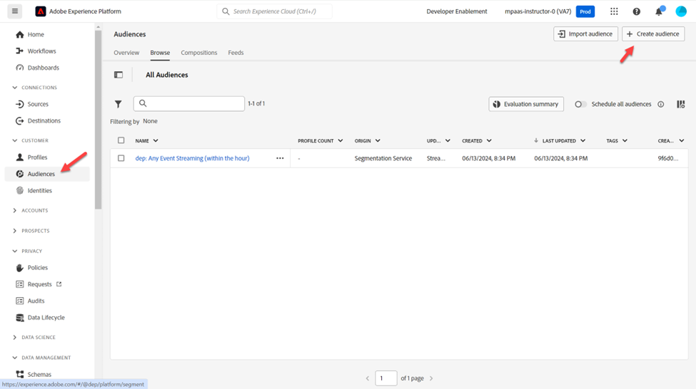
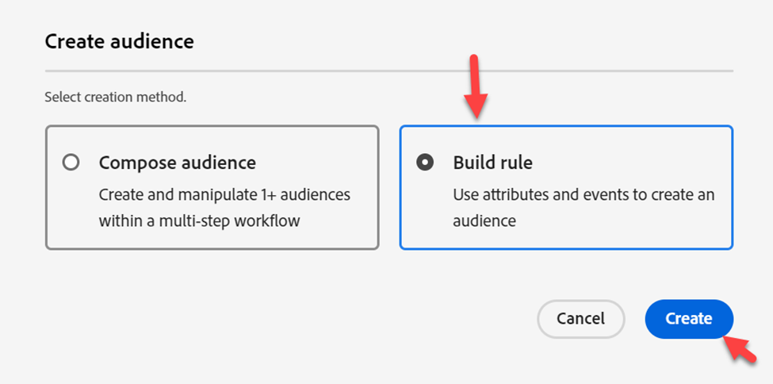
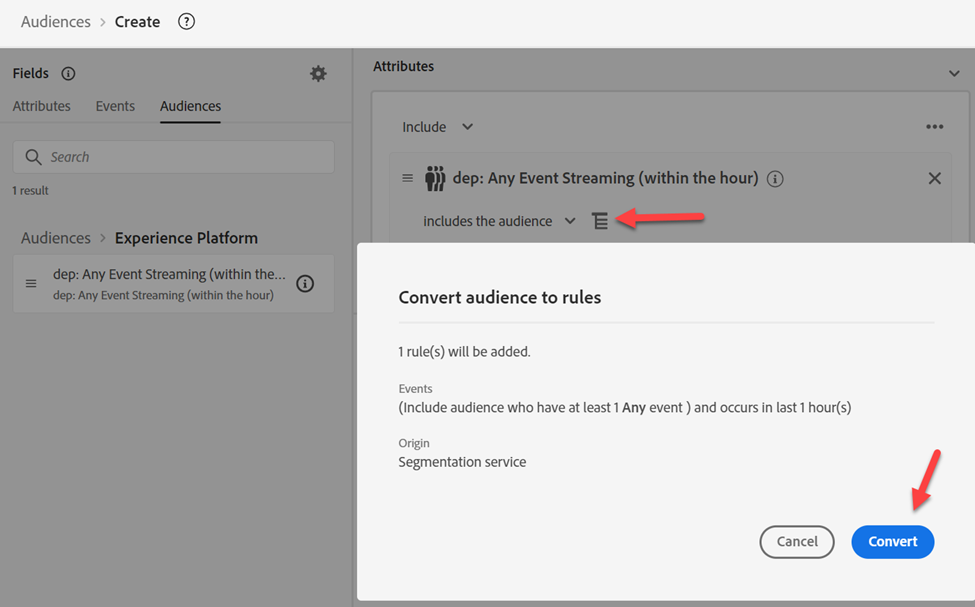
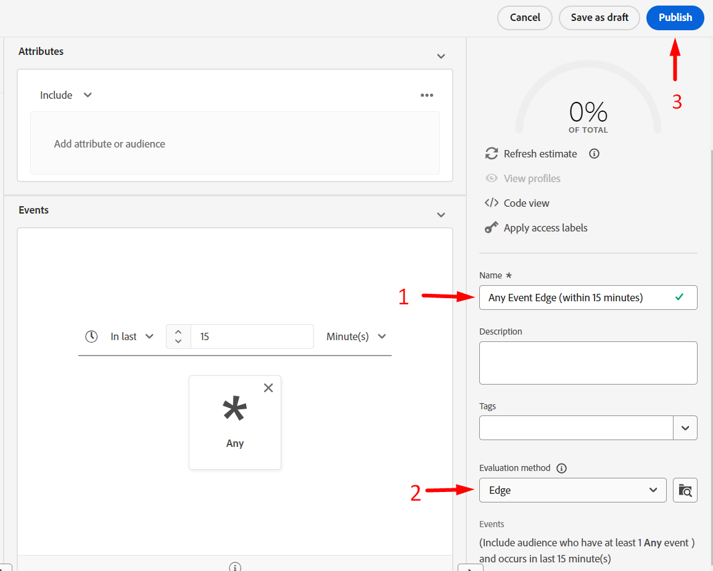

# Edge オーディエンスの作成

このオーディエンスは、ペイロード（ページビューなど）がクライアント（Web SDKなど）からEdgeに送信される場合に、オーディエンスを選定するために使用されます。

>[!NOTE]
>
>通常、Edgeでオーディエンスを評価します。これにより、Personalizationでオーディエンスを有効にできます。 EdgeでPersonalizationを実行していない場合は、ハブでのストリーミングとしてオーディエンスを評価することができます。

## オーディエンスを作成

1. 左側のパネルで「オーディエンス」をクリックします
1. 次に、画面の右上隅にある「オーディエンスを作成」をクリックします
1. 「Build Rule」をクリックして

「オーディエンスを作成」ボタンと「ルールを作成」オプションが強調表示された

## オーディエンスをルールに変換

1. **Audiences**&#x200B;に移動し、**Experience Platform** フォルダーをクリックします
1. **dep: Any Event Streaming （within the hour）**&#x200B;という名前のオーディエンスをキャンバスにドラッグ&amp;ドロップ

   

1. 下の&#x200B;**アイコン**&#x200B;の表示をクリックし、**変換**&#x200B;をクリックして、オーディエンスをキャンバス内の一連のルールに変換します

## イベントルールを更新

イベントルールに次の変更を加えます（イベントを展開する必要がある場合があります）

1. In Last
1. 15
1. 分

## セグメントを公開

1. セグメント名を&#x200B;**Any Event Edge （15分以内）**&#x200B;に更新します
1. Edgeへの評価方法の更新
1. セグメントを公開

## バッチ評価セグメントを作成

作成したエッジセグメントと同じ手順を繰り返しますが、代わりに次の情報を使用します。

>[!NOTE]
>
>Edgeにイベントが渡されても、一括評価として保存されたオーディエンスは、ストリーミング方式で評価されないことがわかります。

イベントルール：

- In Last
- 1
- 日

セグメントの詳細：

- 名前 – > **任意のイベントバッチ（1日以内）**
- 評価方法 – > バッチ
