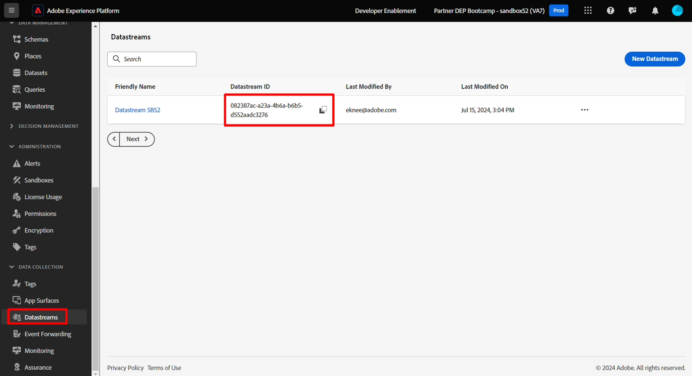
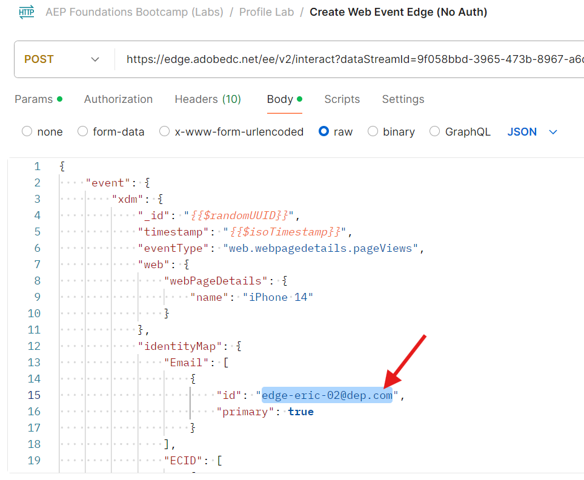
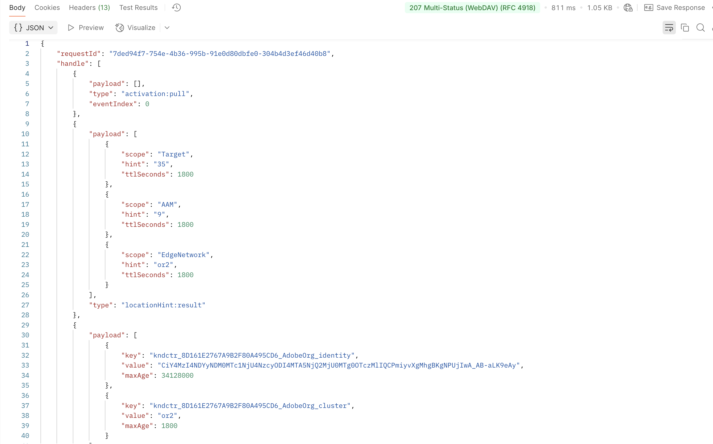

# Edge イベントの送信

すべての設定が完了したら、Edgeにイベントを送信して、すべての動作を確認します。

これを行うには、Postmanを使用して、作成したデータストリームにWeb イベントを送信します。

これにより、OAuth トークン **を持たないイベント**&#x200B;で送信され、webからEdgeに表示されるページビューをシミュレートできます。  このラボを実行するには、コンピューターでPostmanが開いていることを確認します。

>[!NOTE]
>
>認証トークンを渡していないため、属性は返されません。

## ラボの期待

1. Edgeを打つエクスペリエンスイベント
1. イベント転送サービスを使用するデータストリーム設定
1. Webhookにイベントを送信するためのイベント転送
1. AEP サービスを使用するデータストリーム設定
   1. Edge Audience to run
   1. イベントをハブに送信
1. Edge オーディエンスを含めるPostmanの応答（属性なし）
1. イベントを受信し、イベントプロファイルフラグメントを追加するプロファイルストア
1. 関係を追加するID ストア
1. データを受信し、データレイクに保存するデータセット

## 通話に移動

1. **Postman左サイドバー** -> コレクション
1. **Collection** -> AEP Foundations Bootcamps （Labs）
1. **フォルダー** -> プロファイルラボ
1. **API リクエスト** -> Web イベント Edgeの作成（認証なし）

## API リクエストを変更

API リクエストを実行する前に、リクエストに追加の情報を追加する必要があります。 まず、次の値を収集します。

## データストリーム IDの収集

1. 左側のパネルで「**データストリーム**」（「データ収集」見出しの下）をクリックします
1. データストリームを選択し、**データストリーム ID**&#x200B;値をコピーします

## Postman クエリパラメーターの更新

1. リクエスト自体で「**パラメーター**」をクリックします
1. 前の手順のデータストリーム IDで&#x200B;**値**&#x200B;を更新します
1. 「**保存**」ボタンをクリックして、更新を保存します

メールアドレスを変更

## APIの実行

**送信** ボタンをクリックして、リクエストを実行します。

応答で返ってくるのは、このコアなことです。

- 200 OKの応答は、データが正常に送信され、Edge Networkによって受け入れられたことを意味します

>[!NOTE]
>
>ストリーミングセグメントとバッチセグメントは、最初にハブで評価されるまで表示されません

## イベント転送の検証

Webhook.siteでは、Postman リクエストを介して送信したのと同じペイロード本文がすぐに表示されます。

>[!NOTE]
>
>ペイロードが、エッジ設定で使用したデータストリームの設定時に要求した位置情報を追加していることに注意してください

## プロファイルを検索

Adobe Experience Platformでは、Edge Networkに送信したばかりのイベントから、送信したばかりのプロファイルを検索できます。 プロファイル/参照に移動して、次の情報を使用してルックアップを実行します。

- 結合ポリシー – > デフォルトの時間ベース
- ID名前空間 – > メール
- ID値 – > edge-email\@dep.com
  - 注意：上記の&#x200B;*Postman クエリパラメーターの更新*&#x200B;手順で使用した電子メールと一致するように、これを変更します

1. **表示**&#x200B;をクリックしてプロファイルを検索します
1. **プロファイル ID**&#x200B;をクリックしてプロファイルを開きます

   

1. 上部のナビゲーションの&#x200B;**イベント**&#x200B;をクリックすると、送信したばかりのイベントが表示されます

   Edgeに送信されたエクスペリエンスイベントを表示する

1. 上部のナビゲーションの「オーディエンスメンバーシップ」タブを確認して、プロファイルがオーディエンスに適格であることを検証します。 次の項目が表示されます。

- Any Event Edge（15分以内）
- dep：任意のイベントストリーミング（時間内）

任意のイベント Edgeとdep：任意のイベントストリーミングオーディエンス の資格を示す「 オーディエンスメンバーシップ」タブ

## チェックの解釈方法

1. Postmanで200の応答を確認します（適切にフォーマットされたペイロード）
1. Webhookにイベントがあるかどうかを確認します（適切に設定されたイベント転送）
1. プロファイルにイベント（正しく設定されたAEP サービス、ハブで受信および処理されたイベント）があるかどうかを確認します
1. 数分後に、プロファイルに2つのIDがあるかどうかを確認します（ID グラフがハブにリンクされています）
1. プロファイルがオーディエンス（適切に定義されたオーディエンス）に適格かどうかを確認します
1. データレイクにイベントがあるかどうかを確認します。
